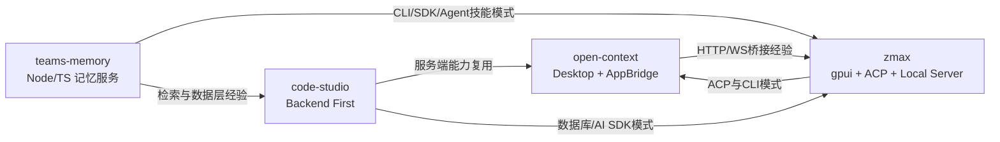
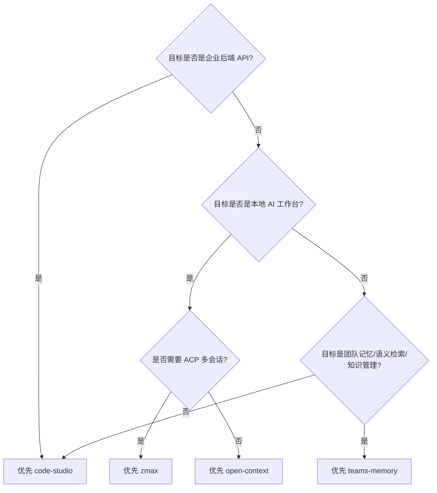

# 00 · 四仓库技术总览与选型建议

本文档用于在 `code-studio`、`open-context`、`zmax`、`teams-memory` 之间进行技术路线判断，并给出可复用模块的优先级建议。

## 1. 一页结论

| 维度 | code-studio | open-context |
|---|---|---|
| 产品形态 | 服务端/管理后台后端基座 | 桌面端 AI 工作台（Tauri） |
| 技术重心 | 分层后端、数据库抽象、AI SDK、工程化 | 多工具集成（终端/编辑器/数据库/Git）、跨进程桥接 |
| Rust 组织 | 5 个核心 workspace members | 15 个 workspace members（`src-tauri` + 多 domain crates） |
| 前端体量 | 根仓库前端依赖较轻（主要 dev tool） | React + Tauri + 丰富 UI/可视化生态 |
| 数据库策略 | 面向业务后端，多库统一抽象 | 本地与远程混合，偏桌面工具场景 |
| 典型场景 | 新建 API 服务、后台系统、AI 中台 | 构建本地 Agent 客户端、集成式开发工作台 |

| 维度 | zmax |
|---|---|
| 产品形态 | gpui 桌面 IDE/Agent 工作台 |
| 技术重心 | CLI 体系、ACP 运行时、本地 server（HTTP/WS/MCP）、事件系统 |
| Rust 组织 | 多 crate workspace（核心/基础设施/UI 面板/服务端） |
| 典型场景 | 本地智能开发工具、可编排 Agent 客户端、插件化工作流 |

| 维度 | teams-memory |
|---|---|
| 产品形态 | 团队记忆/知识管理工具（CLI + SDK + 本地代理 + 远程服务 + Skills） |
| 技术重心 | 记忆存储、语义检索（召回+重排）、共享权限、图谱、Graph RAG |
| 语言/组织 | Node.js 22+ / TypeScript（pnpm monorepo）+ Python AI Sidecar |
| 数据策略 | SurrealDB（元数据/关系）+ Qdrant（向量）+ Keyv/Redis（缓存） |
| 典型场景 | 团队知识沉淀、Agent 记忆技能、代码库/RUM 搜索、语义检索产品 |

## 架构版图（4 仓库）



## 选型决策流程



## 复用数据流（文档决策到方案落地）


## 关键结构体（建议统一）

```rust
pub struct TechOption {
  pub name: String,
  pub repository: String,
  pub strengths: Vec<String>,
  pub risks: Vec<String>,
  pub fit_score: u8,
}

pub struct DecisionRecord {
  pub scenario: String,
  pub options: Vec<TechOption>,
  pub selected: String,
  pub rationale: String,
}
```

## 2. 仓库画像

### 2.1 code-studio

- 架构：Actix-Web HTTP + Tonic gRPC + `admin-core/admin-config/admin-ai` 能力层。
- 长项：
  - 分层清晰，适合多人协作与服务演进。
  - 数据库抽象 + BaseService 适合快速搭建 CRUD 后台。
  - AI 多厂商接入抽象具备扩展性。
- 潜在成本：
  - 多数据库并存时，类型系统与查询 DSL 一致性维护成本较高。
  - 某些 feature 默认全开，编译和二进制体积需要治理。

### 2.2 open-context

- 架构：React 19 + Tauri 2 + Rust domain crates + AppBridge（HTTP/WS）。
- 长项：
  - 系统级能力齐全（终端、文件、Git、LSP、数据库、Notebook）。
  - `tauri-specta` 保证 IPC 类型安全，前后端协作成本低。
  - 对外可通过 AppBridge 复用能力，适合作为“本地能力底座”。
- 潜在成本：
  - 前端依赖规模大，升级与安全治理压力更高。
  - 桌面端跨平台测试面更广，回归成本高于纯后端。

### 2.3 zmax

- 架构：gpui 桌面应用 + Rust workspace + `zmax-server` + `gpui-agent-acp`。
- 长项：
  - CLI 设计完整，具备 GUI 驱动与 headless 双模式。
  - ACP 连接复用与 session 隔离模型清晰，便于多会话并发。
  - 事件系统分层明确（局部 EventEmitter + 全局 AppEventBus）。
- 潜在成本：
  - server 的 HTTP 服务与 OpenAI 兼容代理已落地（含 admin / 鉴权 / 健康检查），MCP / ACP / App API 仍为 501 占位；部分 UI 面板仍为骨架，落地时需二次实现。
  - gpui 生态相对小众，团队学习曲线高于 Web 技术栈。

### 2.4 zmax 仓库内更多专题（未提炼，可直接查阅 `zmax/docs/`）

docs 目录另含以下高价值专题，目前未在本文档集内提炼：

| zmax/docs 文档 | 内容 |
|---|---|
| `agent.md` | Agent 编排与运行时 |
| `git-tools.md` / `git-merge.md` | Git 工作台与合并流程 |
| `global-search.md` | 全局搜索实现 |
| `screen-memory-recorder.md` / `screen-memory-parser-store.md` | 屏幕记忆录制与解析存储 |
| `knot-api-system-prompt.md` / `knoy-api-agent.md` | 知识库（Knot）API 与 Agent 提示词 |
| `auto-kit.md` / `autotest.md` | 自动化工具与自测 |
| `app-layout.md` / `config-and-settings.md` | 布局与配置体系 |
| `picture-in-picture.md` / `record-to-test.md` | 画中画 / 录制转测试 |
| `roadmap.md` | 路线图 |

### 2.5 teams-memory

- 架构：Node.js 22+ / TypeScript（pnpm monorepo）+ Python AI Sidecar；CLI + SDK + Local Client Server + Remote Server（HTTP/WS 双通道）+ SurrealDB/Qdrant。
- 长项：
  - 记忆主链路完整（store → 向量化 → Qdrant 召回 → Reranker 精排），含 `is_vectorized` 失败标记与 `retry` 补偿。
  - 四级数据隔离（owner / team / project / repo+branch 动态分表）+ 共享幂等管理。
  - Graph RAG 方案完整（本体、异步抽取状态机、混合检索、实体消歧）。
  - 多入口接入：CLI（20 命令）、MemoryClient SDK、Claude Code Skills、Hooks、MCP。
- 潜在成本：
  - SurrealDB 生态较小众，学习成本高于 PostgreSQL。
  - 检索链路强依赖 GPU 模型服务（Qwen 系）与内部基础设施，离线不可用。
  - 自带文档（2026-03 版）落后于代码，部分"待补齐"能力已实现（见 [25](25-teams-memory-reuse-overview.md) 差异清单）。

## 3. 按目标选仓库能力

| 目标 | 建议主参考 | 次参考 |
|---|---|---|
| 搭建企业后端服务（权限、CRUD、多数据库） | code-studio | open-context（仅参考工具化） |
| 搭建本地 AI IDE/工作台 | open-context | code-studio（参考服务端模式） |
| 做 AI 多供应商网关 | code-studio（`08` 章节） | open-context（前端交互与插件化） |
| 做统一 CLI + GUI + HTTP/WS 能力输出 | open-context | code-studio |
| 做 ACP 多会话 Agent 客户端 | zmax（`16`/`17` 章节） | open-context |
| 做工程化 CLI 规范与 headless 能力 | zmax（`14` 章节） | code-studio |
| 做团队记忆/知识管理产品 | teams-memory（`25`-`30` 章节） | open-context（参考工具化） |
| 做语义检索（召回+精排+补偿） | teams-memory（`28`/`29` 章节） | code-studio（参考数据层） |
| 做"本地代理 + 远端服务"双通道 | teams-memory（`26` 章节） | open-context（AppBridge） |
| 做 Graph RAG / 图数据库混合检索 | teams-memory（`29` 章节） | zmax（知识库经验） |

## 4. 推荐阅读路径

1. 架构判断：先看 [20-open-context-architecture.md](20-open-context-architecture.md) 与 [01-architecture-layered.md](01-architecture-layered.md)。
2. 依赖评估：看 [11-dependency-inventory.md](11-dependency-inventory.md)。
3. 数据决策：看 [12-database-selection.md](12-database-selection.md)。
4. 落地规范：看 [10-engineering-toolchain-and-ci.md](10-engineering-toolchain-and-ci.md)。
5. 团队记忆/知识管理：看 [25-teams-memory-reuse-overview.md](25-teams-memory-reuse-overview.md) 与 [26-teams-memory-architecture.md](26-teams-memory-architecture.md)。
