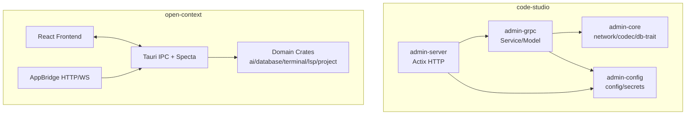
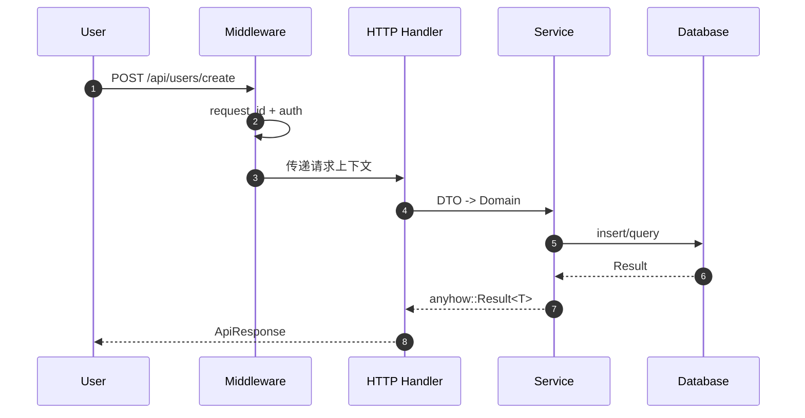
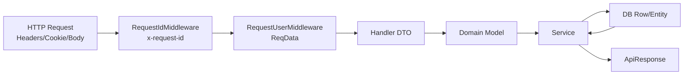

# 01 · 分层架构模式

> HTTP 接入层 / 业务逻辑层 / 基础能力层的职责边界、依赖方向与调用链。

## 适用场景

- 后端需要同时暴露 HTTP + gRPC（或未来 GraphQL / WebSocket）
- 想把「协议处理」与「业务逻辑」彻底拆开，方便复用业务层给 CLI / 消息队列 / 定时任务
- 团队多人协作，需要清晰的模块归属

## 分层模型

```
┌─────────────────────────────────────────────┐
│  admin-server  (HTTP 接入层 · Actix-Web)     │  协议：路由 / 中间件 / DTO ↔ Domain
├─────────────────────────────────────────────┤
│  admin-grpc    (业务逻辑层 · Tonic)          │  业务：Services / Models / Database
├──────────────┬──────────────┬───────────────┤
│ admin-core   │ admin-config │ admin-ai      │  能力：工具 / 配置 / AI SDK
└──────────────┴──────────────┴───────────────┘
```

## 架构图（跨仓库对照）



说明：`code-studio` 更偏服务端分层；`open-context` 更偏客户端-桥接-能力层分层。

**依赖方向严格向下，禁止反向或同层互相依赖：**

```
admin-server ──► admin-grpc ──► admin-config
                 └───────────► admin-core
admin-ai     ──► admin-core（独立，可被 grpc 按需引用）
```

## 职责边界

| 层 | 做什么 | 不做什么 |
|----|--------|---------|
| **admin-server** | 路由注册、中间件、请求 DTO 反序列化、响应包装、调用 Service | SQL、业务规则、事务编排、跨服务聚合 |
| **admin-grpc** | Services 业务逻辑、Models 数据模型、连接池管理、gRPC 服务实现 | HTTP 协议细节、前端响应格式 |
| **admin-core** | 网络客户端、编解码、通用工具、数据库 Trait | 任何业务语义 |
| **admin-config** | 配置加载、覆盖、密钥生成 | 业务配置解释 |

## 真实调用链

以「创建用户」为例（`apps/admin-server/src/api/user.rs` → `apps/admin-grpc/src/services/user_service.rs`）：

```
HTTP POST /api/users/create
  │
  ├─ RequestIdMiddleware          注入 x-request-id
  ├─ RequestUserMiddleware        解析 token → RequestUser 写入 extensions
  │
  ▼
api::user::create_user           (admin-server/src/api/user.rs:130)
  │  web::Data<MySqlClient>      从 app_data 取连接池
  │  ReqData<RequestUser>        从 extensions 取当前用户
  │  web::Json<CreateUserRequest> DTO
  │
  ├─ check_admin_permission()    轻量校验（真正业务仍在 Service）
  │
  ▼
UserService::insert_one          (admin-grpc/src/services/user_service.rs)
  │  impl BaseService<User>      通用 CRUD
  ▼
MySqlPool (sqlx)                 连接池由 admin-grpc 统一初始化
```

## 端到端流程图（HTTP -> Service -> DB）



## 数据流（请求与身份上下文）



## 关键结构体（建议统一建模）

```rust
// 请求上下文
pub struct RequestContext {
  pub request_id: String,
  pub login_user_id: Option<String>,
  pub client_ip: Option<String>,
  pub user_agent: Option<String>,
}

// 统一响应
pub struct ApiResponse<T> {
  pub code: i32,
  pub message: String,
  pub data: Option<T>,
}

// 分页查询
pub struct PageQuery {
  pub page: u64,
  pub page_size: u64,
}
```

建模建议：

1. `RequestContext` 只承载横切信息，不承载业务字段。
2. `ApiResponse<T>` 统一在协议层使用，业务层只返回 `Result<T, E>`。
3. `PageQuery` 在边界层做归一化，业务层只接收合法值。

## 关键设计点

### 1. HTTP 层薄到只剩「翻译」

Handler 只做三件事：取依赖 → 调 Service → 包响应。

```rust
// apps/admin-server/src/api/user.rs:130
pub async fn create_user(
    mysql_client: web::Data<MySqlClient>,      // 依赖注入
    req: web::Json<CreateUserRequest>,          // DTO
    req_user: ReqData<RequestUser>,             // 鉴权上下文
) -> impl Responder {
    let user_service = UserService::new(mysql_client.get_ref().clone());
    let user = User::from(req.into_inner());    // DTO → Domain
    match user_service.insert_one(user).await {
        Ok(id) => ApiResponse::success(id.to_string()),
        Err(e) => ApiResponse::error(e.to_string()),
    }
}
```

**复用要点**：DTO → Domain 用 `From` 实现，避免在 handler 里堆字段拷贝。

### 2. 双栈启动、端口联动

HTTP 与 gRPC 用 `tokio::select!` 并发启动，任一退出则进程退出（`apps/admin-server/src/server/app_server.rs:87`）：

```rust
// gRPC 端口约定：HTTP 端口 + 1000
let grpc_port = config.server.port + 1000;   // 3400 → 4400
tokio::select! {
    result = http_server => { ... }
    result = grpc_server => { ... }
}
```

**复用要点**：端口用偏移约定，免去两处配置漂移；进程生命周期绑定两个 server。

### 3. 路由模块化注册

每个 API 模块导出 `config(cfg: &mut web::ServiceConfig)`，根模块统一挂载：

```rust
// apps/admin-server/src/api/mod.rs
pub fn config(cfg: &mut web::ServiceConfig) {
    user::config(cfg);
    auth::config(cfg);
    #[cfg(debug_assertions)]
    system::config(cfg);   // 调试专用路由仅在 debug 编译
}
```

**复用要点**：`#[cfg(debug_assertions)]` 做环境隔离，比运行时 if 更安全。

### 4. 业务层内部再分层（Services）

`admin-grpc/src/services/mod.rs` 按业务优先级分组，避免文件平铺失控：

```
基础服务   base_service / auth_service / user_service / redis_service / cached_service
P0 核心   account / api_key / role / user_role
P1 业务   consumption / model_config / permission / recharge
P2 扩展   team / tenant / notification / rate_limit / quota
P3 统计   api_key_log / daily_stats / model_stats
```

### 5. 统一响应包装

HTTP 层统一 `ApiResponse::success / ApiResponse::error`，业务层返回 `anyhow::Result<T>`，由 handler 决定对外格式。

## 踩坑提醒

1. **中间件 `wrap` 顺序敏感**——`app_server.rs:37` 有注释强调：后 `wrap` 的先执行。鉴权中间件必须在 Session/CORS 之后、业务之前。
2. **不要在 HTTP handler 直接碰数据库**——本项目 handler 通过 `web::Data<MySqlClient>` 取池再 `UserService::new(pool)`，池的所有权管理仍在 admin-grpc；新项目建议把 pool 也藏进 Service 工厂。
3. **admin-server 的 Cargo.toml 直接依赖了 sqlx/redis**——这是历史债务，正确做法是只依赖 `admin-grpc` 导出的类型。复用时请收紧边界。
4. **`AppState` 用 `Arc<Mutex<_>>` 过重**——当前只存 version，读多写少的场景用 `Arc<AppState>` + 内部 `RwLock` 即可；能 `app_data` 注入的就别塞全局状态。

## 新项目落地清单

- [ ] 划定 4 个 crate：`server` / `biz` / `core` / `config`
- [ ] 用 `cargo tree` 检查依赖方向无环
- [ ] 每个 API 模块自带 `config(cfg)` 注册函数
- [ ] DTO / Domain 分离，`From` 互转
- [ ] 双协议端口用偏移约定
- [ ] debug-only 路由用 `cfg(debug_assertions)` 门控
