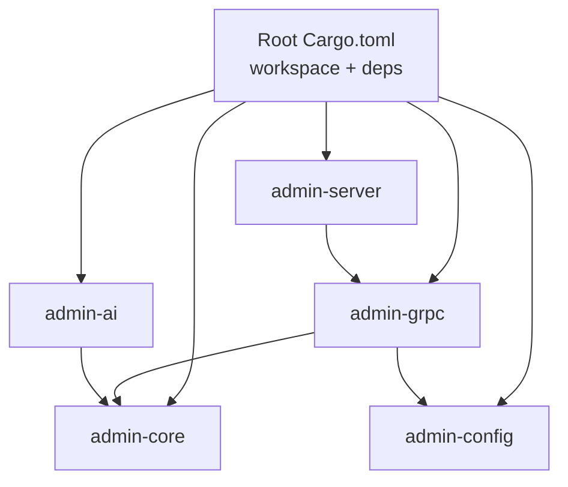
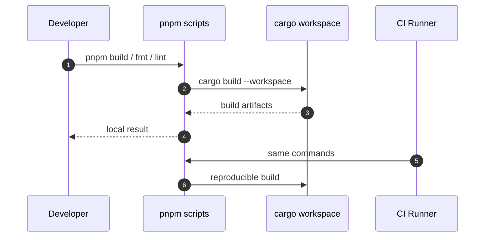
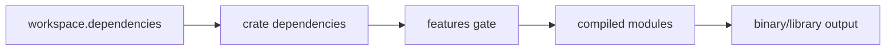

# 02 · Cargo Workspace 与 Features 按需加载

> 多 crate monorepo 的组织方式、workspace 依赖统一管理、库 crate 的 feature 门控。

## 适用场景

- 一个仓库里有多个可独立发布的 Rust crate
- 工具库被多个业务线复用，希望下游只编译用到的模块
- 想统一依赖版本、避免 `cargo tree` 里出现同库多版本

## Workspace 结构

```toml
# Cargo.toml（仓库根）
[workspace]
resolver = "3"
members = [
    "apps/admin-ai",
    "apps/admin-core",
    "apps/admin-config",
    "apps/admin-server",
    "apps/admin-grpc",
]

[workspace.dependencies]
# 所有版本号只在这里写一次
actix-web = { version = "4", features = ["rustls-0_23"] }
tokio = { version = "1", features = ["full"] }
sqlx = { version = "0.8", features = ["runtime-tokio", "tls-rustls", "mysql", "postgres", "sqlite", "macros", "chrono", "uuid", "derive"] }
anyhow = "1.0"
thiserror = "2.0"
# ...
```

子 crate 引用时**不写版本号**：

```toml
# apps/admin-grpc/Cargo.toml
[dependencies]
admin-config = { path = "../admin-config" }
admin-core   = { path = "../admin-core" }
tokio        = { workspace = true }
sqlx         = { workspace = true }
```

**收益**：升级依赖只改根 `Cargo.toml` 一行；`Cargo.lock` 全仓共享；CI 可一次 `cargo build --workspace`。

## Workspace 架构图



## 分层依赖规则

```
admin-server ──► admin-grpc ──► admin-config
      │              └────────► admin-core
      └──────────────────────► admin-core / admin-config

admin-ai ──► admin-core（独立，不反向依赖业务）
```

| crate | 角色 | 可发布 | 允许依赖 |
|-------|------|-------|---------|
| `admin-core` | 通用工具库 | ✅ crates.io | 仅第三方 |
| `admin-config` | 配置管理库 | ✅ crates.io | 仅第三方 |
| `admin-ai` | AI SDK | ✅ crates.io | admin-core + 第三方 |
| `admin-grpc` | 业务逻辑 | ❌ 内部 | admin-core/config + 第三方 |
| `admin-server` | HTTP 入口 | ❌ 内部 | admin-grpc/core/config |

**复用要点**：越底层的 crate 越「无业务语义」，越应该可独立发布；业务 crate 永远在最上层。

## Features 矩阵（admin-core）

```toml
# apps/admin-core/Cargo.toml
[features]
default = ["all"]
all = ["client", "codec", "mysql", "postgresql", "sqlite", "mongodb", "redis"]

client    = ["reqwest", "tokio-tungstenite", "tungstenite"]
codec     = ["aes-gcm", "argon2", "base64", "hex", "sha2", "jsonwebtoken"]
mysql     = ["sqlx"]
postgresql= ["sqlx"]
sqlite    = ["sqlx"]
mongodb   = ["dep:mongodb"]
redis     = ["dep:redis"]
```

模块门控：

```rust
// apps/admin-core/src/lib.rs
#[cfg(feature = "client")]
pub mod client;
#[cfg(feature = "codec")]
pub mod codec;
pub mod database;   // trait 层始终编译
pub mod shell;
pub mod utils;
```

**设计原则**：

| 原则 | 本项目做法 |
|------|-----------|
| 重依赖必须可选 | reqwest / sqlx / mongodb / redis 全部 `optional = true` |
| 抽象层不门控 | `db_trait.rs`、`db_const.rs` 始终编译，实现层门控 |
| 纯工具不门控 | `shell/`、`utils/` 无外部重依赖，永远可用 |
| 默认全开、可关掉 | `default = ["all"]` 方便开发，下游用 `default-features = false` 精裁 |

下游使用：

```toml
# 只要 HTTP 客户端 + 密码哈希，不要数据库
admin-core = { version = "0.1", default-features = false, features = ["client", "codec"] }
```

## 可选依赖写法

```toml
# 方式 A：feature 与依赖同名（隐式可选）
mongodb = { workspace = true, optional = true }
# feature: mongodb = ["dep:mongodb"]   ← 显式 dep: 更清晰，推荐

# 方式 B：feature 名与依赖名不同
client = ["reqwest", "tokio-tungstenite", "tungstenite"]
```

## 双轨 Monorepo（Rust + TS）

```
code-studio/
├── Cargo.toml              # Rust workspace（apps/admin-*）
├── package.json            # pnpm scripts 聚合
├── pnpm-workspace.yaml     # packages: apps/*
└── apps/
    ├── admin-*             # Rust crates
    └── admin-app/          # 前端（TS + Tauri）【规划中：当前仓库未创建该目录，
                            #   package.json 的 --filter admin-app 脚本暂不可用】
```

聚合脚本（`package.json`）：

```json
{
  "scripts": {
    "build": "cargo build --workspace",
    "build:app": "pnpm --filter admin-app build:app",
    "fmt": "pnpm fmt:js && pnpm fmt:rs",
    "fmt:js": "prettier -w . --log-level warn",
    "fmt:rs": "cargo fmt --all",
    "lint:rs": "cargo clippy --all --fix --allow-dirty --allow-staged",
    "test:rs": "cargo test",
    "update:all": "cargo update && pnpm update -r"
  }
}
```

**复用要点**：`pnpm` 只做「任务编排器」，真正构建仍走 `cargo`；`--filter` 隔离子包脚本。

## 构建流程图



## 依赖与 Feature 数据流



## 关键结构体（治理配置）

```rust
pub struct WorkspacePolicy {
  pub resolver: String,
  pub members: Vec<String>,
  pub shared_dependencies: Vec<String>,
}

pub struct FeaturePolicy {
  pub default_features: Vec<String>,
  pub optional_features: Vec<String>,
  pub forbidden_in_default: Vec<String>,
}
```

## 踩坑提醒

1. **`default = ["all"]` 对库消费者过重**——发布到 crates.io 时，下游若未写 `default-features = false` 会拖进全部数据库驱动。README 必须醒目提示。
2. **三个数据库 feature 共享 `sqlx`**——`mysql`/`postgresql`/`sqlite` 都启用 `sqlx`，但 sqlx 的驱动是按 feature 合并的，无法只编译 mysql 驱动。要精细裁剪需拆成三个独立可选依赖。
3. **`resolver = "3"` + `edition = "2024"`** 需要较新 toolchain，CI 镜像要锁 Rust 版本。
4. **workspace 依赖不要写 `path` 之外的版本**——否则容易出现 path 依赖与版本依赖并存的混乱。
5. **`build-dependencies` 别忘 workspace 统一**——`tonic-prost-build` 这类 proto 构建工具也要进 `[workspace.dependencies]`。

## 新项目落地清单

- [ ] 根 `Cargo.toml` 只写 `[workspace]` + `[workspace.dependencies]`
- [ ] 子 crate 全部 `{ workspace = true }`
- [ ] 可发布的工具库：重依赖全部 `optional` + feature 门控
- [ ] 抽象 trait 不门控，具体实现门控
- [ ] 提供 `prelude` 或根 re-export 降低导入成本
- [ ] 双语言 monorepo 用根 `package.json` 做脚本聚合
