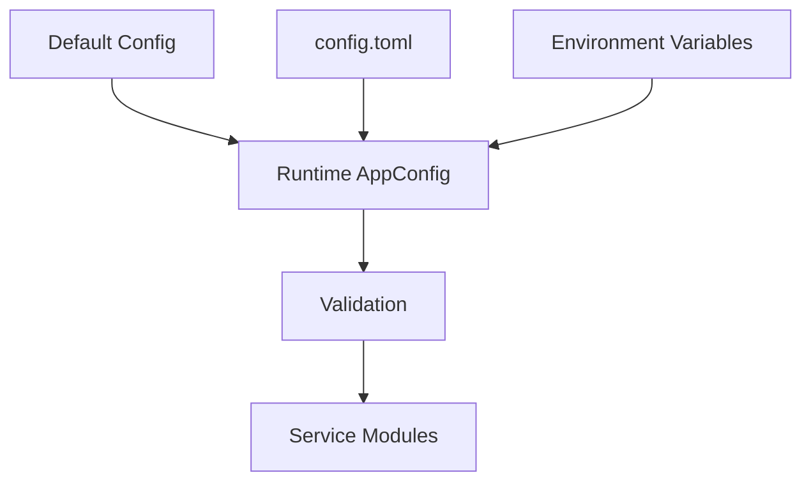
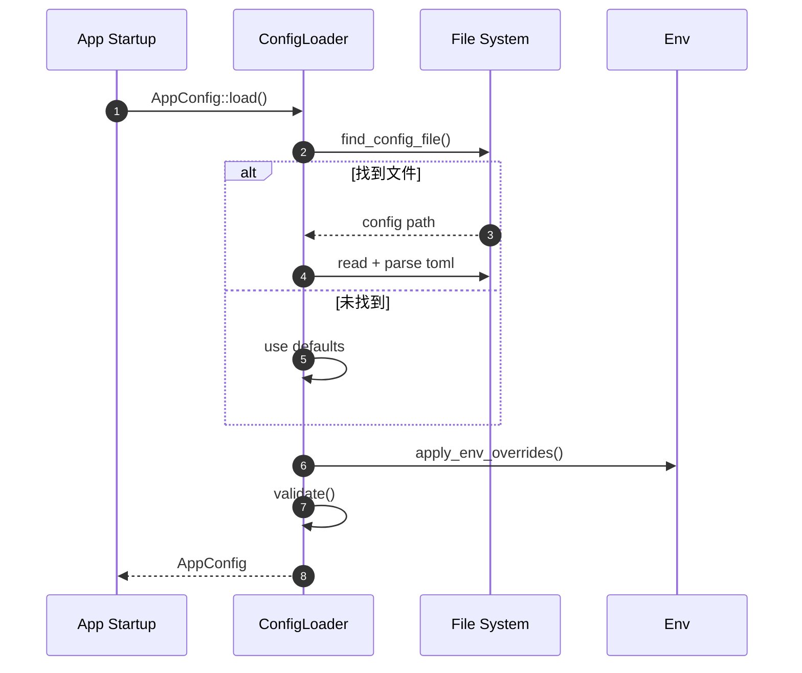
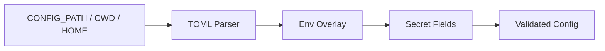

# 03 · 配置管理

> TOML 文件 + 环境变量覆盖 + 多路径查找 + 敏感密钥自动生成。

## 适用场景

- 后端服务需要 12-factor 式配置（一份代码，多环境部署）
- 需要本地 `config.toml` 开发、生产用环境变量注入
- 首次初始化希望自动生成 JWT/AES 等安全密钥

## 核心模型

```
优先级（高 → 低）
  1. 环境变量      PORT / SERVER__PORT
  2. config.toml  [server] port = 3400
  3. Default      impl Default for ServerConfig
```

## 配置系统架构图



## 加载流程图



## 配置数据流



## 关键结构体

```rust
pub struct AppConfig {
    pub server: ServerConfig,
    pub database: DatabaseConfig,
    pub redis: RedisConfig,
    pub auth: AuthConfig,
    pub security: SecurityConfig,
}

pub struct SecurityConfig {
    pub aes_key: String,
    pub aes_iv: String,
    pub token_secret: String,
}
```

> 注：文档/注释里提到的「命令行参数最高优先级」在当前代码中**未实现**，实际优先级如上。

## 配置文件查找链

`AppConfig::find_config_file()`（`apps/admin-config/src/app_config.rs:115`）按序查找：

| # | 路径 | 用途 |
|---|------|------|
| 1 | `$CONFIG_PATH` | 容器 / CI 显式指定 |
| 2 | `$CARGO_MANIFEST_DIR/config.toml` | 当前 crate 目录 |
| 3 | `./config.toml` | 当前工作目录 |
| 4 | workspace 根（向上找含 `[workspace]` 的 Cargo.toml） | monorepo 统一配置 |
| 5 | `~/.config/admin-config/config.toml` | 用户级全局配置 |

全找不到时**降级为 Default + 环境变量**，只 warn 不 panic（`app_config.rs:78`）。

**复用要点**：多路径查找让开发/测试/部署都能零配置启动；`CONFIG_PATH` 是容器部署的逃生门。

## 环境变量双轨命名

同一配置项支持**简写**和**层级**两种写法，简写优先：

```rust
// apps/admin-config/src/app_config.rs:214
if let Ok(port) = std::env::var("PORT").or_else(|_| std::env::var("SERVER__PORT"))
    && let Ok(p) = port.parse()
{
    self.server.port = p;
}
```

| 配置项 | 简写 | 层级（`__` 分隔） |
|--------|------|-------------------|
| 服务端口 | `PORT` | `SERVER__PORT` |
| Redis 主机 | `REDIS_IP` | `REDIS__HOST` |
| Mongo 用户 | `MONGODB_USER` | `DATABASE__MONGODB__USERNAME` |
| 腾讯云 COS | `COS_SECRET_ID` | `COS__TENCENT__SECRET_ID` |
| JWT 密钥 | `TOKEN_SECRET` | `AUTH__TOKEN_SECRET` |

层级规则：**段全大写，字段名保持 TOML 原样**（`DATABASE__MONGODB__USERNAME` ↔ `[database.mongodb] username`）。

## 配置结构拆分

```
AppConfig
├── server            ServerConfig        host / port / log_level
├── database          DatabaseConfig      mongodb / mysql / postgresql / sqlite / neo4j / qdrant / seekdb
├── redis             RedisConfig         host / port / password / database
├── auth              AuthConfig          token_secret / token_expiry_hours / refresh_token_expiry_days
├── email             EmailConfig         smtp_host / smtp_port / smtp_username / smtp_password
├── sms               SmsConfig           provider / app_id / app_key（阿里/腾讯）
├── verification_code VerificationCodeConfig
├── cos               CosConfig           tencent / aliyun / aws / minio / huawei / rustfs
├── security          SecurityConfig      aes_key / aes_iv / api_key_encrypt_key / password_salt / cors / csrf
└── session           SessionConfig       secret_key / ttl
```

**复用要点**：每个子配置独立文件 + 独立 `Default` + 独立 `validate()`，可单独测试。

## 敏感密钥自动生成

首次 `cargo run -p admin-config -- init` 时，`Default` 实现随机生成：

```rust
// apps/admin-config/src/security_config.rs:49
impl Default for SecurityConfig {
    fn default() -> Self {
        Self {
            aes_key:            Self::generate_hex(32), // 64 hex = 32 bytes (AES-256)
            aes_iv:             Self::generate_hex(16), // 32 hex = 16 bytes
            api_key_encrypt_key:Self::generate_hex(32),
            password_salt:      Self::generate_hex(16),
            ...
        }
    }
}

// apps/admin-config/src/auth_config.rs:57
fn generate_token_secret() -> String {
    (0..32).map(|_| format!("{:02x}", rand::random::<u8>())).collect()
}
```

| 密钥 | 长度 | 用途 |
|------|------|------|
| `token_secret` | 64 hex (32B) | JWT 签名 |
| `session.secret_key` | 64 hex (32B) | Cookie Session |
| `aes_key` | 64 hex (32B) | AES-256 对称加密 |
| `aes_iv` | 32 hex (16B) | AES IV |
| `api_key_encrypt_key` | 64 hex (32B) | 第三方 API Key 加密 |
| `password_salt` | 32 hex (16B) | 密码哈希盐 |

校验：

```rust
// security_config.rs:83
pub fn validate(&self) -> Result<(), String> {
    if self.aes_key.len() != 64 { return Err(...); }
    if !self.aes_key.chars().all(|c| c.is_ascii_hexdigit()) { return Err(...); }
    // ...
}
```

## CLI 初始化

```bash
cargo run -p admin-config -- init [-p config.toml] [--force]
```

`apps/admin-config/src/main.rs`：已存在则报错（需 `--force`），写入后打印安全提示（勿提交 Git、生产建议用密钥管理服务）。

## 加载流程（可复用骨架）

```rust
impl AppConfig {
    pub fn load() -> Result<Self> {
        match Self::find_config_file() {
            Ok(path) => Self::load_from_path(&path),
            Err(_) => Ok(Self::default_with_env()),   // 降级不崩溃
        }
    }

    fn load_from_path(path: &Path) -> Result<Self> {
        let content = std::fs::read_to_string(path)?;
        let mut config: Self = toml::from_str(&content)?;
        config.apply_env_overrides();                  // env 覆盖 toml
        Ok(config)
    }
}
```

## 踩坑提醒

1. **密钥在 `Default` 里随机生成是双刃剑**——无 `config.toml` 时每次启动密钥都变，JWT/Session 全失效；多实例部署密钥不一致。**必须 init 写盘后持久化**，或生产环境强制走环境变量/密钥管理服务。
2. **`rand::random` 不是 OS CSPRNG**——生成密钥应优先 `getrandom` / `rand::rngs::OsRng`。当前实现可接受但不理想。
3. **`apply_env_overrides` 是手写 if-let 长链**——新增配置项容易漏写覆盖逻辑。规模变大后可抽 `overlay!` 宏，或换 `config-rs` / `figment`。
4. **找不到配置不 panic 是好事，但生产要反着来**——建议加 `strict` 模式：生产环境找不到配置直接退出，避免用默认密钥裸奔。
5. **`config.toml` 含密钥，必须进 `.gitignore`**——本项目 `.gitignore` 明确忽略 `config.toml`，保留 `config.example.toml`。

## 新项目落地清单

- [ ] 配置结构按领域拆子模块，各自 `Default` + `validate()`
- [ ] 多路径查找 + `CONFIG_PATH` 逃生门
- [ ] 环境变量双轨命名（简写 + `__` 层级）
- [ ] `init` 子命令生成密钥并打印安全提示
- [ ] `config.toml` 进 `.gitignore`，提交 `config.example.toml`
- [ ] 敏感字段校验长度 + 字符集
- [ ] 生产环境禁用「默认密钥降级」路径
