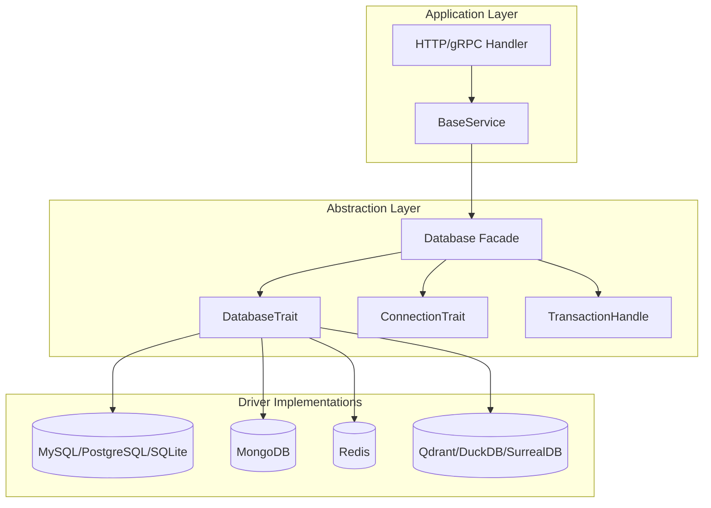
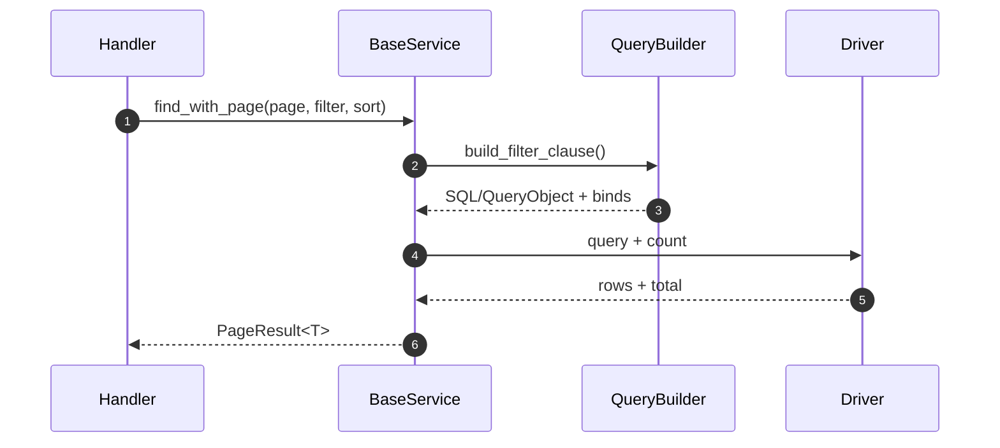
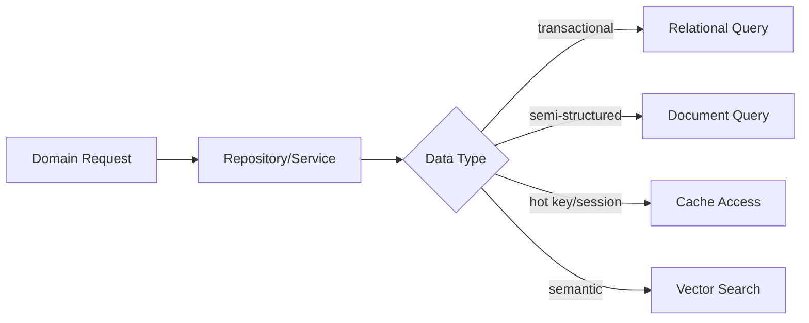

# 04 · 多数据库抽象与通用 CRUD

> 统一 Trait 擦除数据库差异、连接池分档配置、可复用的 BaseService CRUD。

## 适用场景

- 同时对接 MySQL + MongoDB + Redis + Qdrant（向量库）
- 希望业务 Service 用同一套 CRUD 接口，后端可换
- 需要软删除、分页、过滤、排序的管理后台

## 两层抽象

```
┌─────────────────────────────────────────────┐
│  BaseService<T, ID>     业务 CRUD Trait       │  ← Service 层用这个
│  insert/find/update/delete/page/filter      │
├─────────────────────────────────────────────┤
│  Database / DatabaseTrait                   │  ← admin-core 底层抽象
│  ConnectionTrait / TransactionHandle        │
├──────────┬──────────┬──────────┬────────────┤
│  MySQL   │ Postgres │  Mongo   │ Redis/...  │
└──────────┴──────────┴──────────┴────────────┘
```

## 数据库分层架构图



## 读写流程图（分页查询）



## 数据流（多数据库路由）



## 关键结构体与接口建议

```rust
pub struct QueryOptions {
    pub limit: Option<u64>,
    pub offset: Option<u64>,
    pub sort: Vec<SortField>,
}

pub struct PageResult<T> {
    pub list: Vec<T>,
    pub page: u64,
    pub page_size: u64,
    pub total: u64,
}

pub enum DbFlavor {
    Mysql,
    Postgres,
    Sqlite,
    Mongo,
    Redis,
    Duckdb,
    Qdrant,
}
```

扩展建议：

1. `DbFlavor` 用于可观测性打点，避免日志里只出现匿名连接错误。
2. `PageResult<T>` 在边界层统一，前端可复用同一分页解析逻辑。
3. 事务接口只给支持事务的驱动实现，其他驱动显式返回 `NotSupported`。

## 底层 Trait（admin-core）

`apps/admin-core/src/database/db_trait.rs` 四个 trait 组合：

```rust
// 事务句柄：Box 擦除生命周期
#[async_trait]
pub trait TransactionHandle: Send + Sync {
    async fn commit(self: Box<Self>) -> Result<(), DbError>;
    async fn rollback(self: Box<Self>) -> Result<(), DbError>;
    fn is_active(&self) -> bool;
}

// 连接管理：库/表操作 + 事务创建
#[async_trait]
pub trait ConnectionTrait: Send + Sync {
    async fn connect(&mut self) -> Result<(), DbError>;
    async fn disconnect(&mut self) -> Result<(), DbError>;
    async fn list_databases(&self) -> Result<Vec<String>, DbError>;
    async fn drop_database(&self, db_name: &str) -> Result<(), DbError>; // 内置系统库保护
    async fn begin_transaction(&self) -> Result<Box<dyn TransactionHandle>, DbError> {
        Err(DbError::TransactionError("not supported".into()))  // 默认不支持
    }
}

// CRUD + 事务内 CRUD
#[async_trait]
pub trait DatabaseTrait: Send + Sync {
    async fn query(&self, table: &str, conditions: Vec<QueryCondition>, options: QueryOptions)
        -> Result<QueryResult, DbError>;
    async fn insert(&self, table: &str, data: Row) -> Result<u64, DbError>;
    async fn update(&self, table: &str, conditions: Vec<QueryCondition>, data: Row) -> Result<u64, DbError>;
    async fn delete(&self, table: &str, conditions: Vec<QueryCondition>) -> Result<u64, DbError>;

    // 事务版本：默认返回「不支持」
    async fn insert_with_tx(&self, tx: &dyn TransactionHandle, table: &str, data: Row)
        -> Result<u64, DbError> { ... }
}

// 门面：组合连接 + 事务 + 操作
#[async_trait]
pub trait Database: Send + Sync {
    fn transaction(&mut self) -> &mut dyn TransactionTrait;
    fn database(&mut self) -> &mut dyn DatabaseTrait;
    fn db_name(&self) -> &str;
    async fn with_transaction<F, Fut, T>(&mut self, f: F) -> Result<T, DbError> { ... }
}
```

公共类型（`db_const.rs`）：

```rust
pub type Row = HashMap<String, Value>;
pub struct QueryCondition { /* And/Or/Not 组合 */ }
pub struct QueryOptions  { /* limit / offset / sort */ }
pub struct QueryResult   { rows, total }
pub enum DbError { /* thiserror：连接/查询/事务/权限 */ }
```

**设计精髓**：

| 技巧 | 效果 |
|------|------|
| trait 方法默认返回 `Err(NotSupported)` | Mongo/Redis 只实现子集即可，不必空实现 |
| `Box<dyn TransactionHandle>` | 擦除 `sqlx::Tx` / `MongoTransaction` 生命周期差异 |
| `drop_database` 内置系统库黑名单 | 防误删 `mysql`/`information_schema`/`template0` |
| `with_transaction(closure)` | 自动 commit/rollback，调用方不写样板 |

## 业务层 BaseService（admin-grpc）

`apps/admin-grpc/src/services/base_service.rs` —— 面向业务实体的完整 CRUD：

```rust
#[async_trait]
pub trait BaseService<T, ID = String>
where T: Send + Sync, ID: Send + Sync
{
    async fn insert_one(&self, data: T) -> Result<ID>;
    async fn insert_many(&self, data: Vec<T>) -> Result<Vec<ID>>;
    async fn delete_by_id(&self, id: &ID) -> Result<bool>;
    async fn delete_many(&self, ids: Vec<ID>) -> Result<u64>;
    async fn soft_delete_by_id(&self, id: &ID) -> Result<bool>;      // 置 del_flag
    async fn soft_delete_many(&self, ids: Vec<ID>) -> Result<u64>;
    async fn update_by_id(&self, id: &ID, data: T) -> Result<bool>;
    async fn update_many_by_ids(&self, ids: Vec<ID>, data: T) -> Result<u64>;
    async fn find_by_id(&self, id: &ID) -> Result<Option<T>>;
    async fn find_one(&self, filter: Vec<FilterCondition>) -> Result<Option<T>>;
    async fn find_all(&self) -> Result<Vec<T>>;
    async fn find_with_filter(&self, filter: Vec<FilterCondition>, sort: Option<Vec<SortField>>)
        -> Result<Vec<T>>;
    async fn find_with_page(&self, page_query: PageQuery,
        filter: Option<Vec<FilterCondition>>, sort: Option<Vec<SortField>>)
        -> Result<PageResult<T>>;
    async fn count(&self, filter: Option<Vec<FilterCondition>>) -> Result<u64>;
    async fn exists(&self, filter: Vec<FilterCondition>) -> Result<bool>;
}
```

配套查询 DSL：

```rust
// 分页（自带越界保护）
pub struct PageQuery { pub page: u64, pub page_size: u64 }
impl PageQuery {
    pub fn new(page: u64, page_size: u64) -> Self {
        Self { page: page.max(1), page_size: page_size.clamp(1, 100) }
    }
}

// 过滤（泛型 value，可接 String / 数字 / 数组）
pub struct FilterCondition<V = String> {
    pub field: String,
    pub operator: FilterOperator,   // Eq/Ne/Gt/Gte/Lt/Lte/In/Nin/Regex
    pub value: V,
}

// 排序
pub struct SortField { pub field: String, pub order: SortOrder }  // Asc/Desc
```

实现示例（`user_service.rs`）：

```rust
pub struct UserService { pool: MySqlPool }

impl UserService {
    fn build_filter_clause(filter: &[FilterCondition]) -> (String, Vec<String>) {
        // FilterOperator → SQL 片段 + 参数列表，参数化防注入
    }
}

#[async_trait]
impl BaseService<User, Uuid> for UserService {
    async fn find_by_id(&self, id: &Uuid) -> Result<Option<User>> {
        sqlx::query_as::<_, User>("SELECT ... FROM sys_user WHERE id = ? AND del_flag = 0")
            .bind(id).fetch_optional(&self.pool).await.map_err(Into::into)
    }
    // ...
}
```

## 连接池分档

`apps/admin-grpc/src/database/pool_config.rs`：

```rust
pub struct PoolConfig {
    pub max_connections: u32,
    pub min_connections: u32,
    pub acquire_timeout_secs: u64,
    pub idle_timeout_secs: u64,
    pub max_lifetime_secs: u64,
    pub test_before_acquire: bool,
}

impl PoolConfig {
    pub fn for_development()     -> Self { max: 10,  min: 2  }
    pub fn for_production()      -> Self { max: 50,  min: 10 }  // Default
    pub fn for_testing()         -> Self { max: 5,   min: 1, test_before_acquire: false }
    pub fn for_high_performance()-> Self { max: 100, min: 20 }
}

// 监控
pub struct PoolMetrics { size, idle, active }
impl PoolMetrics {
    pub fn usage_rate(&self) -> f64;
    pub fn is_near_capacity(&self) -> bool;   // > 80%
    pub fn display(&self) -> String;          // "Pool[size=50, active=40, idle=10, usage=80.0%]"
}
```

统一初始化入口（`apps/admin-grpc/src/database/mod.rs`）：

```rust
pub async fn init_database(config: &AppConfig)
    -> (MongoDatabase, MySqlClient, RedisClient, Key, RedisSessionStore)
{
    let mongo = init_mongo_database(config).await;
    let mysql = init_mysql_database(config).await;
    let (redis, key, store) = init_redis_and_session_store(config).await;
    (mongo, mysql, redis, key, store)
}
```

**复用要点**：连接池**只在一处初始化**，通过 Actix `web::Data` / gRPC Service 构造函数注入；严禁 handler 里临时建连。

## 多租户隔离

`apps/admin-grpc/src/database/tenant.rs` 提供：

- `TenantClient` — 租户维度的客户端包装
- `TenantNamingStrategy` — 集合/表命名策略
- `TenantResourceManager` — 租户资源生命周期
- Qdrant：`create_tenant_collection` / `get_tenant_collection_name`

**复用要点**：多租户命名策略抽成 trait，数据库层决定「共享表 + tenant_id」还是「每租户独立表/集合」。

## 踩坑提醒

1. **`FilterOperator::Regex` 在 SQL 实现里映射成 `LIKE`**——与 Mongo 的真 regex 语义不一致。跨库抽象时要么改名 `Like`，要么在文档里写清各后端行为。
2. **`In` / `Nin` 的参数展开**——`build_filter_clause` 生成 `IN (?)` 但只 bind 一个值，调用方需自己拼 `?,?,?` 或改用 sqlx 的 `query_as_with`。这是当前实现的隐患。
3. **软删除必须全局一致**——`find_by_id` 自动过滤 `del_flag = 0`，但 `find_all` / 聚合查询容易漏。建议在 BaseService 默认实现层统一注入软删条件。
4. **`PageQuery` 上限 100**——`page_size.clamp(1, 100)` 硬编码，导出类接口需单独放开或分档。
5. **事务闭包 `with_transaction` 的 `Send` 约束**——`Fut: Send` 且闭包捕获不能有 `Rc`，提前规划好所有权。
6. **不要把 `Row = HashMap<String, Value>` 直接暴露给 HTTP 层**——中间一定要有 typed Model，否则前后端字段名耦合。

## open-context 补充（桌面端场景）

相比 `code-studio` 的服务端导向抽象，`open-context` 的 `crates/database` 在数据库定位上更偏“本地工具 + 可选远程连接”：

| 维度 | code-studio | open-context |
|---|---|---|
| 关系型驱动 | `sqlx`（mysql/postgres/sqlite） | `sqlx`（mysql/postgres）+ `rusqlite`（本地） |
| 本地嵌入式 | 非主路径 | SQLite（`rusqlite` + `r2d2_sqlite`） |
| 分析型数据库 | 无 | DuckDB（`duckdb` crate） |
| 文档与缓存 | MongoDB / Redis | MongoDB / Redis |

设计启发：

1. 本地优先应用建议把“配置/状态”落到 SQLite，把“分析查询”放到 DuckDB，避免主业务库承担离线分析。
2. 当同时存在 `sqlx` 与 `rusqlite` 时，建议在仓库规范中明确分工边界：
    - `sqlx` 只服务远程业务库。
    - `rusqlite` 只服务本地状态库。
3. 数据访问层可以保留统一 Trait，但要在实现层区分“事务语义”和“连接生命周期”，避免把远程数据库假设强行套用到本地嵌入式场景。

## 新项目落地清单

- [ ] 底层：4 个 trait（Handle/Connection/Database/门面）+ `DbError` + 公共类型
- [ ] 默认方法返回 `NotSupported`，让 NoSQL 只实现子集
- [ ] 业务层：`BaseService` 15 个方法 + `PageQuery`/`FilterCondition`/`SortField`
- [ ] 连接池分档（dev/prod/test/high-perf）+ 指标
- [ ] 统一 `init_database`，一处建连
- [ ] 软删除条件在 Service 基类统一注入
- [ ] 多租户命名策略抽象
