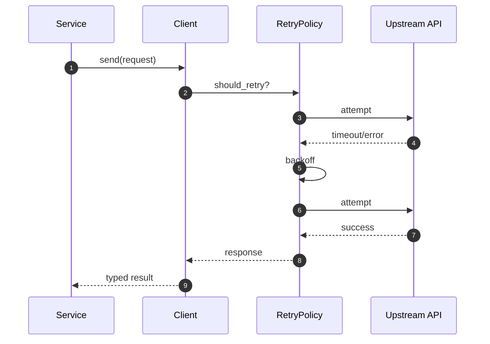

# 05 · 网络客户端封装

> HTTP / WebSocket / TCP / UDP / SSE 统一 Builder、超时重试、TLS 配置。

## 适用场景

- 对接第三方 API，需要可复用的客户端而不是裸 `reqwest`
- 希望超时、重试、认证、代理一次配置处处生效
- 需要 SSE 流式、WebSocket 长连接、裸 TCP/UDP

## 统一骨架

`apps/admin-core/src/client/` 五种客户端共享同一套模式：

```
client/
├── config.rs      RetryConfig / TlsConfig / 超时常量
├── http.rs        HttpClient + HttpClientBuilder
├── websocket.rs   WebSocketClient + WebSocketHandle（auto-ping）
├── tcp.rs         TcpClient + TcpClientBuilder
├── udp.rs         UdpClient + UdpClientBuilder
└── sse.rs         SseClient + SseEvent（reconnect / last_event_id）
```

## 网络能力架构图


## 请求流程图（带重试）



## 关键结构体（网络层）

```rust
pub struct TransportConfig {
    pub connect_timeout_ms: u64,
    pub read_timeout_ms: u64,
    pub write_timeout_ms: u64,
    pub retry: RetryConfig,
    pub tls: TlsConfig,
}

pub struct Endpoint {
    pub method: String,
    pub url: String,
    pub headers: Vec<(String, String)>,
}
```

每个客户端 = **Builder（fluent `with_*`）+ 主体（异步方法）+ `AnyResult` 错误**。

## 公共配置

```rust
// apps/admin-core/src/client/config.rs
// 超时默认值
const CONNECT_TIMEOUT: Duration = Duration::from_secs(10);
const READ_TIMEOUT:    Duration = Duration::from_secs(30);
const WRITE_TIMEOUT:   Duration = Duration::from_secs(30);
const BUFFER_SIZE:     usize = 8 * 1024;

// 重试策略
pub struct RetryConfig {
    pub max_retries: u32,          // 默认 3
    pub initial_delay: Duration,   // 默认 100ms
    pub max_delay: Duration,       // 默认 10s
    pub backoff_multiplier: f64,   // 默认 2.0
}
impl RetryConfig {
    pub fn no_retry() -> Self;
    pub fn delay_for_attempt(&self, attempt: u32) -> Duration;  // min(base * 2^n, max)
}
```

**复用要点**：重试退避公式统一在 `delay_for_attempt`，避免各处自己写 `sleep`。

## HTTP 客端（最常用）

```rust
// apps/admin-core/src/client/http.rs
pub struct HttpClientBuilder {
    timeout, connect_timeout, headers, bearer_token, basic_auth,
    user_agent, retry_config, accept_invalid_certs,
}

// fluent 构建
let client = HttpClient::builder()
    .bearer_token("my-token")
    .timeout(Duration::from_secs(60))
    .retry(RetryConfig::default())
    .build()?;

// 泛型反序列化
let data: MyResponse = client.get("https://api.example.com/data").await?;
let resp: ApiResponse = client.post("https://api.example.com/users", &user).await?;
// 还有 put / delete / send_with_retry
```

关键能力：

| 能力 | 实现 |
|------|------|
| 认证 | `bearer_token` / `basic_auth` / 自定义 header |
| 重试 | `send_with_retry`（要求 Request 可 clone） |
| TLS | `accept_invalid_certs`（仅测试用） |
| 超时 | `tokio::time::timeout` + reqwest 自带双超时 |

## SSE 客户端

```rust
// apps/admin-core/src/client/sse.rs
pub struct SseClient { ... }
pub struct SseEvent { pub event, pub data, pub id, pub retry }

// 支持
// - 自动重连（reconnect）
// - last_event_id 断点续传
// - 回调式 / Stream 式消费
```

**复用要点**：SSE 与 AI 流式（见文档 08）可共用底层；关键是「事件边界切分 + 断线续传 id」。

## WebSocket / TCP / UDP

```rust
// WS：支持 auto_ping 心跳
let ws = WebSocketClient::builder().url("wss://...").build()?;
let handle: WebSocketHandle = ws.connect().await?;

// TCP / UDP：统一 Builder + 超时包裹
let tcp = TcpClient::builder().addr("127.0.0.1:9000").build()?;
let udp = UdpClient::builder().bind("0.0.0.0:0").build()?;
```

UDP 的 IO 用 `tokio::time::timeout` 包裹（`udp.rs:137`），避免 datagram 丢包导致永久挂起。

## 交叉关注点对照

| 关注点 | HTTP | WS | TCP | UDP | SSE |
|--------|------|----|-----|-----|-----|
| Builder | ✅ | ✅ | ✅ | ✅ | ✅ |
| 超时 | ✅ | ✅ | ✅ | ✅ | 读超时 |
| 重试 | ✅ | 重连 | — | — | 自动重连 |
| 认证 | Bearer/Basic | header | — | — | header |
| TLS | rustls | rustls | — | — | rustls |

## 踩坑提醒

1. **`send_with_retry` 要求 Request 可 clone**——流式 body（`Body::wrap_stream`）无法重试。需要重试的请求务必用完整 buffer body。
2. **`accept_invalid_certs(true)` 别带到生产**——只在 `cfg(test)` 或显式 dev 配置里打开。
3. **超时要分「连接」和「读写」**——只设一个全局 `timeout` 会在长流式响应上误杀。
4. **SSE 重连要带 `Last-Event-ID`**——否则断线会丢事件；服务端需支持按 id 续传。
5. **UDP 无连接，必须自己处理超时和乱序**——`timeout` 只解决挂起，不解决可靠性。

## 新项目落地清单

- [ ] `RetryConfig` / `TlsConfig` 独立模块，全客户端共享
- [ ] 每个客户端：Builder + 主体分离，fluent `with_*`
- [ ] HTTP 提供泛型 `get/post/put/delete` + `send_with_retry`
- [ ] SSE 支持 reconnect + last_event_id
- [ ] WS 支持 auto_ping
- [ ] 所有 IO 走 `tokio::time::timeout`
- [ ] 错误统一 `AnyResult` / 自定义 `TransportError`
