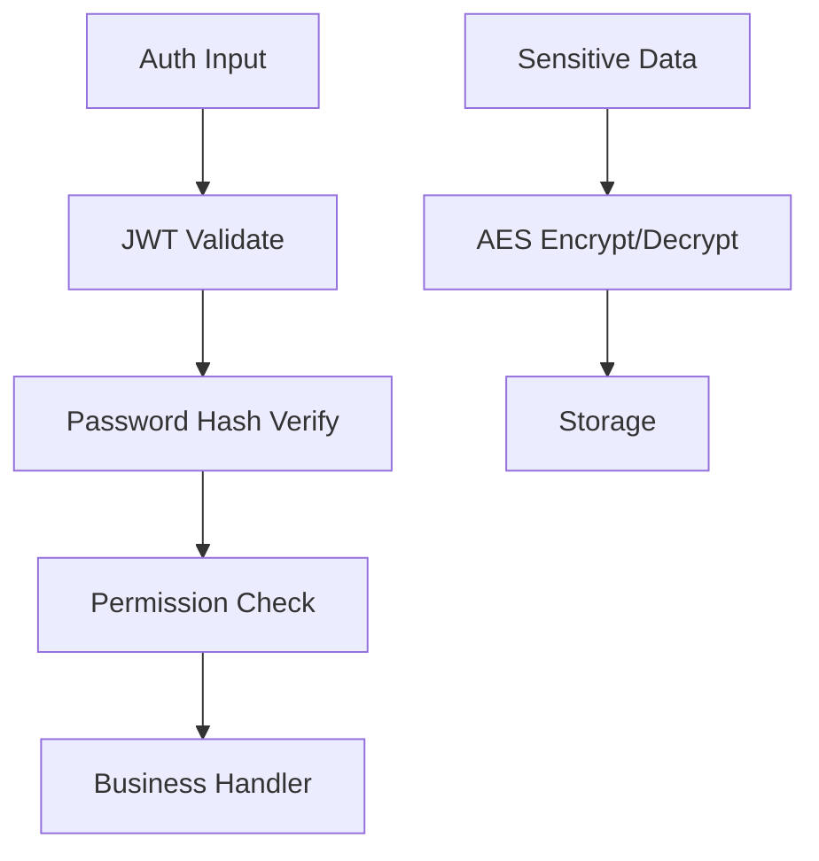
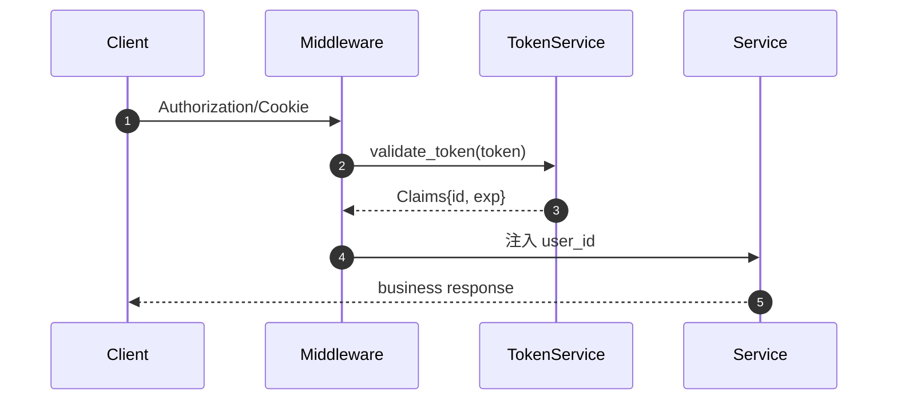
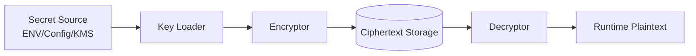

# 06 · 安全与编解码

> JWT / 密码哈希 / AES / Base64-Hex / 分库分表路由 —— 可复用的安全工具集。

## 适用场景

- 登录认证（JWT 签发与校验）
- 密码存储（Argon2 / SHA-256）
- 敏感字段加密（API Key、支付凭证）
- 大数据量分库分表路由

## 模块地图

```
apps/admin-core/src/codec/
├── hash_token.rs        JWT + 密码编码
├── argon2.rs            Argon2 密码哈希
├── base64.rs            Base64 / 图片 data-URI / 流式
├── hex.rs               Hex 编解码 + 校验
├── url_search_params.rs URI 编解码 / 查询串
└── split_database.rs    分库分表路由策略
```

## 安全能力架构图



## 认证流程图



## 密钥与密文数据流



## 关键结构体（安全域）

```rust
pub struct Claims {
    pub id: String,
    pub exp: usize,
}

pub struct SecurityConfig {
    pub token_secret: String,
    pub aes_key: String,
    pub aes_iv: String,
    pub api_key_encrypt_key: String,
}
```

## JWT Token

```rust
// apps/admin-core/src/codec/hash_token.rs
#[derive(Debug, Serialize, Deserialize)]
pub struct Claims {
    pub id: String,   // 用户 ID
    pub exp: usize,   // 过期时间戳
}

pub fn generate_token(user_id: &str, secret: &str) -> AnyResult<String>;
pub fn validate_token(token: &str, secret: &str) -> AnyResult<Claims>;
```

要点：
- 算法 HS256（`jsonwebtoken::Algorithm::HmacSha256`）
- 过期时间在生成侧写入 `exp`
- 校验只验签名 + 过期，业务权限另查

```rust
// 应用侧典型用法（HTTP 中间件）
match hash_token::validate_token(&token, &token_secret) {
    Ok(claims) => { /* claims.id = user_id */ }
    Err(err)   => { /* 401 */ }
}
```

**复用要点**：`Claims` 保持最小（id + exp），别塞权限/角色——会过期不同步。权限放业务层查。

## 密码哈希（两套）

| 函数 | 算法 | 用途 |
|------|------|------|
| `hash_password` / `verify_password`（`argon2.rs`） | Argon2 | **推荐**：登录密码 |
| `encode_password` / `verify_password`（`hash_token.rs`） | SHA-256 | 兼容旧系统 / 非安全场景 |

```rust
// 推荐路径
use admin_core::{hash_password, verify_password};
let hash = hash_password("my_password")?;
let ok   = verify_password("my_password", &hash);
```

**复用要点**：新系统一律 Argon2；SHA-256 无盐无慢哈希，只做兼容保留。

## 对称加密（AES）

配合 `admin-config` 的 `SecurityConfig`：

```rust
// SecurityConfig 生成
aes_key             // 32 bytes (AES-256)
aes_iv              // 16 bytes
api_key_encrypt_key // 32 bytes（专用于 API Key 加密）
```

| 字段 | 用途 | 算法 |
|------|------|------|
| `aes_key` + `aes_iv` | 通用对称加密 | AES-256-CBC/GCM |
| `api_key_encrypt_key` | 第三方 API Key 落库加密 | AES-256-GCM |

**复用要点**：加密密钥与业务密钥分离；API Key 用独立密钥，轮换不影响主密钥。

## 编解码工具

```rust
// Base64
base64_encode / base64_decode
// 图片 data-URI 存取、流式落盘

// Hex
hex_encode / hex_decode

// URL
UrlSearchParams::new().append("q", "hello").to_string()
```

## 分库分表路由

`apps/admin-core/src/codec/split_database.rs` 提供 4 种策略：

```rust
pub trait ShardStrategy {
    fn route(&self, key: &str) -> usize;
}

pub struct HashShardStrategy;          // 哈希取模
pub struct ModuloShardStrategy;        // 直接取模（数字 key）
pub struct RangeShardStrategy;         // 区间路由
pub struct ConsistentHashStrategy;     // 一致性哈希（带虚拟节点）

// 路由器
pub struct ShardRouter;                // strategy + 分片数 → shard_id
pub struct DbTableRouter;              // shard_id → db_x.t_y
```

```rust
// 典型用法
let router = ShardRouter::new(
    Box::new(ConsistentHashStrategy::new(160)), // 160 虚拟节点
    16,                                          // 16 分片
);
let shard = router.route("user_12345");         // → 0..15
let table = DbTableRouter::table_name(shard);   // → "t_07"
```

| 策略 | 优点 | 缺点 | 适用 |
|------|------|------|------|
| Hash | 均匀 | 扩容需迁移 | 通用 |
| Modulo | 简单快速 | 扩容雪崩 | 数字 ID |
| Range | 范围查询友好 | 热点集中 | 时间序列 |
| ConsistentHash | 扩容仅迁移 1/N | 实现复杂 | 缓存 / 高频扩缩容 |

## Shell / Git / Docker（附）

```
apps/admin-core/src/shell/
├── run_cmd.rs            run_cmd / run_cmd_quiet
├── git_info.rs           get_git_branch_name / get_git_commit_id / get_git_info
└── docker_image_name.rs  get_docker_image_name / get_docker_tag_name
```

CI 里打镜像 tag：`get_docker_tag_name()` = 分支 + commit + 时间戳。

## 踩坑提醒

1. **JWT `Claims` 别放权限**——权限变更后旧 token 仍有效。`id + exp` 足够。
2. **密码哈希别用 SHA-256**——太快，易被 GPU 撞库。Argon2id / bcrypt 才对。
3. **`rand::random` 生成密钥不够强**——生产密钥用 `OsRng` / `getrandom`。
4. **AES IV 每次加密必须新生成**——固定 IV 会泄露相同明文。落库时 IV 与密文一起存。
5. **一致性哈希虚拟节点数要够**——少于 ~100 时分布不均。
6. **分片数一旦定了别轻易改**——Hash/Modulo 扩容要全量迁移；预估好再上。

## 新项目落地清单

- [ ] JWT：`Claims { id, exp }` + generate/validate
- [ ] 密码：Argon2 为主，SHA-256 仅兼容
- [ ] 加密：主密钥 + API Key 独立密钥
- [ ] 编解码：base64 / hex / url 一把梭
- [ ] 分片：按业务选 Hash / ConsistentHash
- [ ] 密钥用 OsRng 生成
- [ ] IV 随机化
