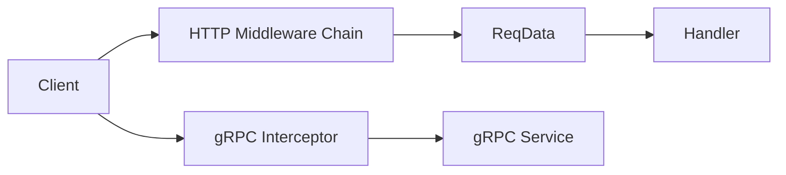
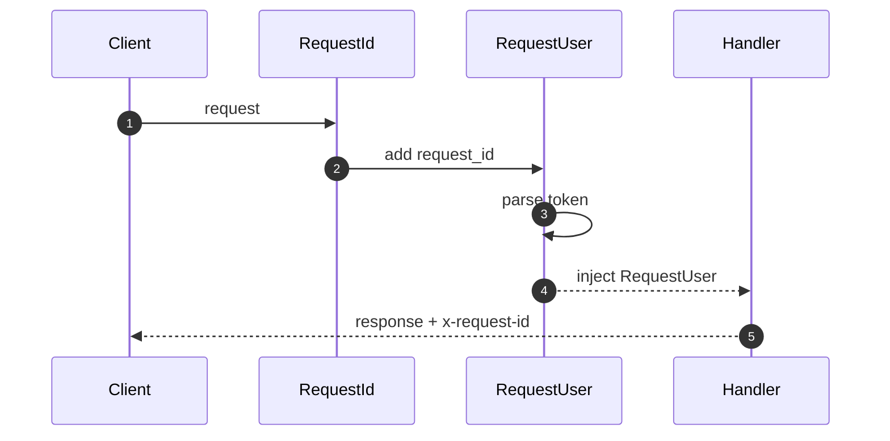
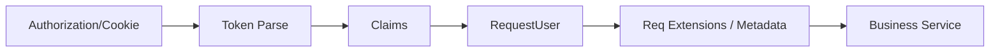

# 07 · 中间件与鉴权

> Actix-Web 中间件链 + Tonic gRPC 拦截器：请求追踪、身份注入、公开路由白名单。

## 适用场景

- HTTP API 需要统一鉴权、请求 ID、客户端识别
- gRPC 服务需要 metadata 级鉴权与链路追踪
- 公开接口（登录、健康检查）需要绕过鉴权

## HTTP 中间件链

`apps/admin-server/src/middlewares/`：

| 中间件 | 文件 | 职责 |
|--------|------|------|
| `RequestIdMiddleware` | `actix_request_id.rs` | 生成/透传 `x-request-id` |
| `RequestClientMiddleware` | `actix_request_client.rs` | 解析 UA / IP / 设备 |
| `RequestUserMiddleware` | `actix_request_user.rs` | Token 验证 → 注入 `RequestUser` |
| `ResponseTimeMiddleware` | `actix_response_time.rs` | 响应耗时统计 |

注册（**顺序敏感**）：

```rust
// apps/admin-server/src/server/app_server.rs:35
App::new()
    .app_data(web::Data::new(app_config_clone.clone()))
    .app_data(web::Data::new(app_state.clone()))
    .app_data(web::Data::new(mongo_client.clone()))
    .app_data(web::Data::new(mysql_client.clone()))
    .app_data(web::Data::new(redis_client.clone()))
    .wrap(Cors::default().allow_any_origin().allow_any_method())
    .wrap(SessionMiddleware::builder(store.clone(), actix_session_key.clone()).build())
    .wrap(RequestIdMiddleware)        // ← 后 wrap 的先执行
    .wrap(RequestClientMiddleware)
    .wrap(RequestUserMiddleware)      // ← 最贴近业务
    .route("/", web::get().to(handle_index))
    .configure(api::config)
```

## 鉴权架构图（HTTP + gRPC）



## 中间件执行流程图



## 请求上下文数据流



## 关键结构体

```rust
pub struct RequestUser {
    pub id: String,
    pub token: String,
}

pub struct TraceContext {
    pub request_id: String,
    pub trace_id: Option<String>,
}
```

执行顺序：`RequestId → RequestClient → RequestUser → Handler`（后注册先生效）。

## 请求 ID

```rust
// apps/admin-server/src/middlewares/actix_request_id.rs
// 1. 优先从 query 取 ?x-request-id=xxx
// 2. 否则 get_random_nonce() 生成
// 3. 写入响应头 x-request-id
```

**复用要点**：支持上游透传 + 自动兜底生成；响应头回写方便前端报障对账。

## 鉴权中间件（HTTP）

```rust
// apps/admin-server/src/middlewares/actix_request_user.rs
pub struct RequestUser {
    pub id: String,
    pub token: String,
}

// Token 来源优先级：query > Authorization: Bearer > Cookie
fn extract_auth_info(req: &ServiceRequest) -> (String, String, String);

// 中间件主体
fn call(&self, req: ServiceRequest) -> Self::Future {
    // 1. 公开路径白名单
    if uri.contains("/public") || uri.len() <= 1 {
        return self.service.call(req);   // 直接放行
    }
    // 2. 取 token_secret
    // 3. 验证 token → RequestUser 写入 extensions
    // 4. 失败 → 401
}
```

Handler 侧用 `ReqData<RequestUser>` 自动提取：

```rust
pub async fn create_user(
    req_user: ReqData<RequestUser>,   // FromRequest，取 extensions
) -> impl Responder {
    // req_user.id 已就绪
}
```

### 公开路径白名单

当前用 `uri.contains("/public")` 判断（`actix_request_user.rs:128`）：

```
GET /api/users/public/find/{id}   ← 公开
POST /api/users/create            ← 需鉴权
```

**复用要点**：路径约定 `/public` 前缀绕过鉴权，简单粗暴但够用；更严格的项目建议路由元数据标注 `#[auth(skip)]`。

### 开发模式跳过

```rust
// actix_request_user.rs:52
if cfg!(debug_assertions) && token.is_empty() {
    return Ok(RequestUser { id: "dev_user", token: "dev_token" });
}
```

**复用要点**：`cfg!(debug_assertions)` 保证 release 构建绝对不含此分支。

## gRPC 拦截器

`apps/admin-grpc/src/server/auth_interceptor.rs` 提供两级拦截：

```rust
// 1. 完整拦截：trace_id + JWT 鉴权
pub fn common_interceptor<T>(mut req: Request<T>, auth_config: &AuthConfig)
    -> Result<Request<T>, Status>
{
    let trace_id = handle_trace_id(&mut req)?;           // 透传/生成 x-trace-id
    let token = req.metadata().get("authorization")...;  // Bearer xxx
    match verify_token(token, auth_config) {
        Ok(claims) => {
            req.metadata_mut().insert("x-login-user-id", ...);  // 注入用户
        }
        Err(_) => return Err(Status::unauthenticated("token is invalid")),
    }
    Ok(req)
}

// 2. 轻量拦截：仅 trace_id（登录等免鉴权接口）
pub fn trace_id_interceptor<T>(mut req: Request<T>) -> Result<Request<T>, Status>;
```

注册（`grpc_server.rs:36`）：

```rust
Server::builder()
    .add_service(GrpcUserServiceServer::with_interceptor(
        user_service, auth_interceptor_fn,      // 需鉴权
    ))
    .add_service(GrpcAuthServiceServer::with_interceptor(
        auth_service, trace_id_interceptor_fn,  // 免鉴权（登录）
    ))
    .serve(addr)
    .await?;
```

Service 侧提取上下文：

```rust
pub fn extract_trace_id<T>(req: &Request<T>) -> String;
pub fn extract_login_user_id<T>(req: &Request<T>) -> String;
```

## HTTP 与 gRPC 鉴权对照

| 维度 | HTTP | gRPC |
|------|------|------|
| Token 位置 | query / Authorization / Cookie | metadata `authorization` |
| 上下文载体 | `req.extensions()` | metadata `x-login-user-id` |
| 链路 ID | `x-request-id` | `x-trace-id` |
| 提取方式 | `ReqData<RequestUser>` | `extract_login_user_id(&req)` |
| 免鉴权 | 路径含 `/public` | 换轻量 interceptor |
| 失败 | `ErrorUnauthorized` | `Status::unauthenticated` |

**复用要点**：两套协议共用同一 JWT 密钥与 `validate_token`，身份语义一致。

## 中间件实现骨架（Actix）

```rust
pub struct MyMiddleware;

impl<S, B> Transform<S, ServiceRequest> for MyMiddleware
where
    S: Service<ServiceRequest, Response = ServiceResponse<B>, Error = Error>,
    S::Future: 'static,
    B: 'static,
{
    type Response = ServiceResponse<B>;
    type Error = Error;
    type Transform = MyMiddlewareService<S>;
    type InitError = ();
    type Future = Ready<Result<Self::Transform, Self::InitError>>;

    fn new_transform(&self, service: S) -> Self::Future {
        ready(Ok(MyMiddlewareService { service }))
    }
}

pub struct MyMiddlewareService<S> { service: S }

impl<S, B> Service<ServiceRequest> for MyMiddlewareService<S> {
    fn call(&self, req: ServiceRequest) -> Self::Future {
        // 前置逻辑
        let fut = self.service.call(req);
        Box::pin(async move {
            let mut res = fut.await?;
            // 后置逻辑（改响应头等）
            Ok(res)
        })
    }
}
```

## 踩坑提醒

1. **`wrap` 顺序反了就全乱**——鉴权必须在 Session 之后、业务之前。加新中间件时先想清楚执行序。
2. **`uri.contains("/public")` 可能误伤**——`/api/publicity` 也会被放行。建议改为前缀匹配 `starts_with("/api") && path contains "/public/"`。
3. **开发模式跳过鉴权要 `cfg!(debug_assertions)`**——别用运行时 `if cfg!(dev)`，编译期就剔除更安全。
4. **gRPC metadata 值必须是 ASCII**——`AsciiMetadataValue::try_from`，非 ASCII 用户名要先编码。
5. **`token_secret` 取不到时有默认兜底**——`actix_request_user.rs:141` 会用硬编码默认值，生产环境等于裸奔。应改为 panic 或从配置强约束。
6. **trace_id 与 request_id 未打通**——HTTP 用 `x-request-id`，gRPC 用 `x-trace-id`，跨层调用会断链。建议统一命名或做映射。

## 新项目落地清单

- [ ] 中间件：RequestId → Client → User → Handler
- [ ] Token 来源：query / Header / Cookie 三级
- [ ] 公开路径白名单（路径前缀而非 contains）
- [ ] `ReqData<T>` / `FromRequest` 提取上下文
- [ ] gRPC 两级 interceptor（鉴权 / 免鉴权）
- [ ] metadata 注入 `x-login-user-id` + `x-trace-id`
- [ ] 开发跳过鉴权用 `cfg!(debug_assertions)`
- [ ] HTTP/gRPC 链路 ID 命名统一
