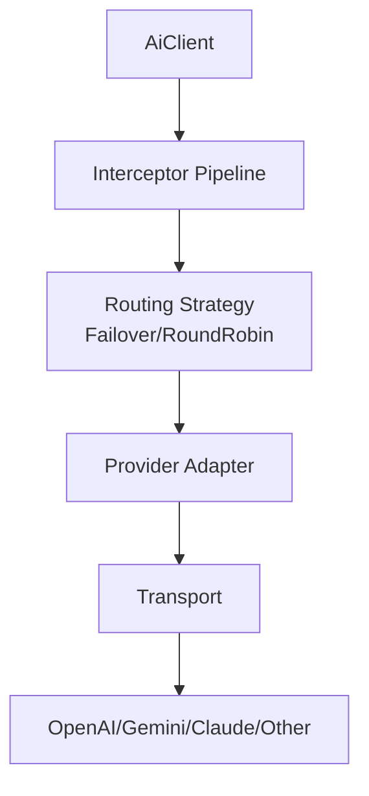
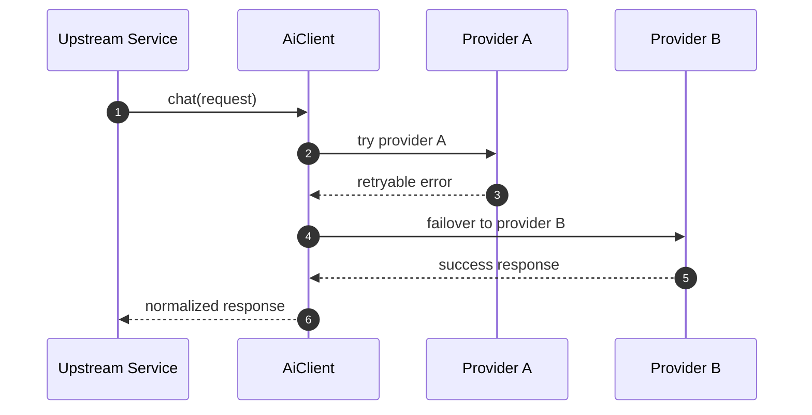

# 08 · 多厂商 AI SDK

> Provider 抽象、配置驱动接入、拦截器链、熔断限流、故障转移、SSE 流式。

## 适用场景

- 需要统一接口对接 OpenAI / Gemini / Claude / Mistral / Ollama 等 20+ 厂商
- 想要「新增一家厂商 = 一份配置」而不是重写适配器
- 需要生产级弹性：重试、熔断、限流、故障转移、用量追踪

## 整体分层

```
┌──────────────────────────────────────────────────────┐
│  client        AiClient / AiClientBuilder / Provider  │  用户入口
├──────────────────────────────────────────────────────┤
│  api           ChatApi / ChatProvider trait           │  能力契约
├──────────────────────────────────────────────────────┤
│  provider      适配器 + 策略 + 配置                    │
│    ├─ openai / gemini / mistral / cohere / ...        │  协议特异
│    ├─ generic (GenericAdapter + FieldMapping)         │  配置驱动
│    └─ strategies (failover / round_robin / health)     │  路由策略
├──────────────────────────────────────────────────────┤
│  interceptors  retry / timeout / rate_limit / breaker │  横切钩子
│  resilience    circuit_breaker / rate_limiter / error  │  弹性原语
├──────────────────────────────────────────────────────┤
│  transport     HttpTransport / DynHttpTransport       │  可注入传输层
│  sse           SSE / JSONL 流式解析                    │
│  types         Request / Response / Error / Tool       │  统一领域模型
└──────────────────────────────────────────────────────┘
```

## 多 Provider 架构图



## 调用流程图（带故障转移）



## 数据流（统一请求到统一响应）


## 关键结构体

```rust
pub struct ProviderConfig {
    pub base_url: String,
    pub api_key_env: String,
    pub chat_endpoint: String,
    pub chat_model: String,
}

pub struct ChatCompletionRequest {
    pub model: String,
    pub messages: Vec<Message>,
    pub tools: Option<Vec<Tool>>,
}

pub struct ChatCompletionResponse {
    pub choices: Vec<Choice>,
    pub usage: Usage,
}
```

## 统一契约：ChatProvider

```rust
// apps/admin-ai/src/provider/chat_provider.rs
#[async_trait]
pub trait ChatProvider: Send + Sync {
    fn name(&self) -> &str;

    async fn chat(&self, request: ChatCompletionRequest)
        -> Result<ChatCompletionResponse, AiError>;

    async fn stream(&self, request: ChatCompletionRequest)
        -> Result<Box<dyn Stream<Item = Result<ChatCompletionChunk, AiError>> + Send + Unpin>, AiError>;

    async fn list_models(&self) -> Result<Vec<String>, AiError>;
    async fn get_model_info(&self, model_id: &str) -> Result<ModelInfo, AiError>;
    async fn batch(&self, requests: Vec<ChatCompletionRequest>, concurrency_limit: Option<usize>)
        -> Result<Vec<Result<ChatCompletionResponse, AiError>>, AiError>;
}
```

**设计精髓**：Failover / RoundRobin **也实现同一个 trait**，策略与适配器可任意嵌套：

```
FailoverProvider [ RoundRobin [ openai, azure ], gemini ]
```

`AdapterProvider` 给 `Box<dyn ChatProvider>` 补 `name`，统一包装：

```rust
pub struct AdapterProvider {
    name: String,
    inner: Box<dyn ChatProvider>,
}
```

## 两层厂商接入策略

### 1. 配置驱动（17+ 家）—— GenericAdapter

```rust
// apps/admin-ai/src/provider/config.rs
pub struct ProviderConfig {
    pub base_url: String,              // https://api.example.com
    pub api_key_env: String,           // 环境变量名，不存明文密钥
    pub chat_endpoint: String,         // /chat/completions
    pub chat_model: String,            // 默认模型
    pub multimodal_model: Option<String>,
    pub upload_endpoint: Option<String>,
    pub upload_size_limit: Option<u64>,
    pub models_endpoint: Option<String>,
    pub headers: HashMap<String, String>,
    pub field_mapping: FieldMapping,
}

pub struct FieldMapping {
    pub messages_field: String,                    // "messages" | "contents"
    pub model_field: String,                       // "model"
    pub role_mapping: HashMap<String, String>,     // System→system, ...
    pub response_content_path: String,             // "choices.0.message.content"
}

impl ProviderConfig {
    pub fn openai_compatible(base_url, api_key_env, chat_model, multimodal_model) -> Self;
    pub fn openai_compatible_default(base_url, api_key_env) -> Self;
    pub fn validate(&self) -> Result<(), AiError>;
}
```

**新厂商 = 一份 TOML/配置**，零代码接入（只要 OpenAI 兼容）。

### 2. 协议特异（6 家）—— 独立适配器

| 厂商 | 差异点 | 适配器 |
|------|--------|--------|
| OpenAI | 基准协议 | `openai.rs` |
| Gemini | `contents` / `:generateContent` | `gemini.rs` |
| Mistral | 特有字段 | `mistral.rs` |
| Cohere | 特有字段 | `cohere.rs` |
| Perplexity | 特有字段 | `perplexity.rs` |
| AI21 | 特有字段 | `ai21.rs` |

适配器职责：**统一模型 ↔ 厂商协议**的请求/响应转换，内部复用 `FieldMapping`。

## 统一领域模型

```rust
// types/request.rs + common.rs
pub struct ChatCompletionRequest {
    pub model: String,
    pub messages: Vec<Message>,
    pub response_format: ResponseFormat,   // Text/JsonSchema/Markdown/Html/Audio/Video/Image/Custom
    pub tools: Option<Vec<Tool>>,
    pub thinking_config: Option<ThinkingConfig>,
    // ...
}

pub enum Content {
    Text(String),
    Json(serde_json::Value),
    Image(...), Audio(...), Video(...), Document(...),
    Table(...), Geospatial(...),
}

pub struct Message {
    pub role: Role,               // System / User / Assistant
    pub content: Content,
    pub function_call: Option<FunctionCall>,
}
```

```rust
// types/response.rs
pub struct ChatCompletionResponse {
    pub choices: Vec<Choice>,
    pub usage: Usage,
    pub usage_status: UsageStatus,   // Finalized | Estimated | Pending | Unsupported
}

// 取值辅助
resp.first_text() / first_json::<T>() / parsed() / validate_with(f)
```

**设计精髓**：`UsageStatus` 标注用量可信度——估算 token 不会误当真实计费。

## 错误体系（驱动一切弹性决策）

```rust
// types/error.rs
pub enum ErrorSeverity { Transient, Client, Server, Fatal }

pub enum AiError {
    ProviderError(String),
    TransportError(#[from] TransportError),
    InvalidRequest(String),
    RateLimitExceeded(String),
    AuthenticationError(String),
    ConfigurationError(String),
    NetworkError(String),
    TimeoutError(String),
    RetryExhausted(String),
    SerializationError(String),
    DeserializationError(String),
    FileError(String),
    UnsupportedFeature(String),
    ModelNotFound(String),
    InvalidModelResponse(String),
    ContextLengthExceeded(String),
}

impl AiError {
    pub fn severity(&self) -> ErrorSeverity;
    pub fn is_retryable(&self) -> bool;          // 单一判定源
    pub fn error_code_with_severity(&self) -> String;
}
```

**设计精髓**：`is_retryable()` 是重试 / 熔断 / 故障转移的**唯一判定源**，避免各处硬编码。

## 拦截器链

```rust
// apps/admin-ai/src/interceptors/mod.rs
#[async_trait]
pub trait Interceptor: Send + Sync {
    async fn on_request (&self, ctx: &RequestContext, req: &ChatCompletionRequest) {}
    async fn on_response(&self, ctx: &RequestContext, req: &ChatCompletionRequest, resp: &ChatCompletionResponse) {}
    async fn on_error   (&self, ctx: &RequestContext, req: &ChatCompletionRequest, err: &AiError) {}
}

pub struct InterceptorPipeline { interceptors: Vec<Box<dyn Interceptor>> }

impl InterceptorPipeline {
    pub fn with<I: Interceptor + 'static>(self, interceptor: I) -> Self;  // 链式

    pub async fn execute<F, Fut>(&self, ctx, req, f: F)
        -> Result<ChatCompletionResponse, AiError>
    where F: FnOnce() -> Fut, Fut: Future<Output = Result<ChatCompletionResponse, AiError>>
    {
        for ic in &self.interceptors { ic.on_request(ctx, req).await; }
        match f().await {
            Ok(r)  => { for ic in &self.interceptors { ic.on_response(...).await; } Ok(r) }
            Err(e) => { for ic in &self.interceptors { ic.on_error(...).await; } Err(e) }
        }
    }
}

// 内置
RetryInterceptor / TimeoutInterceptor / RateLimitInterceptor / CircuitBreakerInterceptor

// 预组合
create_default_interceptors() / DefaultInterceptorsBuilder
```

> ⚠️ **注意**：`InterceptorPipeline::execute` 只跑**观察钩子**，真正重试在 `RetryWrapper`。别误以为 pipeline 会重试。

## 熔断器

```rust
// circuit_breaker/state.rs
pub enum CircuitState { Closed, Open, HalfOpen }

// circuit_breaker/config.rs
pub struct CircuitBreakerConfig {
    pub failure_threshold: u32,     // 连续失败 N 次 → Open
    pub recovery_timeout: Duration, // Open 持续多久 → HalfOpen
    pub success_threshold: u32,     // HalfOpen 连续成功 N 次 → Closed
    pub request_timeout: Duration,
}

// 三档预设
CircuitBreakerConfig::production()      // fail=3, recover=60s, succ=2
CircuitBreakerConfig::development()     // fail=10, recover=15s, succ=5
CircuitBreakerConfig::conservative()    // fail=2, recover=120s, succ=5
```

状态机：

```
Closed ──失败≥threshold──► Open
  ▲                          │
  │                    recovery_timeout
  │                          ▼
  └──成功≥success_threshold── HalfOpen ──失败──► Open
```

## 限流与背压

```
rate_limiter/
├── 令牌桶      capacity + refill_rate，CAS 扣减
├── 自适应      成功 +10% / 失败激进下调（25% ~ 200%）
└── BackpressureController   tokio::Semaphore 限并发
```

## 故障转移 / 负载均衡

```rust
// strategies/failover.rs
pub struct FailoverProvider { providers: Vec<Box<dyn ChatProvider>> }
// 顺序尝试，仅对 is_retryable 错误切换，tracing 记录

// strategies/round_robin.rs
pub struct RoundRobinProvider { cursor: AtomicUsize }
// 轮询分发

// strategies/health.rs
// 对 /models 做存活探测

// 声明式组合
RoutingStrategyBuilder::new()
    .with_failover_chain([openai, azure])
    .with_round_robin_chain([gemini_a, gemini_b])
    .build()
```

## SSE 流式解析

```
sse/
├── parser.rs       SSE 事件：按 \n\n 切分 → 解析 data: → [DONE] 终止
└── jsonl_parser.rs JSONL 流（Ollama 类）
```

归一为 `ChatCompletionChunk / ChoiceDelta / MessageDelta`。

## 可观测性

```rust
// 后端无关门面 + Noop 实现
pub trait Metrics { ... }   // req / duration / p50-p99 / error_rate / cost_usd / tokens
pub trait Timer   { ... }
pub trait Tracer / Span / AuditSink

// NoopMetrics / NoopTimer —— 默认不记录敏感内容
```

## 配置热更新（接口先行）

```rust
pub trait ConfigProvider / ConfigWatcher / ConfigStream;
// ⚠️ ConfigStream::next() 当前占位（恒返回 None），接口有壳无实现

// ConnectionOptions::hydrate_with_env
// 优先级：显式 > PROVIDER_API_KEY > AI_API_KEY
```

## 最值得复用的 5 个设计决策

1. **配置驱动 GenericAdapter + FieldMapping** —— OpenAI 兼容厂商零代码接入。
2. **策略与适配器同 trait** —— Failover/RoundRobin 也是 `ChatProvider`，组合即插即用。
3. **DynHttpTransport 对象安全抽象** —— 适配器不绑 reqwest，可注入 mock 测试。
4. **错误严重度 + `is_retryable()` 单一判定源** —— 重试/熔断/故障转移共用。
5. **`UsageStatus` 标注用量可信度** —— 估算 token 不会误当真实计费。

## 踩坑提醒

1. **`ConfigStream` 是占位实现**——热更新接口有壳无用；生产要自己接文件 watcher。
2. **职责分裂：pipeline 不重试**——`InterceptorPipeline::execute` 只跑观察钩子，真正重试在 `RetryWrapper`。文档/命名要写清楚。
3. **熔断双实现**——`circuit_breaker/breaker.rs` 与 `interceptors/breaker.rs` 并存，阈值/语义易不一致。复用时收敛为一个。
4. **SSE 解析以 OpenAI chunk 为基准**——原生协议（Gemini）仍需适配器各自转换后再进 parser。
5. **`api_key_env` 存环境变量名而非密钥**——好习惯，但要保证启动时校验变量存在。

## 新项目落地清单

- [ ] `ChatProvider` trait 含 chat/stream/list_models/batch
- [ ] GenericAdapter + FieldMapping 覆盖 80% 厂商
- [ ] 协议特异厂商写独立适配器
- [ ] Failover/RoundRobin 实现同一 trait，可嵌套
- [ ] `AiError::is_retryable()` 作为弹性唯一判定源
- [ ] 拦截器三钩子 + RetryWrapper 分工明确
- [ ] 熔断三态 + 分档配置
- [ ] 令牌桶限流 + Semaphore 背压
- [ ] Usage/UsageStatus 区分估算与真实
- [ ] Metrics/Tracer 门面 + Noop 默认
