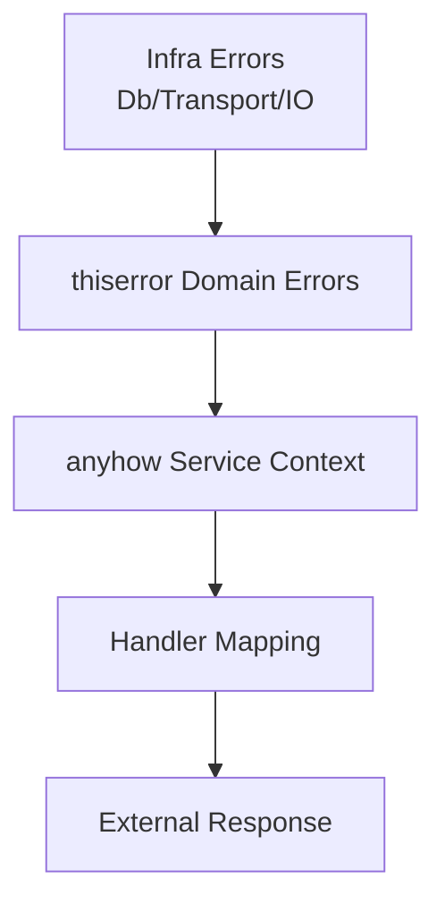
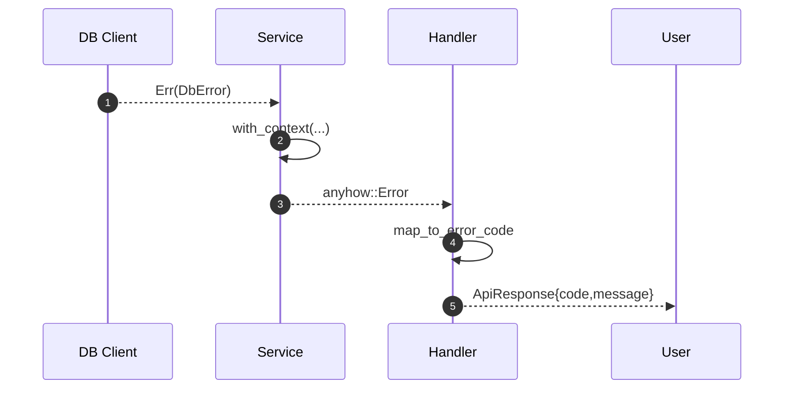

# 09 · 错误处理

> anyhow / thiserror 分层使用、错误分级、库与应用的错误边界。

## 适用场景

- Rust 库与应用混编，需要清晰的错误边界
- 错误要驱动重试/熔断等弹性决策
- 对外 API 需要稳定错误格式，对内需要完整上下文

## 双轨策略

| 场景 | 用什么 | 原因 |
|------|--------|------|
| 应用内部、快速原型 | `anyhow::Result<T>` | 灵活、加 `.context()` 即可 |
| 库公共 API、可匹配错误 | `thiserror` 枚举 | 调用方能 `match`，稳定契约 |
| 二者交界 | `#[from]` 自动转换 | 一行打通 |

## 错误体系架构图



## 错误传播流程图



## 错误数据流


## 关键结构体

```rust
pub enum ErrorSeverity {
    Transient,
    Client,
    Server,
    Fatal,
}

pub struct ErrorEnvelope {
    pub code: String,
    pub severity: ErrorSeverity,
    pub message: String,
    pub trace_id: Option<String>,
}
```

```rust
// 别名（admin-core/src/lib.rs:155）
pub type AnyResult<T> = anyhow::Result<T>;
```

## 库层：thiserror 枚举

### 数据库错误（admin-core）

```rust
// apps/admin-core/src/database/db_const.rs
#[derive(Error, Debug)]
pub enum DbError {
    #[error("connection error: {0}")]
    ConnectionError(String),
    #[error("query error: {0}")]
    QueryError(String),
    #[error("transaction error: {0}")]
    TransactionError(String),
    #[error("transaction not active: {0}")]
    TransactionNotActive(String),
    #[error("permission denied: {0}")]
    PermissionError(String),
    // ...
}
```

### AI SDK 错误（带严重度）

```rust
// apps/admin-ai/src/types/error.rs
#[derive(Debug, Clone, Copy, PartialEq, Eq)]
pub enum ErrorSeverity {
    Transient,   // 瞬态，可安全重试
    Client,      // 请求/配置问题，不重试
    Server,      // 上游问题，可退避重试
    Fatal,       // 致命，永不重试
}

#[derive(Error, Debug, Clone)]
pub enum AiError {
    #[error("Provider error: {0}")]
    ProviderError(String),
    #[error("Transport error: {0}")]
    TransportError(#[from] TransportError),
    #[error("Rate limit exceeded: {0}")]
    RateLimitExceeded(String),
    #[error("Timeout error: {0}")]
    TimeoutError(String),
    // ... 16 个变体
}

impl AiError {
    pub fn severity(&self) -> ErrorSeverity;
    pub fn is_retryable(&self) -> bool;              // 单一判定源
    pub fn error_code_with_severity(&self) -> String; // 结构化日志码
}
```

**设计精髓**：

1. **`#[from]` 自动转换** —— 子层错误无需手工 `map_err`
2. **`severity()` 分级** —— 重试/熔断/告警共用一套语义
3. **`is_retryable()` 唯一判定源** —— 避免三处硬编码 `matches!`
4. **`error_code_with_severity()`** —— 日志/指标可聚合

## 应用层：anyhow + context

```rust
// apps/admin-config/src/app_config.rs
let config_content = std::fs::read_to_string(path)
    .with_context(|| format!("无法读取配置文件: {:?}", path))?;
let mut config: Self = toml::from_str(&config_content)
    .with_context(|| "解析配置文件失败")?;
```

**复用要点**：`with_context` / `context` 给底层 IO 错误补业务语义，`?` 一路传到顶层。

## 分层错误边界

```
HTTP Handler          anyhow::Result → ApiResponse::error(msg)
   ↓                  （对外只暴露 message，不暴露内部结构）
Service               anyhow::Result<T> + .context("...")
   ↓
Database / Client     thiserror 枚举（DbError / TransportError / AiError）
```

| 层 | 返回类型 | 对外暴露 |
|----|---------|---------|
| Handler | `impl Responder` | 统一 `ApiResponse { code, message, data }` |
| Service | `anyhow::Result<T>` | 不直接对外 |
| 底层库 | `thiserror` 枚举 | 可被上层 `match` 或 `From` |

## 统一响应包装

```rust
// apps/admin-server 侧
match user_service.insert_one(user).await {
    Ok(id) => ApiResponse::success(id.to_string()),
    Err(e) => ApiResponse::error(e.to_string()),   // 只透出 message
}
```

**复用要点**：生产环境别把 `e.to_string()` 直接返回——可能泄漏 SQL / 连接串。应 log 完整错误，返回脱敏 message + 错误码。

## 错误分类对照表

| 错误类型 | Severity | 可重试 | 典型处理 |
|----------|----------|--------|---------|
| `NetworkError` | Transient | ✅ | 指数退避重试 |
| `TimeoutError` | Transient | ✅ | 重试 + 故障转移 |
| `RateLimitExceeded` | Transient | ✅ | 退避 + 限流自适应 |
| `ProviderError` | Server | 视情况 | 退避重试 / 切厂商 |
| `InvalidRequest` | Client | ❌ | 直接报错 |
| `AuthenticationError` | Client | ❌ | 重新鉴权 |
| `ConfigurationError` | Fatal | ❌ | 启动失败 / 告警 |
| `ContextLengthExceeded` | Client | ❌ | 截断上下文后重试 |
| `RetryExhausted` | Fatal | ❌ | 降级 / 告警 |

## 自定义错误骨架

```rust
use thiserror::Error;

#[derive(Error, Debug)]
pub enum MyError {
    #[error("not found: {0}")]
    NotFound(String),
    #[error("connection failed")]
    ConnectionFailed,
    #[error("io error")]
    Io(#[from] std::io::Error),
}

// 业务层
fn do_thing() -> anyhow::Result<()> {
    let data = fetch().map_err(MyError::from)?;   // 或 ? 自动
    Ok(())
}
```

## 踩坑提醒

1. **库层别用 `anyhow`**——调用方无法 `match`，只能字符串匹配。公共 API 一律 `thiserror`。
2. **`e.to_string()` 直接给前端是漏洞**——可能泄漏连接串 / SQL。log 完整、返回脱敏。
3. **`#[from]` 一个枚举只能有一个源类型**——两个变体都 `#[from] std::io::Error` 会编译失败；用 `#[error(transparent)]` 或手工 `From`。
4. **`is_retryable()` 别分散实现**——本项目 AI SDK 立了规矩：所有弹性决策走这一个方法。
5. **`DbError::TransactionNotActive` 单独变体很有用**——区分「事务不支持」与「事务已结束」，排查省一半时间。
6. **别用 `panic!` 表达业务错误**——`init_mysql_database` 里的 `.expect("failed to connect to mysql")` 会直接杀进程；生产应可配置为重试或降级。

## 新项目落地清单

- [ ] 库层 `thiserror` 枚举 + `severity()` / `is_retryable()`
- [ ] 应用层 `anyhow` + `with_context`
- [ ] `#[from]` 打通子层错误
- [ ] Handler 统一 `ApiResponse`，对外只出 message + code
- [ ] 错误分类对照表（驱动重试/熔断）
- [ ] 日志记完整错误，响应脱敏
- [ ] 禁用 `.expect()` / `panic!` 表达业务错误
