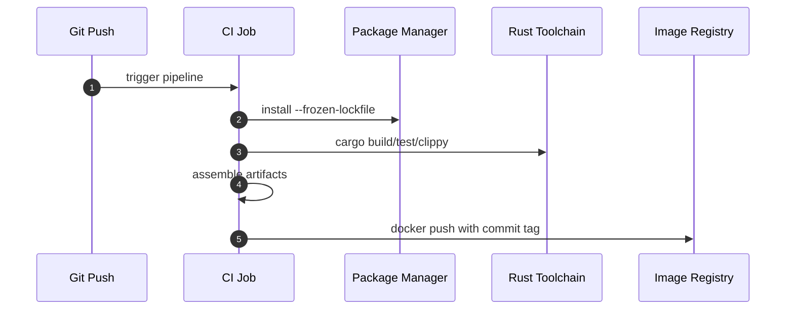
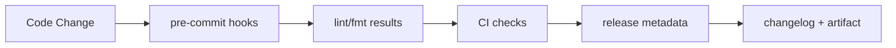

# 10 · 工程化工具链

> 双 monorepo、格式化 / Lint、Git 提交规范、CI 流水线、开发容器。

## 适用场景

- Rust + TypeScript 混合 monorepo 起步
- 想一次配好 fmt / lint / commit / release 全链路
- 需要跨平台开发环境与 CI 镜像

## 双轨 Monorepo

```
code-studio/
├── Cargo.toml              # Rust workspace（apps/admin-*）
├── package.json            # pnpm 脚本聚合
├── pnpm-workspace.yaml     # packages: apps/*
├── .editorconfig           # 跨编辑器统一
├── .rustfmt.toml / clippy.toml
├── .prettierrc / .oxlintrc.json
├── commitlint.config.cjs
├── .versionrc.json / .changelogrc.json
└── apps/
    ├── admin-*             # Rust crates
    ├── admin-app/          # TS + Tauri 前端【规划中：当前仓库未创建该目录】
    └── dev-container/      # 跨平台开发环境
```

**原则**：`pnpm` 只做任务编排，构建仍走 `cargo`；两侧 workspace 独立但脚本聚合。

## 工程化架构图


## 格式化 / Lint

### Rust

```toml
# .rustfmt.toml
max_width = 120
tab_spaces = 4
edition = "2024"
reorder_imports = true

# clippy.toml
too-many-arguments-threshold = 7
cognitive-complexity-threshold = 30
```

```bash
pnpm fmt:rs    # cargo fmt --all
pnpm lint:rs   # cargo clippy --all --fix --allow-dirty --allow-staged
```

### TypeScript

```jsonc
// .prettierrc
{
  "printWidth": 120,
  "tabWidth": 2,
  "singleQuote": true,
  "trailingComma": "none",
  "endOfLine": "lf",
  "plugins": ["prettier-plugin-tailwindcss"]
}

// .oxlintrc.json
{
  "plugins": ["unicorn", "typescript", "oxc"],
  "ignorePatterns": ["dist", "target", "build", "coverage"]
}
```

```bash
pnpm fmt:js    # prettier -w . --log-level warn
pnpm lint:js   # oxlint . --type-aware --fix
```

### .editorconfig（跨语言兜底）

```ini
root = true

[*]
indent_style = space
indent_size = 4
max_line_length = 120

[*.{js,ts,tsx,json}]
indent_size = 2
quote_style = single

[*.rs]
indent_size = 4
```

| 语言 | 格式化 | Lint | 行宽 | 缩进 |
|------|--------|------|------|------|
| Rust | rustfmt | clippy | 120 | 4 |
| TS/JS | Prettier | OxLint (type-aware) | 120 | 2 |

## Git 提交规范

### commitlint（Conventional Commits）

```js
// commitlint.config.cjs
module.exports = {
  extends: ['@commitlint/config-conventional'],
  rules: {
    'type-enum': [2, 'always', [
      'feat', 'fix', 'docs', 'style', 'refactor', 'perf',
      'test', 'build', 'ci', 'chore', 'revert',
    ]],
    'subject-case': [0],   // 关闭大小写限制
  },
};
```

### husky 钩子

```bash
# .husky/commit-msg
npx --no -- commitlint --edit "$1"

# .husky/pre-commit
pnpm fmt && pnpm lint
git update-index --again   # 把格式化结果重新入暂存
```

**复用要点**：`git update-index --again` 让 fmt 修改自动进本次提交，避免「lint 过了但提交里还是旧格式」。

### Release 与 Changelog

```json
// .versionrc.json → standard-version
// .changelogrc.json → conventional-changelog
{
  "preset": "conventionalcommits",
  "types": [
    { "type": "feat",     "section": "Features" },
    { "type": "fix",      "section": "Bug Fixes" },
    { "type": "perf",     "section": "Performance" },
    { "type": "refactor", "section": "Refactoring" },
    { "type": "docs",     "hidden": true },
    { "type": "style",    "hidden": true },
    { "type": "chore",    "hidden": true },
    { "type": "test",     "hidden": true },
    { "type": "build",    "hidden": true },
    { "type": "ci",       "hidden": true }
  ]
}
```

```bash
pnpm release          # standard-version
pnpm release:minor
pnpm changelog        # 增量 changelog
pnpm changelog:all    # 全量重建
```

## CI 流水线

> `.github/` 当前无 workflow，真实 CI 在 `apps/dev-container/ci/`。

```
apps/dev-container/ci/
├── build.sh / build.turbo.sh
├── build_for_prod.sh / build_for_static.sh
├── Cross.toml                  # 交叉编译
└── Dockerfile.*                # base / dev / feat / master / buildkit
```

典型流程：

```
1. 安装包管理器（pnpm / yarn / bun）
2. install：pnpm install --frozen-lockfile --ignore-scripts
3. build：cargo build --workspace [--release]（或 turbo）
4. 产物：拷贝 / 打 zip
5. docker build → login → tag → push
   tag = 分支 + commit + 时间戳（get_docker_tag_name）
```

## CI 执行流程图



## 工程数据流



## 关键结构体（流水线配置）

```rust
pub struct PipelineStage {
  pub name: String,
  pub commands: Vec<String>,
  pub required: bool,
}

pub struct ReleaseMeta {
  pub branch: String,
  pub commit: String,
  pub timestamp: String,
  pub version: String,
}
```

**复用要点**：

- `--frozen-lockfile` 保证 CI 与本地依赖一致
- `--ignore-scripts` 防供应链攻击
- 镜像 tag 带 commit 便于回滚
- `Cross.toml` 支持交叉编译到 Linux 目标

## 环境变量与忽略策略

### .env.example（模板）

```bash
RUST_LOG=info
PORT=3400
REDIS_HOST=localhost
REDIS_PORT=6379
MYSQL_HOST=localhost
MYSQL_PORT=3306
MONGODB_HOST=localhost
TOKEN_SECRET=change-me
# COS_SECRET_ID / COS_SECRET_KEY / ...
```

### .gitignore 关键项

```gitignore
# 依赖与构建
node_modules/  target/  dist/  build/  pkg/

# 密钥（必须）
.env  .env.*
config.toml            # 保留 config.example.toml
*.pem  *.p12  *.jks

# 生成物
*.pb.rs                # proto 生成代码
schemas/               # 生成的 schema

# 非本项目 lockfile
yarn.lock  package-lock.json
```

### .dockerignore

同步剔除：`.idea/` `.vscode/` `.github/` `**/build` `**/cache` `**/logs` `**/examples` `**/tests`。

## 开发容器 / 跨平台

```
apps/dev-container/
├── devcontainer.json    # rust:1 + node LTS
├── docker/              # 中间件 compose：mysql/pg/redis/mongodb/qdrant/neo4j/nginx
├── mac/  linux/  windows/   # 各平台 setup_env 脚本
└── ci/                  # CI 构建镜像
```

`devcontainer.json` postCreate：装 `build-essential` / `libpq` / `libmysql` / `libsqlite` / `pnpm` / `uv`。

**复用要点**：中间件用 docker compose 一键起，新人 `devcontainer` 打开即用。

## 可复用工程化清单

- [ ] pnpm workspace（`apps/*`）+ Cargo workspace 双轨
- [ ] 根 `package.json` 聚合跨语言脚本
- [ ] `.editorconfig` 全局约束 + 分语言覆盖
- [ ] Rust：rustfmt（120/4/edition2024）+ clippy 阈值
- [ ] TS：Prettier（120/2/single/无尾逗号）+ OxLint type-aware
- [ ] commitlint（config-conventional + type-enum）
- [ ] husky：`commit-msg` + `pre-commit`（fmt→lint→`git update-index --again`）
- [ ] standard-version + versionrc / changelogrc 统一分组
- [ ] `.env.example` 模板化
- [ ] `.gitignore` 屏蔽密钥与生成物，保留 example
- [ ] devcontainer + 各平台 setup 脚本 + 中间件 compose
- [ ] CI 脚本化（install → build → docker push），配 Cross.toml
- [ ] 镜像 tag = 分支 + commit + 时间戳

## 踩坑提醒

1. **`pre-commit` 跑 `pnpm fmt` 会改文件**——必须 `git update-index --again`，否则提交内容与 HEAD 树不一致。
2. **`--ignore-scripts` 可能挡住需要 postinstall 的包**——如 esbuild / prisma，需在 `pnpm.onlyBuiltDependencies` 白名单里放行。
3. **`default-features = true` 的库被 CI 全量编译**——CI 若只测单 crate，用 `-p <crate>` 精准构建。
4. **`.github/` 无 workflow 是临时状态**——迁移到 GitHub Actions 时把 `dev-container/ci/build.sh` 逻辑搬过去即可。
5. **conventional-changelog 把 docs/style/chore 藏掉**——团队若希望看到文档变更，调整 `types[].hidden`。

## 新项目落地清单

- [ ] 双 workspace 骨架 + 根脚本聚合
- [ ] fmt / lint 双语言配置
- [ ] commitlint + husky 全钩子
- [ ] release / changelog 自动化
- [ ] `.env.example` + `.gitignore` 密钥屏蔽
- [ ] devcontainer + 中间件 compose
- [ ] CI：frozen-lockfile + ignore-scripts + 镜像 tag
