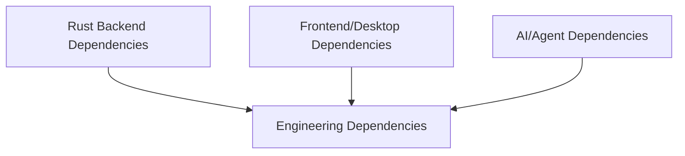
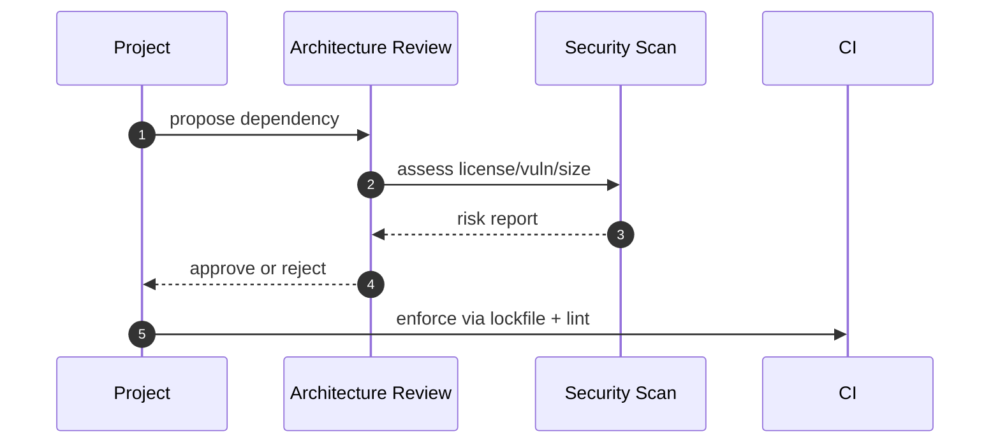

# 11 · 依赖清单与作用说明（code-studio / open-context / zmax）

本文档聚焦“方案选型阶段最常问”的依赖：它们分别解决什么问题、在哪个仓库使用、引入后有什么约束。

说明：
- 版本基线来自两个仓库的 `Cargo.toml` 与 `package.json`。
- 表格以“核心依赖”为主，不展开所有 UI 原子组件。

## 依赖版图架构图



## 1. Rust 核心依赖

| 分类 | 依赖 | 版本基线 | 使用仓库 | 作用 | 备注 |
|---|---|---:|---|---|---|
| Web 框架 | actix-web | 4.x | code-studio, open-context | HTTP 服务框架 | 两仓库都启用 rustls 相关特性 |
| gRPC | tonic / prost / tonic-prost | 0.14.1 | code-studio | gRPC 协议与代码生成 | 服务端/内部服务通信 |
| 异步运行时 | tokio | 1.x | code-studio, open-context | 异步任务调度与 IO | 统一全量 feature，能力足但编译重 |
| HTTP 客户端 | reqwest | 0.13.x | code-studio, open-context | 外部 API 调用 | 两仓库均使用 rustls，禁用 default-features |
| WebSocket | tokio-tungstenite / tungstenite | 0.26~0.28 | code-studio, open-context | WS 通信 | open-context 主要依赖 tokio-tungstenite |
| 序列化 | serde / serde_json | 1.x | code-studio, open-context | 数据结构序列化 | Rust 侧标准组件 |
| 配置格式 | toml | 0.8 / 0.9 | code-studio, open-context | TOML 配置解析 | code-studio 偏后端配置，open-context 偏应用配置 |
| 错误处理 | anyhow | 1.x | code-studio, open-context | 应用层错误传播 | 结合 `with_context` 使用 |
| 错误建模 | thiserror | 2.x | code-studio, open-context | 库层错误枚举 | 对外稳定错误契约 |
| 追踪日志 | tracing / tracing-subscriber | 0.1 / 0.3 | code-studio, open-context | 结构化日志与链路追踪 | 适合接入 observability 平台 |
| Git 能力 | git2 | 0.20 | code-studio, open-context | 本地 Git 操作 | open-context 用于 GUI/工具链集成 |
| CLI 参数 | clap | 4.x | code-studio, open-context | 命令行参数解析 | 双仓库均可做 CLI 工具扩展 |

## 2. 数据库相关依赖（Rust）

| 数据库类型 | 依赖 | 使用仓库 | 作用 | 典型场景 |
|---|---|---|---|---|
| 关系型统一访问 | sqlx | code-studio, open-context(database crate) | 异步 SQL 访问层 | MySQL/Postgres 业务数据 |
| MySQL | sqlx(mysql feature) | code-studio, open-context(database crate) | MySQL 驱动 | 管理后台主存储 |
| PostgreSQL | sqlx(postgres feature) | code-studio, open-context(database crate) | PostgreSQL 驱动 | 强事务、复杂查询 |
| SQLite（嵌入） | rusqlite / r2d2_sqlite | open-context | 本地嵌入式存储与连接池 | 本地状态、轻量缓存 |
| MongoDB | mongodb | code-studio, open-context(database crate) | 文档型数据访问 | 非结构化数据、日志存档 |
| Redis | redis | code-studio, open-context(database crate) | 缓存/会话/队列 | Session、热点缓存、速率限制 |
| DuckDB | duckdb | open-context(database crate) | 本地分析型数据库 | 离线分析、列式查询 |
| Qdrant 向量库 | qdrant-client | code-studio | 向量检索接口 | RAG/语义搜索 |
| 多模型数据库 | surrealdb | code-studio | 多模型数据库接入 | 原型验证、异构数据场景 |

## 3. 前端与桌面核心依赖（open-context）

| 分类 | 依赖 | 版本基线 | 作用 | 备注 |
|---|---|---:|---|---|
| 前端框架 | react / react-dom | 19.2.x | UI 视图层 | 配合 Tauri WebView |
| 构建工具 | vite | 8.x | 前端构建与开发服务 | 与 Tauri CLI 组合 |
| 类型系统 | typescript | 6.0.x | 类型检查 | 大规模前端模块协作基础 |
| 桌面桥接 | @tauri-apps/api | 2.10.x | 前后端 IPC 调用 | 命令与事件通信主入口 |
| 状态管理 | zustand | 5.0.x | 前端状态管理 | 适合多面板工具应用 |
| 数据请求 | @tanstack/react-query | 5.x | 异步状态与缓存 | 统一数据获取策略 |
| 编辑器 | monaco-editor / @monaco-editor/react | 0.55 / 4.7 | 代码编辑能力 | 配合 LSP 与语法高亮 |
| 终端 | @xterm/xterm + addons | 6.x | 终端渲染 | 与 Rust PTY 能力联动 |
| 富文本 | @tiptap/* | 3.22.x | 文档/Notebook 编辑 | 与 markdown 流程集成 |
| 图表渲染 | mermaid / @antv/g2 / @antv/s2 | 11.x / 5.x / 2.x | 图表与流程图可视化 | 技术文档与分析视图 |
| 文档解析 | markdown-it / shiki | 14.x / 4.x | Markdown 渲染与高亮 | 支撑知识工作流 |
| 校验 | zod | 4.3.x | 运行时 schema 校验 | 前后端协议防御式编程 |

## 4. AI 与代理能力依赖

| 依赖 | 使用仓库 | 作用 | 备注 |
|---|---|---|---|
| @mariozechner/pi-agent-core | open-context | Agent 核心协议与执行框架 | ACP 相关能力基础 |
| @mariozechner/pi-ai | open-context | 多模型交互封装 | 与本地工具调用结合 |
| @mariozechner/pi-coding-agent | open-context | 编码 Agent 能力 | 代码任务编排 |
| reqwest-eventsource | code-studio | SSE 流式接收 | AI 流式输出常用 |
| backoff | code-studio | 重试退避策略 | 与熔断、故障转移组合 |

## 5. 工程化与质量保障依赖

| 分类 | 依赖 | 使用仓库 | 作用 |
|---|---|---|---|
| 代码格式 | prettier | code-studio, open-context | 前端与文档格式统一 |
| Rust 静态检查 | cargo clippy | code-studio, open-context | Rust 代码质量检查 |
| JS/TS Lint | oxlint / oxlint-tsgolint | code-studio, open-context | 高性能静态分析 |
| 提交规范 | @commitlint/cli + config-conventional | code-studio | Conventional Commits 约束 |
| 发布版本 | standard-version | code-studio | 自动版本与 CHANGELOG |
| monorepo 编排 | turbo | open-context | 多包构建任务编排 |

## 5.5 zmax 特有依赖（桌面 IDE / Agent 工作台）

| 分类 | 依赖 | 版本基线 | 作用 | 备注 |
|---|---|---:|---|---|
| GUI 框架 | gpui / gpui-component / gpui-wry | 0.2.2 / 0.5.1 / 0.5.0 | 桌面编辑器 UI 与组件 | Zed 系，生态相对小众 |
| 浏览器内核 | cef / wry（lb-wry） | 146.5.0 / 0.53.3 | 内嵌浏览器与 WebView | wry 使用 fork 包名 |
| 终端 | alacritty_terminal / portable-pty | git 依赖 / 0.9 | 终端渲染与 PTY | alacritty_terminal 来自 Zed fork |
| 全文检索 | tantivy | 0.26.1 | 本地全文索引 | 与 SQLite 配合做本地搜索 |
| 嵌入式库 | rusqlite | 0.32（bundled） | 本地状态存储 | 与 open-context 同版本 |
| 缓存 | moka | 0.12.15 | 内存缓存 | |
| 事件通道 | flume | 0.11 | 流式事件传递 | |
| 文档渲染 | markdown / pulldown-cmark / mermaid-rs-renderer | 1.0 / 0.11 / 0.2 | Markdown 与 Mermaid 渲染 | |
| 差异对比 | similar | 2.7 | diff 计算 | |

治理提示：gpui / cef / alacritty_terminal 多为 git 依赖或大版本锁定，升级需回归 UI 与编译期；tantivy 索引格式跨版本不兼容，升级需重建索引。

## 6. 依赖治理建议

1. 后端仓库优先治理：数据库驱动 feature 裁剪、减少默认全量编译。
2. 桌面仓库优先治理：前端依赖安全扫描与升级窗口管理（季度一次）。
3. 三仓统一：对 `tokio`、`reqwest`、`tracing` 设升级策略，减少知识碎片。
4. zmax 特有：gpui / cef / alacritty_terminal 等 git 依赖或大版本锁定项，升级前先查依赖清单（§5.5）。

## 依赖评审流程图



## 依赖数据流

```mermaid
flowchart LR
	A[Manifest Files]\nCargo.toml/package.json --> B[Dependency Inventory]
	B --> C[Risk Scoring]
	C --> D[Upgrade Plan]
	D --> E[CI Verification]
```

## 关键结构体（依赖台账）

```rust
pub struct DependencyRecord {
	pub name: String,
	pub ecosystem: String,
	pub version: String,
	pub purpose: String,
	pub risk_level: String,
}

pub struct DependencyPolicy {
	pub allow_list: Vec<String>,
	pub deny_list: Vec<String>,
	pub review_cycle_days: u32,
}
```
