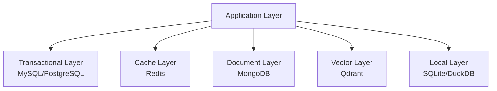
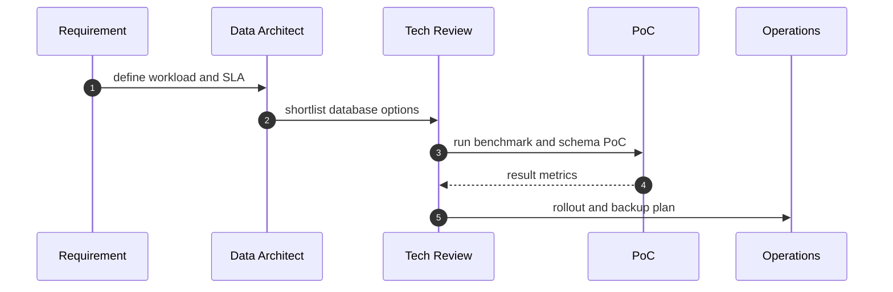
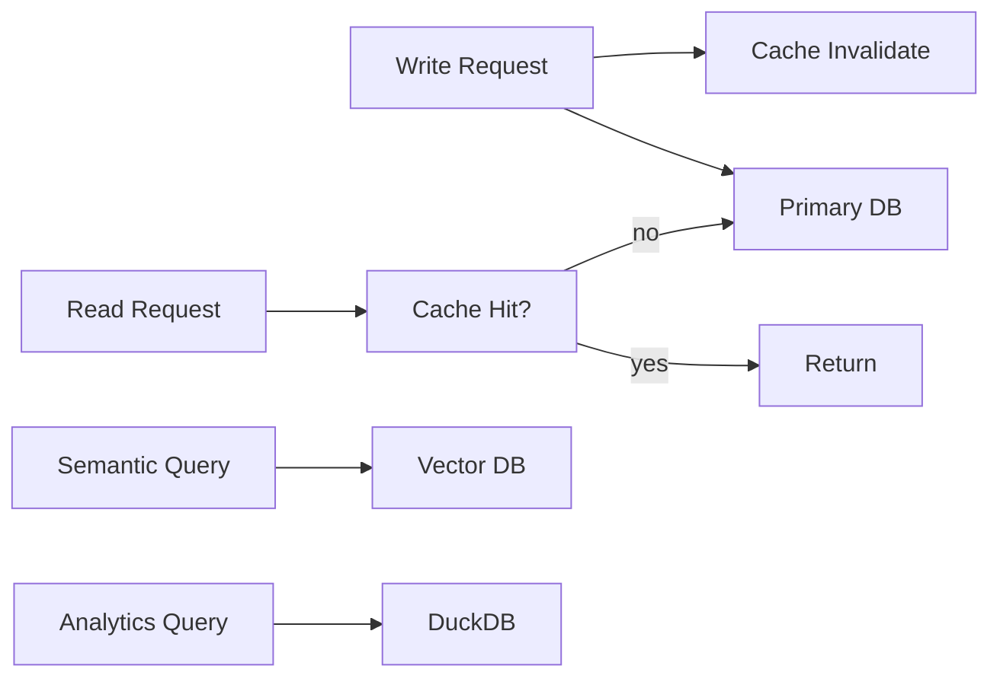

# 12 · 数据库选型对比与落地建议

本文档用于补齐数据库选型信息，支持从“单库”到“多库组合”的方案决策。

## 1. 三仓库当前数据库基线

### 1.1 code-studio

- 已使用：MySQL、PostgreSQL、SQLite（通过 sqlx feature）、MongoDB、Redis、Qdrant、SurrealDB。
- 典型定位：
  - 业务主库：MySQL / PostgreSQL
  - 缓存与会话：Redis
  - 文档/半结构化：MongoDB
  - 向量检索：Qdrant
  - 异构探索：SurrealDB

### 1.2 open-context


- 已使用：SQLite（rusqlite + r2d2_sqlite）、MySQL/PostgreSQL（sqlx）、MongoDB、Redis、DuckDB。
- 典型定位：
  - 本地状态：SQLite
  - 分析查询：DuckDB
  - 可选远程业务库：MySQL / PostgreSQL
  - 缓存/协同：Redis
  - 文档型补充：MongoDB

## 数据架构图（分层选型）



## 2. 数据库能力对比（选型矩阵）

评分说明：5=强，3=中，1=弱。

| 数据库 | 事务一致性 | 查询复杂度 | 扩展性 | 运维复杂度 | 成本 | 典型用途 |
|---|---:|---:|---:|---:|---:|---|
| SQLite | 4 | 3 | 1 | 1 | 1 | 本地单机配置、轻量状态、离线数据 |
| MySQL | 4 | 4 | 4 | 3 | 3 | 通用业务系统、后台 CRUD |
| PostgreSQL | 5 | 5 | 4 | 3 | 3 | 强事务、复杂查询、分析混合场景 |
| MongoDB | 2 | 3 | 4 | 3 | 3 | 文档存储、Schema 频繁变更 |
| Redis | 1 | 2 | 4 | 2 | 2 | 缓存、会话、限流、队列 |
| DuckDB | 3 | 5 | 2 | 1 | 1 | 本地分析、批处理、列式查询 |
| Qdrant | 2 | 2 | 4 | 3 | 3 | 向量检索、RAG 相似度搜索 |
| SurrealDB | 2 | 3 | 3 | 4 | 3 | 多模型原型探索、快速迭代验证 |

## 3. 关键维度详细比较

| 维度 | MySQL | PostgreSQL | MongoDB | Redis | SQLite | DuckDB | Qdrant |
|---|---|---|---|---|---|---|---|
| 数据模型 | 关系型 | 关系型（扩展强） | 文档型 | KV/内存 | 嵌入式关系型 | 列式分析型 | 向量索引 |
| 强一致事务 | 强 | 强 | 文档级/多文档有限 | 弱 | 强（单机） | 单机内可控 | 非事务主导 |
| 复杂 Join | 强 | 很强 | 弱 | 无 | 中 | 强（分析向） | 无 |
| 写入吞吐 | 高 | 高 | 高 | 很高 | 中 | 中 | 中 |
| 检索类型 | 精确查询 | 精确+扩展 | 文档检索 | Key/结构化缓存 | 本地查询 | OLAP 分析 | 语义相似检索 |
| 最佳位置 | 核心业务库 | 核心业务库/分析融合 | 内容与日志域 | 缓存层 | 客户端本地层 | 本地分析层 | 向量检索层 |

## 4. 推荐组合（按场景）

### 4.1 典型管理后台（中小规模）

- 组合：MySQL + Redis
- 原因：开发成本低、生态成熟、CRUD 效率高。

### 4.2 复杂业务平台（权限/审计/复杂查询）

- 组合：PostgreSQL + Redis + MongoDB（可选）
- 原因：PG 承担复杂关系和事务，Redis 负责性能兜底，Mongo 承担弹性文档域。

### 4.3 AI Agent / RAG 平台

- 组合：PostgreSQL(or MySQL) + Redis + Qdrant + DuckDB（可选）
- 原因：
  - 业务元数据在关系型库。
  - Redis 负责会话、缓存和速率限制。
  - Qdrant 专注向量召回。
  - DuckDB 处理离线分析和回放评估。

### 4.4 本地优先桌面应用

- 组合：SQLite + DuckDB +（可选）远程 PostgreSQL
- 原因：离线能力强、部署简化、成本低，且便于后续向远程服务演进。
- zmax 参照：本地状态用 SQLite，全文检索另配 tantivy（而非 DuckDB），适合"笔记 / 文档 / 代码搜索"场景。

### 4.5 zmax 数据库基线（补充）

- 已使用：SQLite（rusqlite bundled）、tantivy（本地全文索引）、moka（内存缓存）。
- 典型定位：
  - 本地状态与索引：SQLite + tantivy（全文检索）。
  - 内存缓存：moka。
  - 无远程数据库连接（区别于 code-studio / open-context 的远程库）。

## 5. 选型决策树

1. 是否需要本地离线优先？
   - 是：优先 SQLite，分析加 DuckDB。
   - 否：进入第 2 步。
2. 是否需要复杂事务和复杂 SQL？
   - 是：优先 PostgreSQL。
   - 否：进入第 3 步。
3. 是否以管理后台 CRUD 为主、团队 MySQL 经验更强？
   - 是：优先 MySQL。
   - 否：优先 PostgreSQL。
4. 是否需要语义检索/RAG？
   - 是：增加 Qdrant（不要把向量检索硬塞到主业务库）。
5. 是否存在高频热点读写？
   - 是：增加 Redis（缓存/限流/会话）。

## 选型流程图（实施版）



## 数据流（多库组合）



## 关键结构体（选型记录）

```rust
pub struct DatabaseOption {
   pub name: String,
   pub transaction_score: u8,
   pub query_score: u8,
   pub ops_score: u8,
   pub cost_score: u8,
}

pub struct DataArchitecturePlan {
   pub primary_db: String,
   pub cache_db: Option<String>,
   pub document_db: Option<String>,
   pub vector_db: Option<String>,
   pub local_analytics_db: Option<String>,
}
```

## 6. 风险与治理建议

1. 多库并存风险：同一业务实体跨库拆分时，要先定义主数据源，避免“双写不一致”。
2. 驱动与 feature 膨胀：统一在 workspace 层管控，非必要不要默认启用全部数据库驱动。
3. 运维复杂度：每增加一种数据库，都要同步补齐备份、告警、容量与灾备策略。
4. 成本可控策略：优先“主库 + Redis + 可选专项库”，避免早期过度多库化。

## 7. 落地最小集（推荐）

- 后端服务优先：PostgreSQL + Redis。
- AI 检索扩展：在业务稳定后引入 Qdrant。
- 本地分析需求：补充 DuckDB，不侵入主事务链路。
