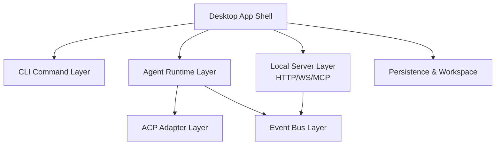
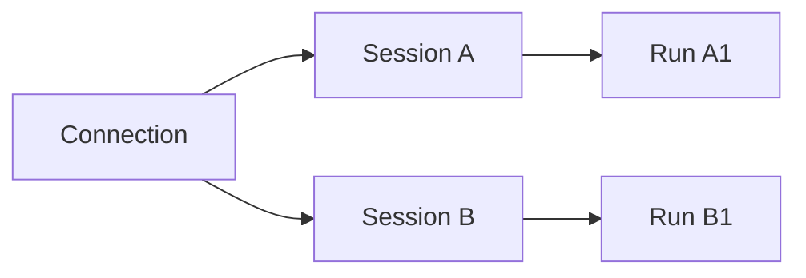
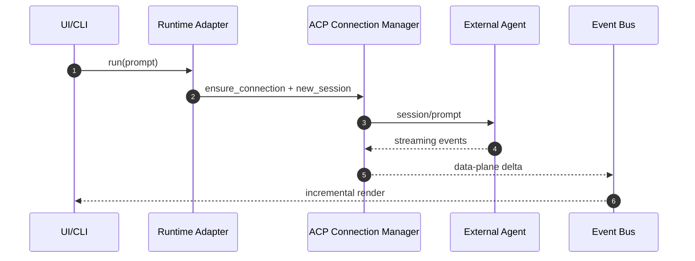

# 13 · ZMAX 可复用技术方案总览

本文档将 `zmax` 中适合复用到其他项目的方案抽象出来，重点覆盖 CLI、Server、ACP、HTTP、Socket/事件流。

## 1. 可复用能力地图

## 2. 复用优先级

| 优先级 | 模块 | 价值 | 适用项目 |
|---|---|---|---|
| P0 | CLI 命令体系 | 高一致性、可脚本化、低迁移成本 | 有本地工具链或 DevTools 的项目 |
| P0 | ACP 运行时分层 | Agent 框架可扩展、并发会话清晰 | 需要多 Agent / 多会话的应用 |
| P1 | 本地 HTTP/WS/MCP Server | 可对外暴露能力，便于插件生态 | IDE 客户端、自动化平台 |
| P1 | 事件系统（broadcast + mpsc） | 解决流式消息与控制消息解耦 | 实时交互产品 |
| P2 | 工作区状态持久化 | 多窗口/多工作区体验稳定 | 桌面端 IDE 类应用 |

## 3. 关键设计抽象

### 3.1 三层语义模型

- Connection：进程级连接（可复用）
- Session：会话级上下文（隔离）
- Run：单次执行（可取消）

### 3.2 双通道事件模型

- 控制面：`broadcast`（生命周期、权限、状态变更）
- 数据面：`mpsc`（流式 delta，带背压）

## 4. 数据流（Agent 请求）

## 5. 推荐落地顺序

1. 先迁移 CLI 命令模型与输出规范。
2. 再迁移 ACP 的 Connection/Session/Run 抽象。
3. 最后接入本地 Server（HTTP/WS/MCP）与事件总线。
