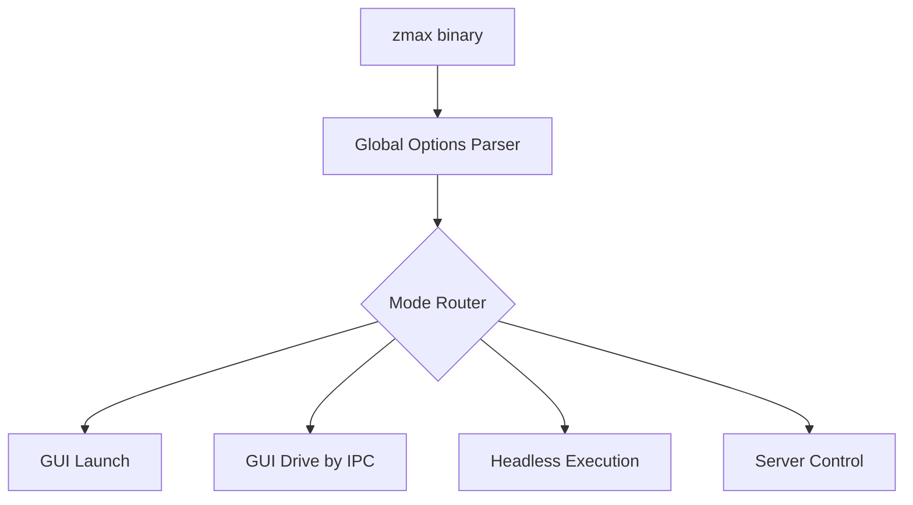
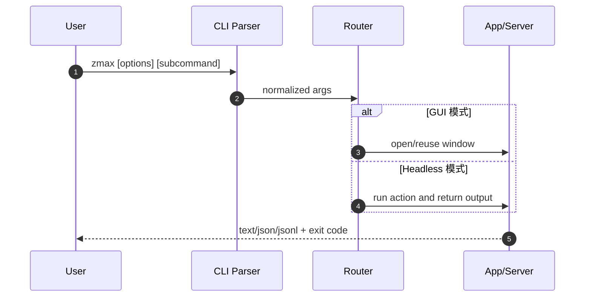
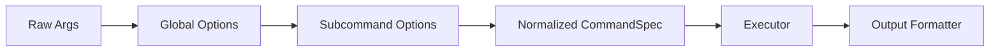

# 14 · ZMAX CLI 可复用设计

来源基线：`zmax/docs/cli.md`。

## 1. CLI 架构图



## 2. 执行流程图



## 3. 数据流（参数标准化）



## 4. 关键结构体

```rust
pub struct CommandSpec {
    pub cwd: Option<String>,
    pub format: OutputFormat,
    pub quiet: bool,
    pub verbose: u8,
    pub wait: bool,
    pub subcommand: Option<SubcommandSpec>,
}

pub enum OutputFormat {
    Table,
    Json,
    Jsonl,
    Text,
}
```

## 5. 可复用规范

1. 所有子命令统一支持 `--format` 与 `--cwd`。
2. 默认文本输出，人机友好；`json/jsonl` 为自动化编排保底。
3. 保持“无参数可启动主程序”的入口体验。
