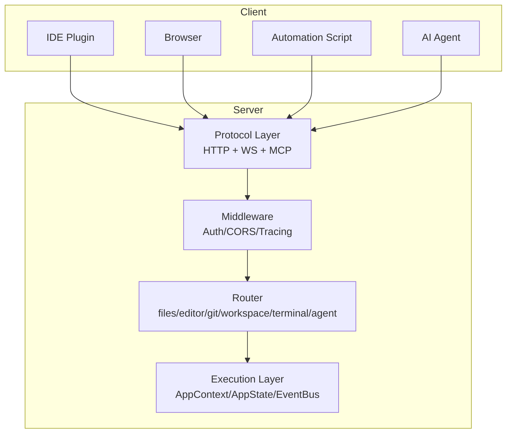
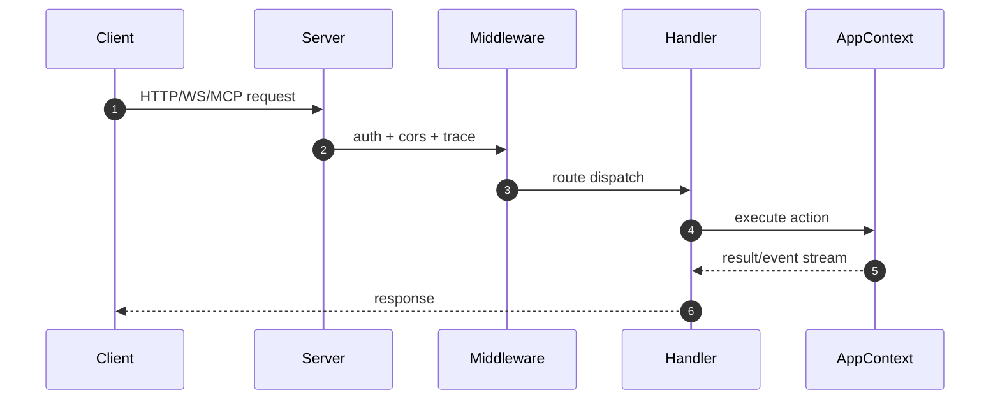
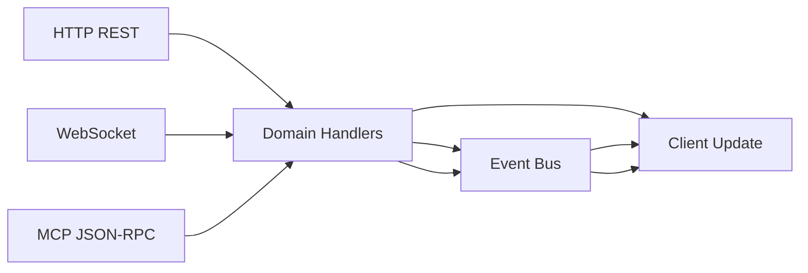

# 15 · ZMAX 本地 Server（HTTP/WS/MCP）可复用设计

来源基线：`zmax/docs/server.md`。

## 1. 协议分层架构图



## 2. 请求流程图



## 3. 数据流（REST vs WS vs MCP）



## 4. 关键结构体

```rust
pub struct ServerConfig {
    pub host: String,
    pub port: u16,
    pub token: Option<String>,
    pub enable_ws: bool,
    pub enable_mcp: bool,
}

pub struct ApiEnvelope<T> {
    pub code: i32,
    pub message: String,
    pub data: Option<T>,
    pub trace_id: Option<String>,
}
```

## 5. 复用建议

1. 协议层与执行层严格解耦，避免 handler 直接绑定 UI 状态细节。
2. 将高频实时场景（终端流、日志流）优先放在 WS 或 MCP。
3. 本地服务默认绑定 `127.0.0.1`，并启用 token 鉴权。
