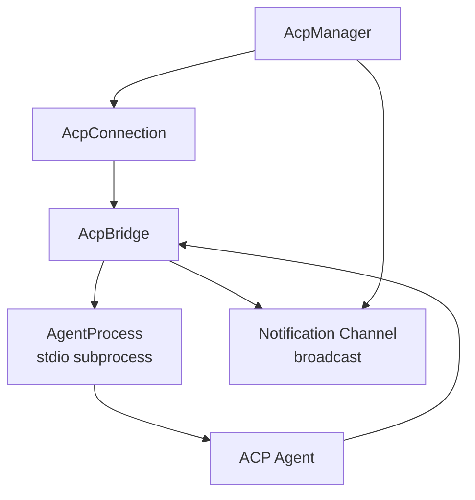
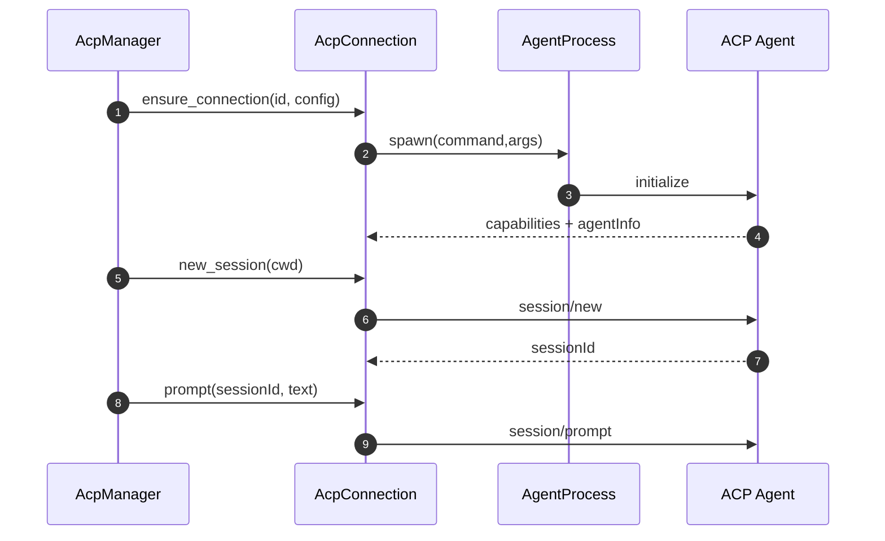

# 16 · ZMAX ACP 运行时可复用设计

来源基线：
- `zmax/crates/gpui-agent-acp/src/connection.rs`
- `zmax/crates/gpui-agent-acp/src/manager.rs`
- `zmax/crates/gpui-agent-acp/src/process.rs`

## 1. ACP 运行时架构图



## 2. 连接与会话流程图



## 3. ACP 数据流


## 4. 关键结构体

```rust
pub enum AcpConnectionState {
    Disconnected,
    Connecting,
    Connected,
    Failed,
}

pub struct AgentInfo {
    pub name: String,
    pub version: String,
}

pub struct AcpConnection {
    pub bridge: std::sync::Arc<AcpBridge>,
    pub agent_info: AgentInfo,
    pub agent_capabilities: serde_json::Value,
}
```

## 5. 可复用亮点

1. `connection_id` 级复用可避免多 tab 重复拉起 Agent 子进程。
2. 明确区分 `connection` 与 `session`，便于并发隔离。
3. `npx` 进程 cwd 隔离策略可规避 package manager 环境冲突。
