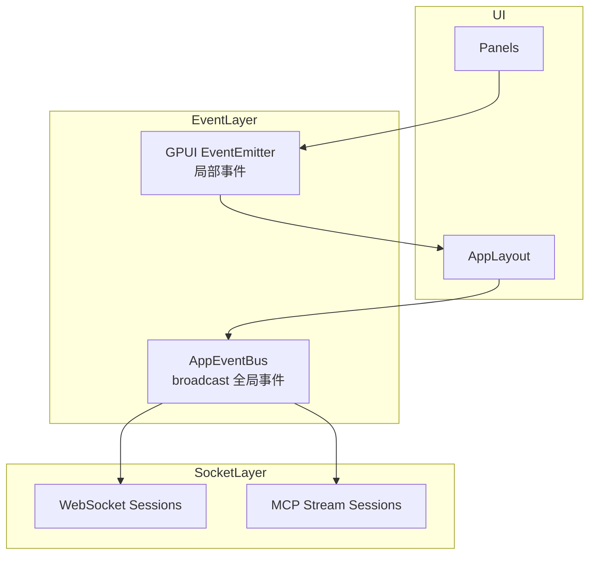
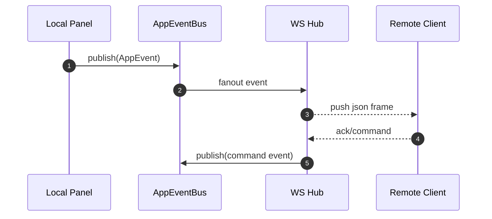
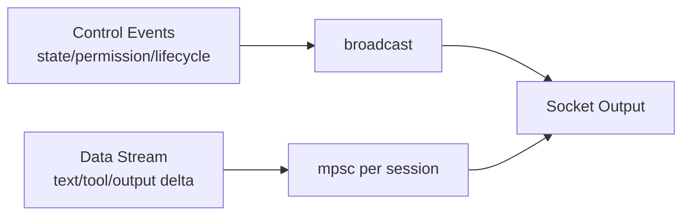

# 17 · ZMAX Socket 与事件总线可复用设计

来源基线：`zmax/docs/event-system.md` 与 `zmax/docs/server.md`。

## 1. 事件通信架构图



## 2. 实时流处理流程图



## 3. 控制面与数据面数据流



## 4. 关键结构体

```rust
pub enum AppEvent {
    FileChanged,
    WorkspaceSwitched,
    AgentRuntime,
    ServerStarted,
    ServerStopped,
    Custom,
}

pub struct RuntimeDelta {
    pub session_id: String,
    pub kind: String,
    pub payload: serde_json::Value,
}
```

## 5. 复用建议

1. 局部 UI 交互优先 EventEmitter，全局跨模块通信统一 EventBus。
2. Socket 层不要直接操作业务状态，必须通过事件层桥接。
3. 流式大消息用分 session 的有界队列，避免全局广播拥塞。
