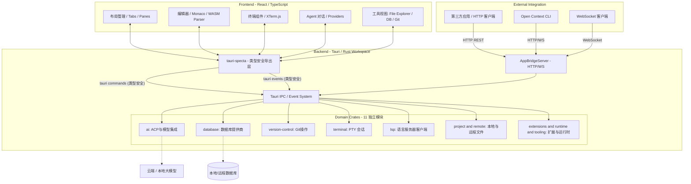

# Open Context 项目架构指南

## 1. 整体架构概览

Open Context 采用极致解耦的**跨端分离式架构**，以 Tauri 2.x 作为底座，将复杂的 AI 调度、系统级功能访问和跨进程通讯能力封装在 Rust 后端，而前端专注通过 React 和 Zustand 提供流畅的图形用户界面。

整体架构由以下几个核心层次组成：

1. **Frontend (React UI 层)**：负责与用户交互，呈现各种视图与组件。
2. **IPC 与绑定层**：连接前端与后端的桥梁，利用 Tauri IPC 事件总线和 `tauri-specta` 实现完全强类型安全的通讯。
3. **AppBridgeServer (开放能力层)**：为外部应用（CLI、第三方客户端）提供基于 HTTP 与 WebSocket 的统一接口。
4. **Domain Crates (系统核心层)**：由 14 个 Rust Domain Crate（加上 `src-tauri` 共 15 个 workspace members）组成，每个 Crate 专注于单一领域（例如终端、文件、LSP 等）。

---

## 2. 系统拓扑图

---

## 3. 前端架构 (React + 领域驱动设计)

前端代码全部位于 `src/` 目录下，并以领域驱动设计 (DDD) 划分为多个 Feature：

- **`src/features/`**: 包含 26 个功能独立的模块（如 editor, ai, terminal, git, database 等）。
  - 大模块内部按照职责深度嵌套划分：`components/`, `hooks/`, `stores/`, `services/`, `utils/`, `types/`。
  - 核心状态管理采用 **Zustand Slices** 模式，将巨型 Store 分割为易维护的切片。
- **`src/ui/`**: 存放共享的、无业务逻辑的原子 UI 组件（基于 shadcn/ui 构建）。
- **`src/app.tsx` & `main.tsx`**: 应用生命周期管理，处理初始化、路由、快捷键注册及主题加载。

---

## 4. 后端架构 (Tauri + Rust Workspace)

后端代码位于 `crates/` 和 `src-tauri/` 目录下：

- **`src-tauri/src/`**: Tauri 应用的主入口与 IPC 粘合层。负责挂载所有 Domain Crates 提供的命令，启动 AppBridge 服务，并初始化系统托盘、窗口菜单等。
- **`crates/`**: 包含 14 个单一职责的 Rust Domain Crate（workspace 共 15 个成员，含 `src-tauri`）：
  - `ai`: 实现 Agent Client Protocol (ACP) 与各类 AI 模型集成。
  - `database`: 统一连接池管理，实现 7+ 数据库引擎（SQLite, Postgres 等）的提供者。
  - `terminal`: 管理底层的 PTY（伪终端）会话与进程 I/O。
  - `lsp`: 管理语言服务器的生命周期与请求。
  - `version-control`: 基于 libgit2 实现高效的本地 Git 操作。
  - `notebook`: 交互式 Notebook / Markdown 笔记。
  - `code-chunker`: Tree-sitter 代码切片（NAPI）。
  - `dot-config`: 用户配置文件管理。
  - 其他诸如 `project`, `remote`, `runtime`, `tooling`, `extensions`, `github` 等模块。
  - 另有 `bot-agent-server` / `bot-channel`（TypeScript）与 `tauri-icon-builder` 位于 `crates/` 下，但不属于 Rust workspace 成员。
