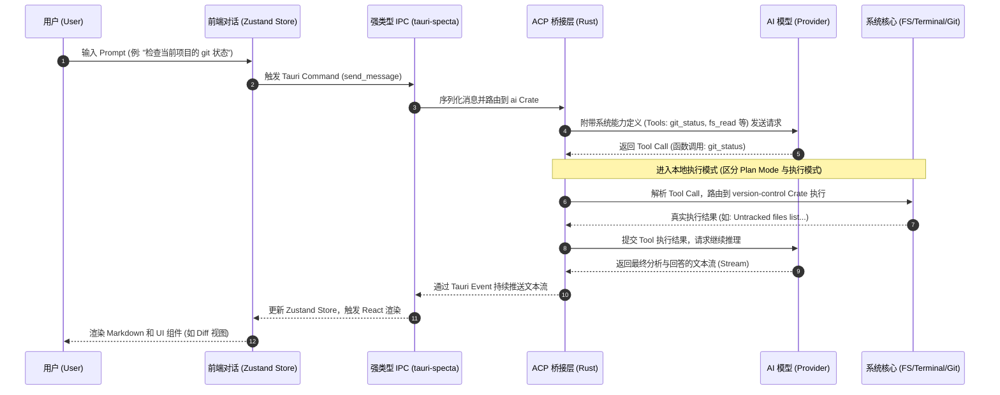
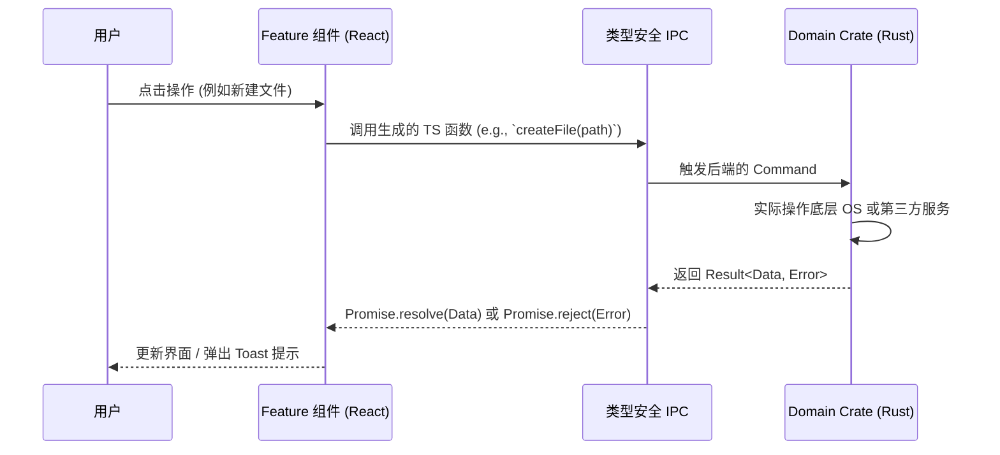

# 客户端交互流程文档

本文档详细描述了用户在 Open Context 客户端内部的交互流转机制，重点聚焦于 AI Agent（基于 ACP 协议）如何规划与执行系统级操作。

## 1. 核心链路：ACP (Agent Client Protocol) 交互流

Open Context 的 AI 交互完全遵循 ACP 标准。用户输入需求后，大模型不会直接修改本地文件，而是通过“规划 -> 生成 Tool Call -> 客户端执行 -> 返回结果”的循环，安全地完成任务。

---

## 2. 常规系统操作流程 (非 AI 操作)

对于用户直接点击按钮操作（例如：在文件树新建文件、在数据库视图执行 SQL、在终端敲击按键）：

## 3. 安全与状态管理规范

1. **类型边界**: 前后端的交互参数与返回值必须在 `tauri-specta` 中注册，杜绝任何 Any 类型的滥用。
2. **状态解耦**: 耗时操作（如执行代码、长文本推理）必须通过 Tauri Events (Payload) 推送到前端的 Zustand Store 中，由 Store 驱动 UI 变化，禁止组件内部直接 `await` 长时间堵塞的 IPC 请求。
3. **Plan Mode 保护**: AI Agent 发起的任何写操作（文件修改、命令执行）在 Plan Mode 下会被拦截为预览操作，仅当用户显式授权时才转入真实的执行模式。
