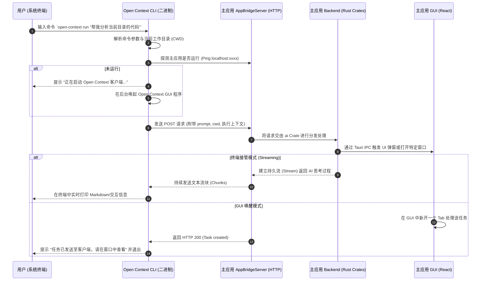

# CLI 命令行交互流程文档

> **状态说明（2026-09-22 核验）**：Open Context 仓库当前**未提供 CLI 二进制**（`package.json` 无 `bin` 字段，`src-tauri` 仅有 `open-app` GUI 二进制）。本文档描述的是**规划中的 CLI 交互设计**，供后续实现参考，请勿按"已存在 CLI"理解。

**Open Context** 计划提供一个原生的命令行工具（CLI）。它允许用户在系统的终端（如 iTerm, Windows Terminal, 或 VS Code Terminal）中直接调用并触发运行在后台的 Open Context GUI 客户端的特定功能。

## 1. CLI 扮演的角色

在这个架构中，CLI 二进制文件并不直接执行沉重的逻辑，它是作为一个**轻量级的客户端 (Thin Client)** 存在。
当用户在命令行输入指令时，CLI 会寻找当前在本地运行的 Open Context 守护进程（通过 AppBridgeServer 暴露的本地 HTTP/WebSocket 接口），并将命令转发给主应用执行。

---

## 2. 核心执行流程（规划）

---

## 3. 典型使用场景 (CLI 路由流转，规划)

### 场景 A：快速通过外部编辑器打开

_命令_：`open-context open ./src/main.rs`
_流程_：CLI 将绝对路径封装成 JSON 发给 `AppBridgeServer` -> Rust 后端调用 `project` Crate -> 通过 Tauri Event 通知前端 React -> 触发 `editor` Feature 组件在界面中新增一个 Buffer 标签页。

### 场景 B：在命令行中寻求 Agent 帮助

_命令_：`open-context ask "如何解决这个编译错误？" --context ./build.log`
_流程_：CLI 读取 `build.log` 内容连同问题通过 HTTP 接口发送给主应用的 Agent 引擎。主应用利用现成的大模型配置（免去 CLI 单独配置 API Key 的麻烦），生成结果后直接通过长连接打回给终端，展示出解决方案。

### 场景 C：执行后台自动化任务

_命令_：`open-context script run ./task.toml`
_流程_：CLI 解析任务文件 -> 传递给主应用的自动化引擎 -> 主应用利用 `terminal` Crate 或 `version-control` Crate 执行一系列操作，并将汇总日志返回给 CLI 端。

## 4. 设计原则

- **单例模式**: 所有重型资源（如数据库连接池、大模型上下文、LSP 服务器）只在主 GUI 进程中维护一份，CLI 仅仅是主进程的外部触角。
- **环境一致性**: CLI 继承用户在命令行所处的环境变量与当前路径 (`pwd`)，确保当外部工具调用 Open Context 时，上下文完全一致。
