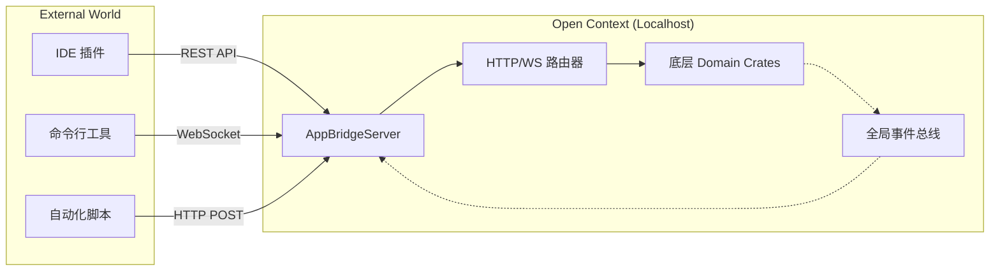
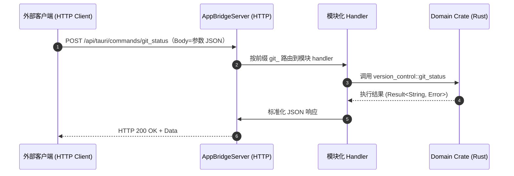
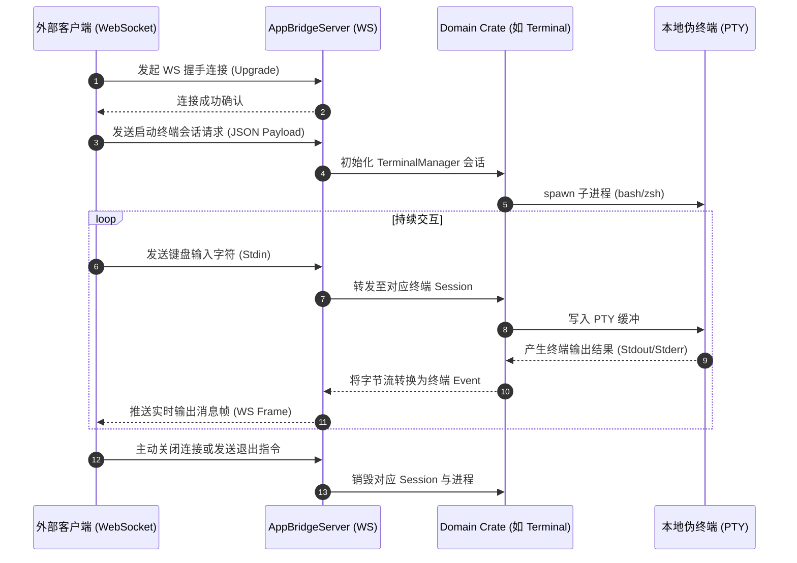

# HTTP 与 WebSocket 交互流程文档

> **实现现状（2026-09-22 核验）**：AppBridgeServer 已实现，实际路由为**通用命令分发**（`/api/tauri/commands/{name}`），而非初版设想的 `/api/v1/...` 逐资源 REST；默认绑定 `127.0.0.1:5500`；Bearer Token 鉴权尚未实现。详见「1.1 实际实现」。

除了作为独立的 GUI 桌面客户端，Open Context 内部集成了 **AppBridgeServer**，使客户端能够作为一个“本地操作系统节点”为第三方应用、IDE 插件或外部自动化脚本提供跨进程的系统级能力。

## 1. 整体架构

---

### 1.1 实际实现（2026-09-22 核验）

AppBridgeServer（`src-tauri/src/bridge/server.rs`）暴露以下**统一端点**：

| 路由 | 方法 | 说明 |
|---|---|---|
| `/api/tauri/health` | GET | 健康检查，返回 `{status, service}` |
| `/api/tauri/commands/{name}` | POST / GET | 执行任意 Tauri Command（body 为参数 JSON） |
| `/api/tauri/events` | GET（WebSocket Upgrade） | 事件订阅推送 |

- **通用分发**：`handlers.rs` 按命令名**前缀**路由到模块化 handler（`terminal_` / `fs_` / `git_` / `system_` / `project_` / `search_` / `db_` / `ai_` / `notebook_` / `media_` …），未命中的走未实现分支。
- **绑定**：默认 `127.0.0.1:5500`（`BridgeConfig`），可用 `AGENT_BOX_BRIDGE_PORT` / `AGENT_BOX_BRIDGE_HOST` / `AGENT_BOX_BRIDGE_DISABLED` 环境变量调整；CORS 全开（`allow_any_origin`）。
- **事件推送**：`events.rs` + `handlers_ws.rs` 将 Tauri Events（文件变更、终端输出、AI 流、Notebook 变更等 24 个）经 WebSocket 推送给订阅端。
- **鉴权**：**未实现 Token 鉴权**，安全边界目前仅依赖本机绑定。

> 注：以下章节的 `/api/v1/fs/read` 等具体 REST 路径为**初版设计示意**，实际调用请统一走 `/api/tauri/commands/{name}`。

---

## 2. HTTP 命令分发交互流程

主要用于短连接的、即时返回的任务（如：读取文件、查询数据库状态、检查 Git 状态）。实际实现为**通用命令分发**，而非逐资源 REST：

---

## 3. WebSocket 长连接交互流程（`/api/tauri/events`）

主要用于流式传输、双向通讯或耗时极长的任务（如：触发 AI 交互、连接 PTY 终端进行实时输入输出、监听文件变化事件）。

## 4. API 安全与权限机制

- ✅ **本机绑定**: HTTP/WS 接口默认绑定在 `127.0.0.1:5500` 仅限本机访问（`BridgeConfig` 默认值），避免内网暴露风险。
- 🚧 **动态 Token**: 规划在 GUI 设置中心生成 Bearer Token，要求第三方请求携带 `Authorization` 头 —— **截至 2026-09-22 未在 bridge 代码中实现**，当前无鉴权。
- 🚧 **GUI 弹窗拦截**: 规划对外部发起的高危操作做前端授权确认 —— 当前未发现 AppBridge 层的统一拦截；ACP 会话内的权限请求（`ai::respond_acp_permission`）已有独立机制，但不属于 AppBridge HTTP 层。
