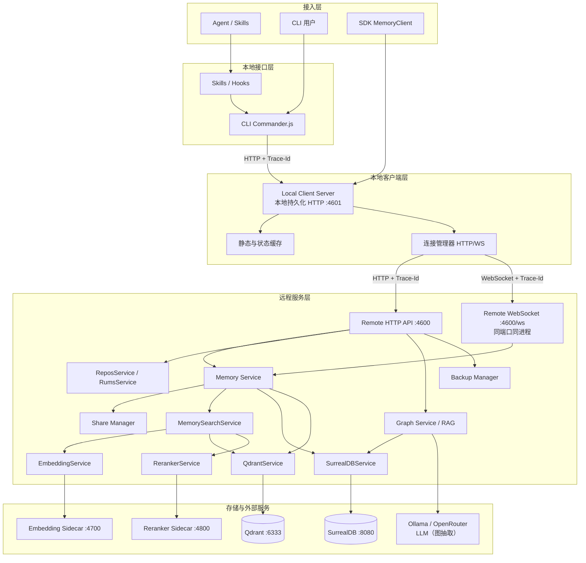
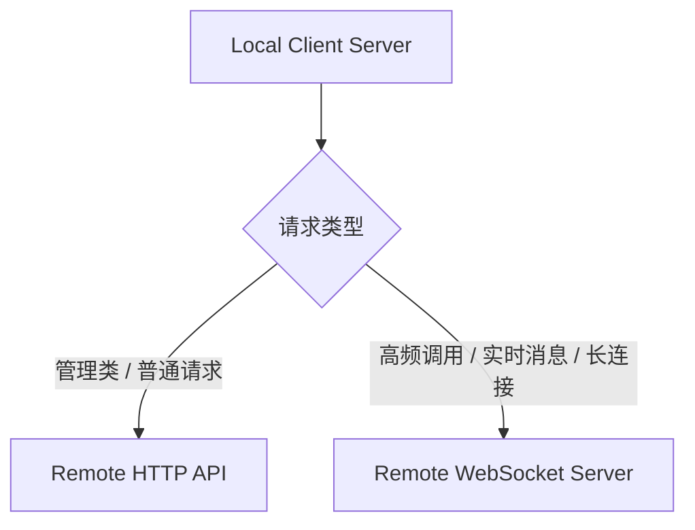
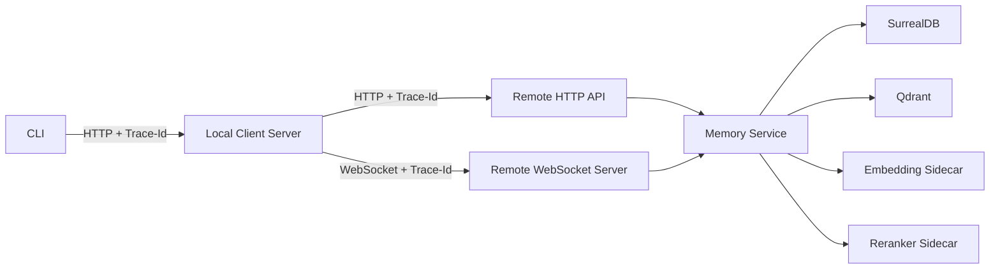
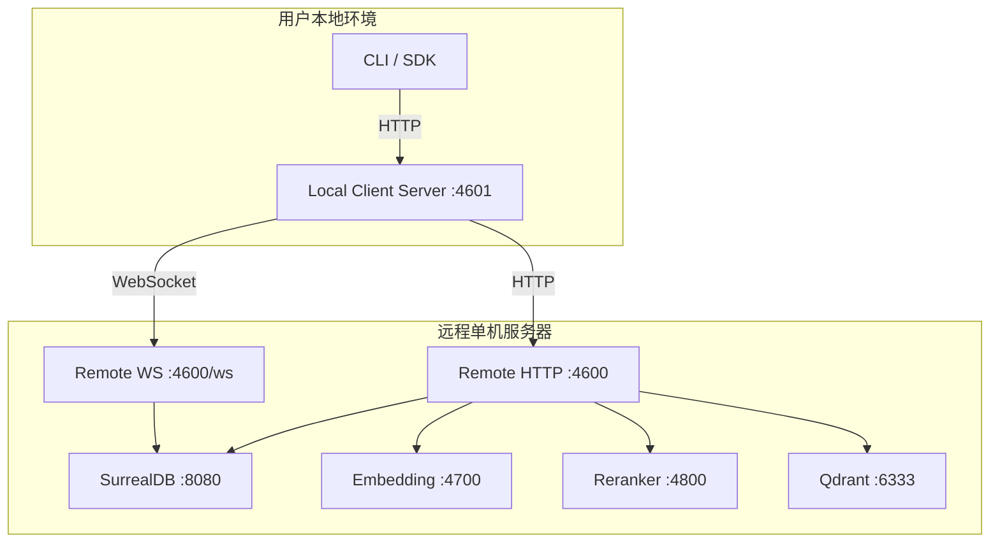

# 26 · teams-memory 架构

> **整理时间**: 2026-09-23，核验基线 HEAD `5a8bc00`
> **来源**: 仓库 `docs/teams-memory-architecture.md`（v1.6，2026-03-28）+ 代码核验
> **部署模式**: 单机部署（PM2 原生进程管理）；SurrealDB 独立服务

## 1. 总体架构

系统采用"接入层 → 本地接口层 → 本地客户端层 → 远程服务层 → 存储层"的分层架构。



## 2. 通信架构

### 2.1 完整调用链路

1. 用户执行 CLI 命令（或 SDK 调用）。
2. CLI 通过 HTTP 调用本地 Local Client Server。
3. Local Client Server 生成 `Trace-Id`（UUID）。
4. Local Client Server 按请求类型选择 HTTP 或 WebSocket 与 Remote Server 通信。
5. Remote Server 执行业务逻辑（鉴权 → 限流 → 业务编排 → 存储/检索）。
6. Remote Server 返回结果给 Local Client Server。
7. Local Client Server 将远程结果封装为本地 HTTP 响应返回给 CLI。

### 2.2 双通道职责划分

| 通道 | 用途 |
|---|---|
| HTTP | 普通请求、管理类请求、健康检查、配置读取、低频接口调用 |
| WebSocket | 长连接复用、高频调用、实时消息、异步回传、流式扩展 |



### 2.3 Local Client Server 设计要点（代码核验）

- 实现于 `src/client/local-server.ts`（Hono + `@hono/node-server` + `ws`），CLI 所有命令经它统一转发。
- 职责：本地 HTTP 接入、Trace-Id 生成与透传、HTTP/WS 双通道管理与自动重连、静态配置与远端健康状态缓存、请求 ID 映射与结果回传。
- 缓存策略：**仅缓存**静态配置、远端健康状态、连接状态；**不缓存**业务记忆数据（避免多端不一致）。
- 本地端口：4601（CLI 默认）；Remote Server 单端口 **4600**（HTTP API + WS 端点 `/ws` 同端口同进程，`createNodeWebSocket` + `ws-handler`）。

## 3. 技术选型总览

| 模块 | 技术 | 说明 |
|---|---|---|
| 主语言 | Node.js 22+ / TypeScript（ESM） | CLI、Client、Server 全 TS |
| 本地客户端服务 | Hono + `@hono/node-server` | 本地持久化 HTTP 服务 |
| WebSocket | `ws` + `@hono/node-ws` | 长连接接入 |
| CLI | Commander.js | 20 个命令 |
| 元数据存储 | SurrealDB | 记忆主数据、共享、关系、上下文 |
| 向量数据库 | Qdrant | 向量召回与过滤 |
| 向量化服务 | Python FastAPI（Qwen3-Embedding-0.6B） | 文本嵌入 |
| 多模态嵌入 | Qwen3-VL-Embedding-2B（`vl_embedder.py`） | 文本/图像/视频 |
| 重排序服务 | Python FastAPI（qwen3-reranker:0.6b） | 候选精排 |
| 中文分词 | `@node-rs/jieba` | 关键词/稀疏召回 |
| 缓存 | Keyv + `@keyv/bigmap` + `@keyv/redis`（可选） | 状态缓存 |
| 日志 | pino + pino-pretty | 结构化日志（绑定 traceId） |
| 进程管理 | PM2 | 单机部署进程守护 |

## 4. 目录结构（代码现状）

```text
teams-memory/
├── src/                        # 根包（npm 发布：CLI + SDK + 本地服务器）
│   ├── cli/                    # 20 个命令（index/init/store/query/search/list/delete/
│   │                           #   share/share-info/revoke/graph/link/unlink/retry/
│   │                           #   backup/start/stop/restart/status/config/skill）
│   ├── client/                 # SDK：local-server.ts / memory.ts / protocol.ts / types.ts
│   ├── logger/                 # pino 包装
│   └── monitoring/             # 性能监控（measureAsync 等）
├── apps/
│   ├── teams-memory/           # 核心服务端（HTTP + WebSocket）
│   │   └── src/
│   │       ├── server/         # Hono 路由（api/*）+ ws-handler + rate-limit 中间件
│   │       ├── database/       # SurrealDB 连接 / schema / surrealdb.service
│   │       ├── services/       # MemoryService / document-parser / ollama.client
│   │       ├── search/         # 两阶段检索编排
│   │       ├── embedding/      # 嵌入客户端（:4700）
│   │       ├── reranker/       # 重排客户端（:4800）
│   │       ├── qdrant/         # Qdrant 客户端与集合管理
│   │       ├── auth/           # API Key 签发、中间件、权限检查
│   │       ├── share/          # ShareManager（team/project 粒度）
│   │       ├── graph/          # 知识图谱查询/关联
│   │       ├── graph-rag/      # 图抽取（extractor + zod schema）
│   │       ├── workers/        # graph-extractor.worker（异步抽取队列）
│   │       ├── embedding-health/ # 文档加载与嵌入健康调度
│   │       ├── isolation/      # 数据隔离服务
│   │       ├── backup/         # 备份管理（surreal/qdrant + scheduler）
│   │       ├── rag/            # RAG 检索
│   │       ├── repos/ / rums/  # 代码库 / RUM 项目搜索
│   │       ├── config/         # JSON 配置 + {{ENV_VAR}} 模板替换
│   │       └── errors/         # 类型化错误层级 + 错误码
│   ├── teams-memory-embedding/ # Python：FastAPI + sentence-transformers/vLLM，:4700
│   └── teams-memory-reranker/  # Python：FastAPI + transformers，:4800
├── plugins/
│   ├── hooks/                  # Agent Hooks 脚本（pre/post-tool-use、user-prompt-submit、agent-log）
│   └── mcp.json                # MCP 服务器清单（figma/knot/iwiki/tapd/gongfeng）
├── docs/                       # 自带 4 份技术文档
├── openspec/                   # Spec-driven 变更（api-auth / backup-api 等）
└── tests/                      # cli / gpu / sdk-memory-client 测试
```

## 5. 数据流设计



## 6. 部署拓扑与端口

| 服务 | 端口 | 说明 |
|---|---:|---|
| Local Client Server | 4601 | 本地持久化 HTTP 服务 |
| Remote HTTP API | 4600 | 远程 HTTP 服务 |
| Remote WebSocket | 4600 | 与 Remote HTTP 同进程同端口，端点 `/ws`（ws-handler） |
| SurrealDB | 8080 | 元数据与关系存储 |
| Embedding Sidecar | 4700 | 向量化服务 |
| Reranker Sidecar | 4800 | 精排服务 |
| Qdrant | 6333 | 向量数据库 |



进程管理（`apps/teams-memory/pm2.config.json`）：`teams-memory-server`（PORT=4600）与 `teams-memory-worker`（`dist/graph-extractor-worker.mjs`，Graph 抽取独立进程）两个进程；根 `pm2.config.json` 管理 SurrealDB 与 Qdrant；嵌入/重排各自带 `pm2.config.json`（uvicorn 0.0.0.0:4700 / :4800）与 `deploy.sh`。

## 7. 配置管理

- 优先级：环境变量 > `.teams-memory.json` > 默认值。
- 配置实现支持 `{{ENV_VAR}}` 模板替换（`apps/teams-memory/src/config/`），敏感凭证（如 `SURREALDB_PASSWORD`）禁止写入 JSON，必须经环境变量注入。
- 核心配置键：`localClient.port`、`server.httpUrl/wsUrl`、`surrealdb.url/namespace/database`、`qdrant.url/collection`、`embedding.url/model`、`reranker.url/model/topK`、`auth.apiKeyExpiresInDays`、`rateLimit.queryPerMinute`、`graph.autoLink/rules`、`backup.enabled/schedule/path/retentionDays`。

## 8. 鉴权、限流与追踪

| 能力 | 机制 |
|---|---|
| 认证 | 内部 API Key（Bearer），默认有效期 365 天；HTTP 头 `Authorization: Bearer <KEY>`；WS 在 Handshake/Auth 消息传递 |
| 限流 | 按用户维度，查询接口 10 次/分钟，超限返回 HTTP 429 |
| 全链路追踪 | Local Client Server 生成 UUID；HTTP 头 `X-Trace-Id`；WS payload `traceId`；下游调用日志必须绑定 traceId |
| 数据隔离 | `owner_id`（用户）/ `team`（团队）/ `project`（项目）/ `repo+branch`（仓库动态分表） |

## 9. 日志、监控与备份

- 日志：pino，等级 ERROR/WARN/INFO/DEBUG，绑定 traceId。
- 监控指标：请求/错误次数、连接数、内存、响应时间、WS 重连、缓存命中、限流触发、`is_vectorized=false` 数量、Retry 成功率（`src/monitoring/` 与 `apps/.../monitoring/`）。
- 备份：BackupManager 已实现（SurrealDB + Qdrant 快照，`node-cron` 调度），`backup.restore` 仍返回 501；灾备闭环暂不纳入范围。

## 10. 实现状态（对照自带文档口径）

| 能力 | 状态 |
|---|---|
| CLI 全部命令（含 retry/backup/skill） | ✅ 已实现（20 个） |
| Remote HTTP API（memory/backup/graph/repos/rums） | ✅ 已实现 |
| WebSocket `/ws` 长连接 | ✅ 已实现（ws-handler） |
| SurrealDB 主数据 + Qdrant 向量 + 两阶段检索 | ✅ 已实现 |
| API Key 签发与鉴权拦截 | ✅ 已实现 |
| Graph Service 基础功能 | ✅ 已实现 |
| Graph RAG 图抽取（异步 worker + zod schema） | ⚠️ 已开始落地（extractor + worker） |
| 数据恢复（restore） | 🚧 接口存在，返回 501 |
| Graph 自动关联 / 多模型 RAG 融合 | 🚧 规划中 |
