# 28 · teams-memory 关键流程图

> **整理时间**: 2026-09-23，核验基线 HEAD `5a8bc00`
> **来源**: 仓库 `docs/`（架构 v1.6 + Graph RAG v1.2）+ 代码核验；图中服务名与代码目录对应

## 1. 总体请求链路

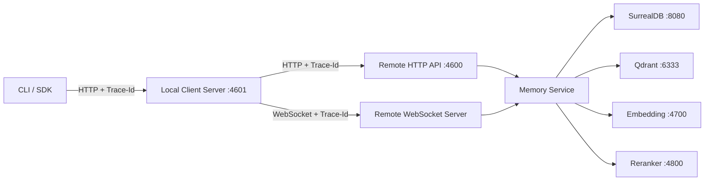

## 2. 双通道路由决策

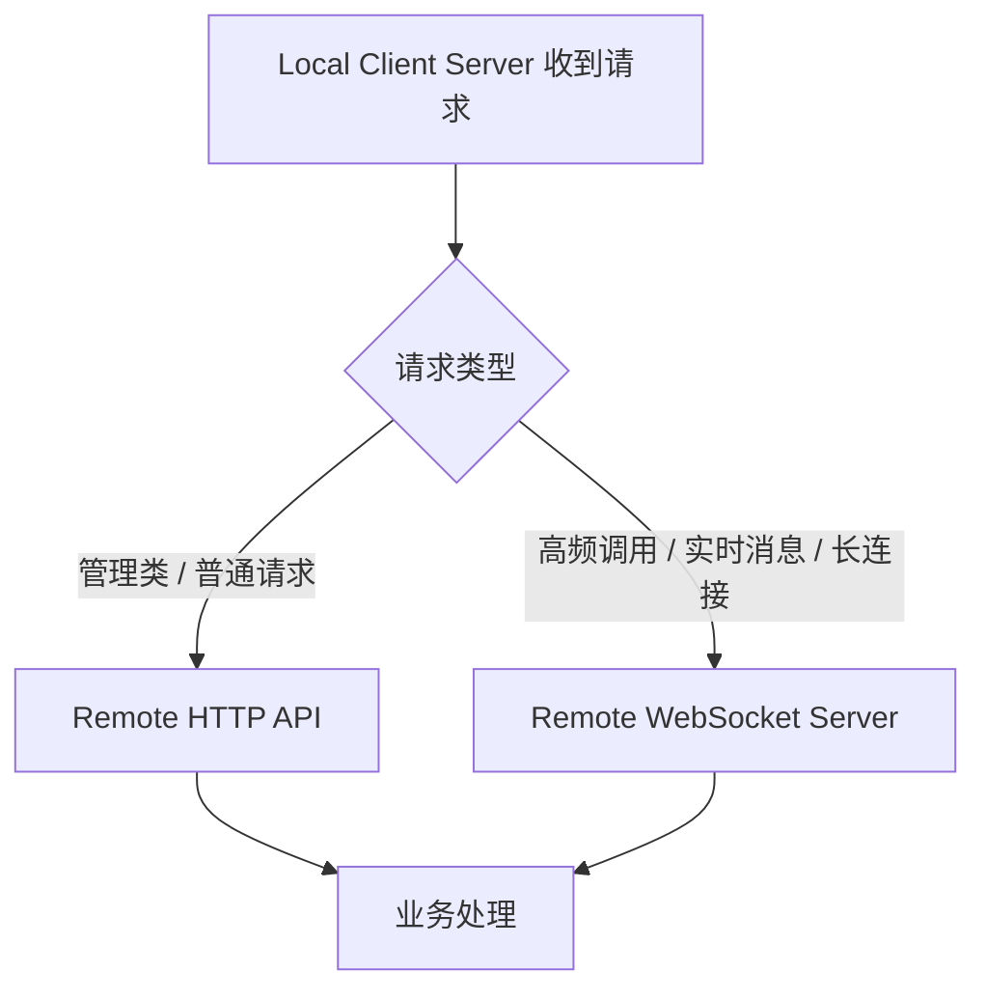

## 3. 存储记忆流程（先写元数据，后写向量，失败补偿）

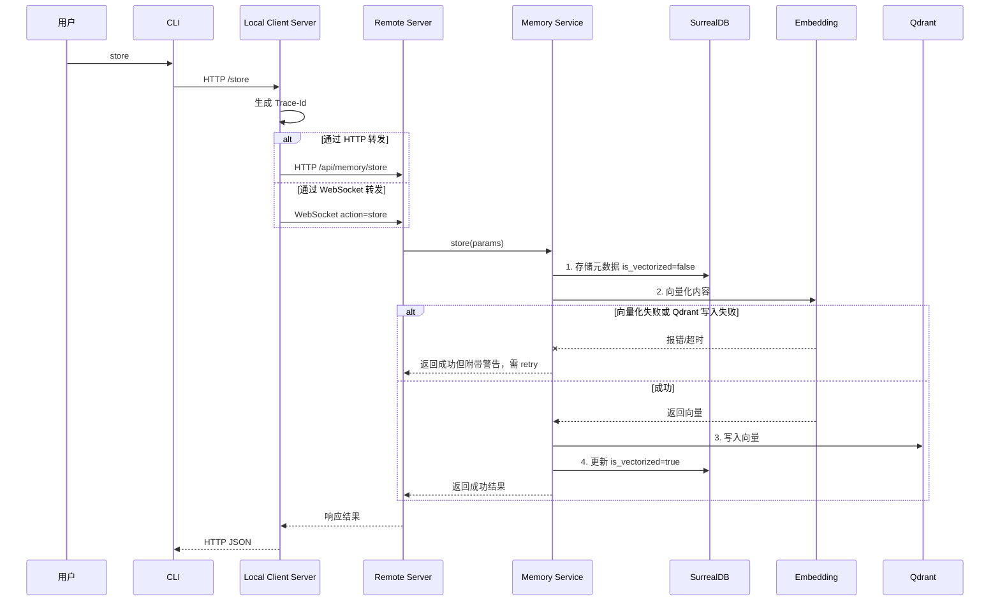

## 4. 查询记忆流程（限流 + 两阶段检索）

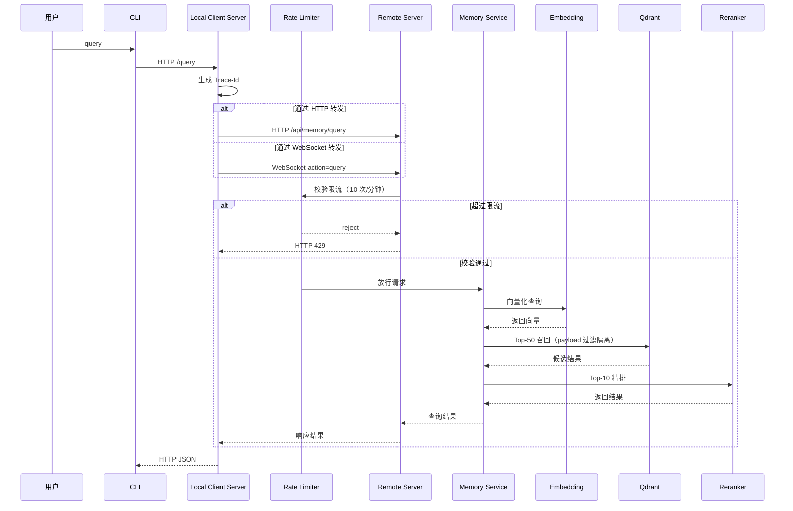

## 5. 共享与撤销流程

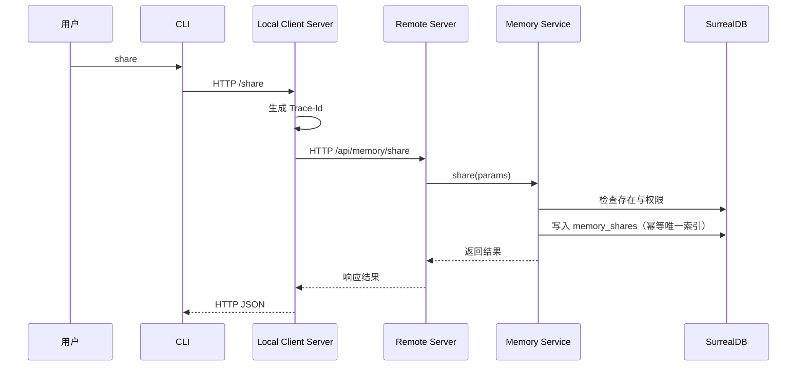

> revoke 同链路：`/api/memory/revoke` → `creator_status=revoked`（软撤销，保留记录）。

## 6. Retry 向量化补偿流程

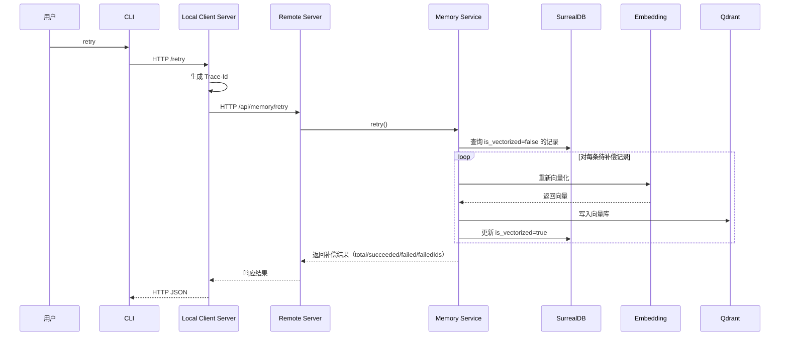

## 7. Graph RAG 异步抽取状态机

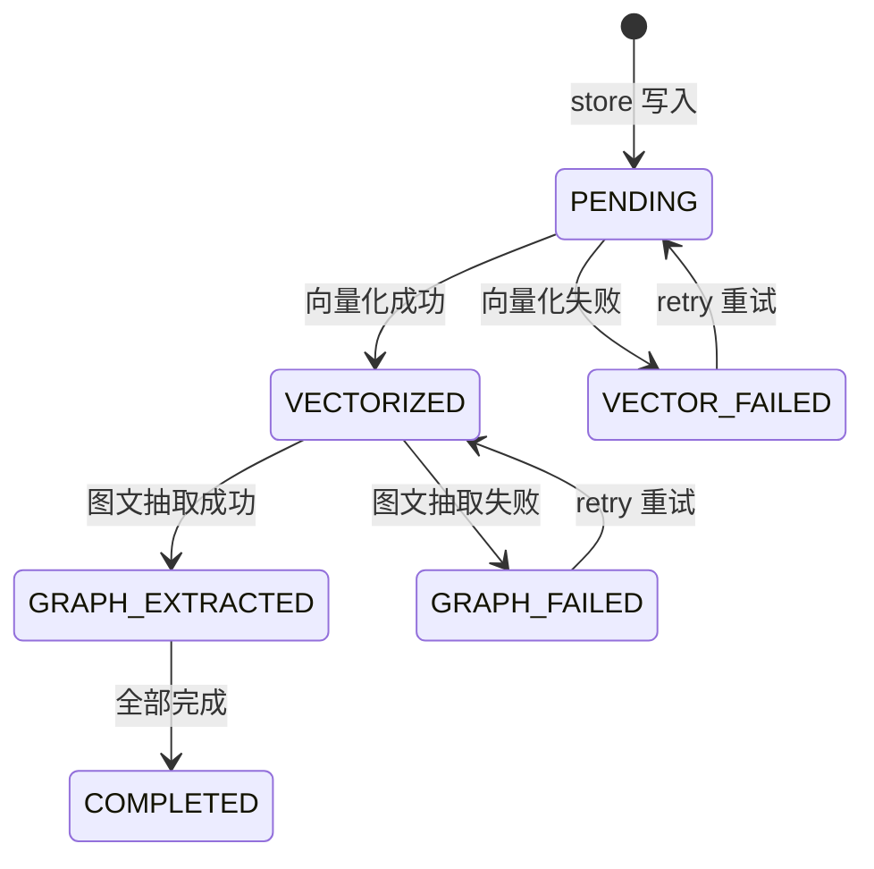

## 8. 异步抽取时序（Worker + LLM）

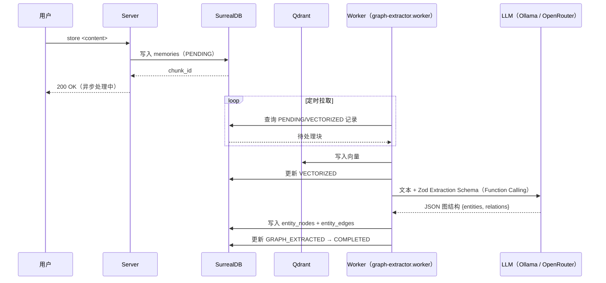

## 9. 混合检索（多路召回 → 图谱展开 → 合成重排）

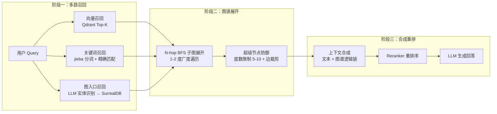

## 10. 实体消歧流程

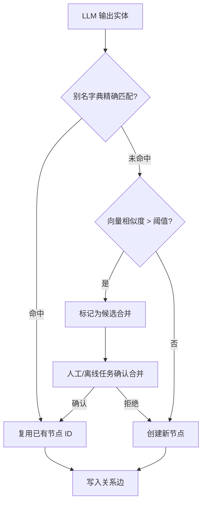

## 11. 写入时冲突检测（记忆代谢）

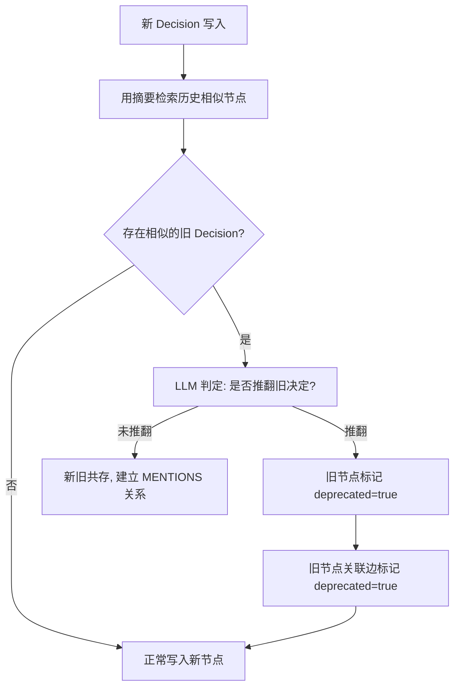

## 12. 部署拓扑

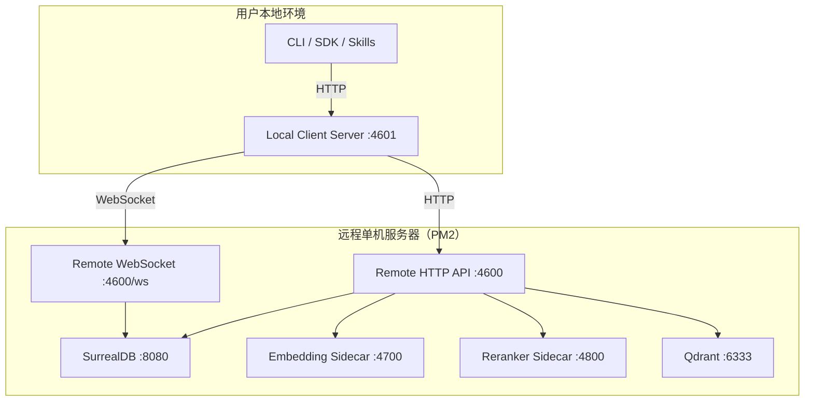

> 图中流程与 `apps/teams-memory/src/server/`（HTTP 路由）、`ws-handler.ts`（WS 端点 `/ws`）、`services/memory.service.ts`（业务编排）、`workers/graph-extractor.worker.ts`（异步抽取，独立进程 `teams-memory-worker`）、`search/`（两阶段检索）一一对应。Remote Server 单端口 4600（HTTP + WS 同端口）。
