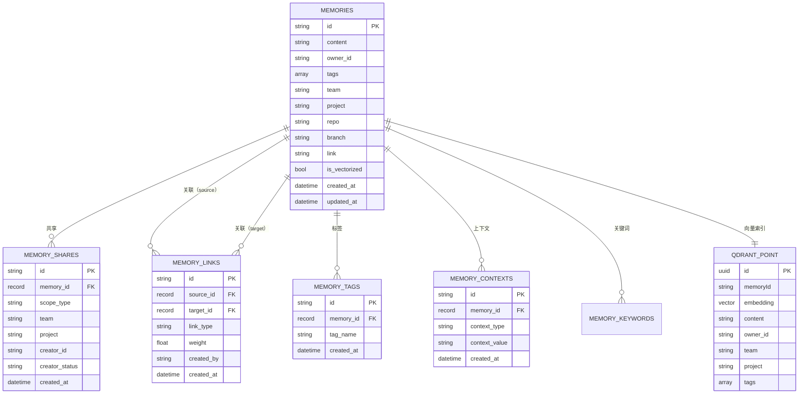

# 29 · teams-memory 数据库与 Graph RAG

> **整理时间**: 2026-09-23，核验基线 HEAD `5a8bc00`
> **来源**: 仓库 `docs/teams-memory-database.md`（v1.5）+ `docs/teams-memory-graph-rag.md`（v1.2）+ 代码核验

## 1. 存储架构概览（双存储引擎）

| 存储引擎 | 职责 | 端口 |
|---|---:|---:|
| SurrealDB | 结构化主数据、共享关系、关联关系、标签、上下文 | 8080 |
| Qdrant | 向量索引与语义召回 | 6333 |

- **SurrealDB** 负责"记忆是什么、属于谁、共享给谁、与谁有关"。
- **Qdrant** 负责"记忆在语义上与查询是否相似"。
- 一致性策略：先写 SurrealDB 元数据，后写 Qdrant 向量；失败标记 `is_vectorized=false`，由 `retry` 接口异步补偿。

## 2. SurrealDB 表结构

### 2.1 memories — 记忆主表

- 主键格式：`mem_{timestamp}_{random}`。
- 支持按 `repo + branch` 动态分表（表名 `memories_{safeRepo}_{safeBranch}`，非字母数字下划线替换为 `_`），与主表共享相同字段与索引。

| 字段 | 类型 | 必填 | 默认值 | 说明 |
|---|---|---|---|---|
| `id` | string | 是 | — | 主键 |
| `content` | string | 是 | — | 记忆内容 |
| `owner_id` | string | 是 | — | 所有者用户 ID |
| `tags` | array<string> | 否 | `[]` | 标签列表 |
| `team` | option<string> | 否 | — | 所属团队 |
| `project` | option<string> | 否 | — | 所属项目 |
| `repo` | option<string> | 否 | — | 所属代码仓库 |
| `branch` | option<string> | 否 | — | 所属分支 |
| `link` | option<string> | 否 | — | 关联链接 |
| `created_at` / `updated_at` | datetime | 是 | — | 创建/更新时间 |

索引：`idx_memories_created_at`、`idx_memories_team`、`idx_memories_project`。

### 2.2 memory_shares — 共享关系表

| 字段 | 类型 | 说明 |
|---|---|---|
| `memory_id` | record<memories> | 关联记忆（外键） |
| `scope_type` | string | `team` / `project`（枚举约束） |
| `team` / `project` | string / option | 共享目标 |
| `creator_id` / `creator_status` | string | 创建者；`active` / `revoked` |

索引：`memory_shares_unique(memory_id, team, project) UNIQUE`（幂等）、`idx_memory_shares_team`、`idx_memory_shares_project`。

### 2.3 memory_links — 记忆关联表（知识图谱边）

| 字段 | 类型 | 说明 |
|---|---|---|
| `source_id` / `target_id` | string | 源/目标记忆 |
| `link_type` | string | 关联类型 |
| `weight` | float | 默认 0.5 |
| `created_by` | string | `manual` / `auto` |

关联类型与权重：

| 类型 | 说明 | 权重范围 | 创建方式 |
|---|---|---:|---|
| `reference` | 直接引用 | 1.0 | 手动 |
| `similar` | 语义相似 | 0.5~0.9 | 自动 |
| `parent` | 父子关系 | 0.8 | 手动 |
| `related` | 相关关系 | 0.6 | 手动 |
| `tag` | 标签关联 | 0.3~0.5 | 自动 |
| `context` | 上下文关联 | 0.2~0.4 | 自动 |

索引：`memory_links_unique(source_id, target_id, link_type) UNIQUE`、`memory_links_source`、`memory_links_target`。

### 2.4 其他附属表

| 表 | 说明 |
|---|---|
| `memory_tags` | 记忆-标签独立关联（支持标签维度查询与图谱扩展） |
| `memory_contexts` | 上下文（`team`/`project`/`repo`/`branch` 四类型） |
| `memory_keywords` | 关键词表（规划中，用于关键词检索） |

类型定义位于 `apps/teams-memory/src/database/schema.ts`，建表/初始化位于 `database/connection.ts`。

## 3. Qdrant 向量存储

- Collection：`teams_memory`（可配置）；向量维度 **1024**（Qwen3-Embedding-0.6B 输出）；距离度量 **Cosine**。
- Point payload：`memoryId`、`content`、`owner_id`、`team`、`project`、`branch`、`tags`、`source`、`created_at`、`updated_at`。
- 检索过滤：Qdrant 查询通过 payload filter 实现数据隔离；共享记忆的跨用户可见性由应用层（Isolation Service）在 SurrealDB 侧完成，Qdrant 仅负责向量召回。
- 客户端：`apps/teams-memory/src/qdrant/client.ts` + `qdrant.service.ts`。

## 4. 数据隔离维度

| 维度 | 字段 | 存储位置 | 说明 |
|---|---|---|---|
| 用户级 | `owner_id` | SurrealDB + Qdrant | 用户个人记忆 |
| 团队级 | `team` | SurrealDB + Qdrant | 团队共享记忆 |
| 项目级 | `project` | SurrealDB + Qdrant | 项目共享记忆 |
| 仓库级 | `repo` + `branch` | SurrealDB（动态分表） | 仓库级记忆隔离 |

## 5. Graph RAG 方案

> 仓库内 `docs/teams-memory-graph-rag.md`（v1.2，草案）为完整设计；代码已落地 `graph-rag/extractor.ts`、`workers/graph-extractor.worker.ts`、`embedding-health/`。

### 5.1 动机

纯向量检索的三点局限：多跳逻辑缺失、专有名词被向量化稀释、记忆陈旧干扰判断。方案引入**图文抽取**（Entity-Relationship Extraction）与**混合检索**（Dense + Sparse + Graph）。

### 5.2 核心本体（Ontology）

| 实体类型 | 说明 | 示例 |
|---|---|---|
| `Person` | 团队成员 | 张三、李四 |
| `Project` | 项目、需求、任务 | Auth 模块、订单系统 |
| `Tech` | 技术栈、组件、服务、错误码 | Redis、K8s、ERR_001 |
| `Decision` | 技术决策、结论、架构演进 | 迁移到微服务 |

| 关系 | 方向 | 说明 |
|---|---|---|
| `OWNS` / `WORKS_ON` | (Person) → (Project/Tech) | 负责/参与 |
| `DEPENDS_ON` | (Project/Tech) → (Project/Tech) | 依赖 |
| `PROPOSED` | (Person) → (Decision) | 提出 |
| `RESOLVED_BY` | (Tech:Error) → (Decision) | 被解决 |
| `MENTIONS` | (Any) → (Any) | 兜底关联 |

约束：采用 **Zod Schema + LLM Function Calling** 限制抽取实体/关系类型，避免开放域抽取导致"关系爆炸"。

### 5.3 新增表（SurrealDB）

| 表 | 关键字段 | 说明 |
|---|---|---|
| `entity_nodes` | `entity_type`、`canonical_name`、`source_chunk_id`、`deprecated` | 图节点 |
| `entity_aliases` | `entity_id`、`alias_name` | 别名字典（消歧） |
| `entity_edges` | `source_id`、`target_id`、`relation_type`、`weight`、`deprecated` | 图边 |

### 5.4 混合检索三阶段

1. **多路召回**：向量召回（Qdrant Top-K）+ 关键词召回（jieba 分词 + 精确匹配）+ 图入口召回（LLM 实体识别 → SurrealDB）。
2. **图谱展开**：N-hop BFS（1-2 度），带**超级节点防御**（单节点最多展开 5-10 条边、按时间新鲜度/权重/意图裁剪）。
3. **合成重排**：文本记录 + 图谱逻辑链合并为 Context → Reranker 重排 → LLM 生成回答。

### 5.5 实体消歧与记忆代谢

- 消歧：别名字典精确匹配优先（Standard: Kubernetes / Mention: K8s）→ 未命中再走向量相似度候选合并。
- 代谢：写入时冲突检测（LLM 判定新旧 Decision 是否推翻，推翻则旧节点/边标记 `deprecated=true`）+ 时间戳衰减（检索降权旧链）。

### 5.6 实施路径（roadmap 对照）

| 阶段 | 内容 | 代码现状 |
|---|---|---|
| Phase 1 基建 | 状态机、store 异步落盘、Zod Schema、LLM 提取器、图边写入 | ✅ 已落地 extractor + worker + schema |
| Phase 2 效果 | 重构 /query 多路召回、图谱展开、Context 合成重排 | 🚧 部分落地（search/ 两阶段为主，图融合规划中） |
| Phase 3 完善 | 冲突检测、别名字典、CLI graph 可视化 | 🚧 规划中 |
