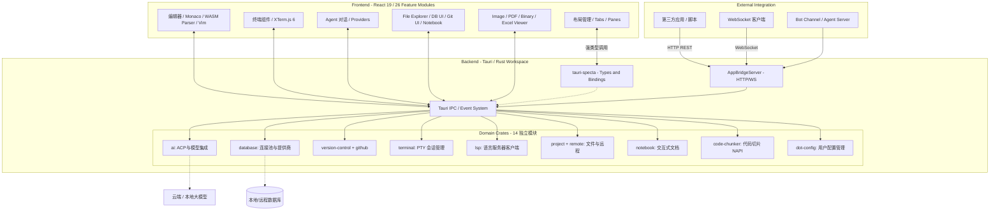
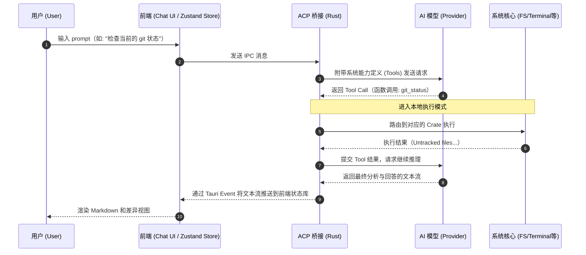

# Open Context

Agent 开发与调试工具集，集成了交互对话、终端、浏览器、文件管理和代码编辑等核心功能，为 AI Agent 提供强大的系统级底层操作环境。

## 🌟 核心功能特性

- **🤖 Agent 交互引擎**
  - **多模型支持**: 支持接入不同的 AI Provider（如 OpenAI, Anthropic, Gemini, Ollama, OpenRouter 等）。
  - **标准协议**: 完整支持 ACP (Agent Client Protocol) 协议。
  - **安全上下文**: 严格区分 Plan Mode 与执行模式，保障 Agent 运行安全。
  - **Bot 集成**: 内置 `bot-agent-server` 与 `bot-channel`，支持多渠道 Bot 接入。

- **🧰 多功能工作台**
  - **终端功能 (Terminal)**: 内置基于 PTY 和 XTerm.js 6 的强大终端模拟器，支持交互式命令行操作、多标签页与会话持久化。
  - **文件管理 (File Explorer)**: 完整的本地文件系统浏览与管理，支持文件树、全局搜索与实时监听。
  - **代码编辑 (Editor)**: 内嵌 Monaco 专业代码编辑器，结合 WASM 语法解析，支持多缓冲区(Buffer)与丰富的编辑特性。内置专用的 JSON、Markdown 甚至二进制与 AST 查看器，支持 Vim 键位模式。
  - **浏览器功能 (Browser)**: 内置 Web 预览与网页交互能力，方便 Agent 进行页面级测试。
  - **多视图预览**: 包含图片编辑/查看（AVIF、JPEG、JXL、PNG、WebP、QOI 等格式）、PDF 预览、Excel 查看（Fortune-Sheet）、OCR 识别、Word/XML 解析、二进制文件查看、Mermaid 图表渲染等丰富的内建视图工具。
  - **Notebook**: 内置交互式 Notebook，支持代码与文档混合编辑（TipTap 3 富文本）。

- **🛠️ 高级开发与系统能力**
  - **LSP 代码智能 (Language Server)**: 内置 LSP 客户端，为编辑器提供自动补全、诊断与跳转能力。
  - **版本控制 (Git & GitHub)**: 原生集成 libgit2 与 GitHub CLI，支持提交历史、分支管理、Diff 视图及 PR 管理。
  - **多数据库管理 (Database)**: 统一连接池管理，原生支持 SQLite, PostgreSQL, MySQL, MongoDB, Redis, DuckDB, SurrealDB 等 7 种以上数据库。
  - **远程连接 (Remote)**: 支持 SSH 远程终端与 SFTP 文件管理。
  - **代码切片 (Code Chunker)**: 基于 Tree-sitter 的代码智能分片，支持 NAPI 原生绑定，用于 RAG 与向量检索。

- **⚙️ 资产与环境管理**
  - **工作流定制**: 支持统一管理和配置 Skills、Rules、Commands 以及 Prompts，灵活扩展 Agent 工作流。提供全局命令面板 (Command Palette)、快速打开 (Quick Open) 与高度可定制的快捷键绑定。
  - **Dot Config 管理**: 统一管理用户配置文件（`dot-config` crate）。
  - **运行时与工具集**: 自动检测与安装外部运行时（Node.js, Bun, Deno, Go, Python, Bash, Nushell, Rust, Zig 等）与语言服务器 (Tooling/Extensions)。

- **🔌 开放 API 与全栈类型安全**
  - **全类型导出 (Specta)**: 所有的 Tauri Commands 和 Tauri Events 均通过 `tauri-specta` 库自动导出 TypeScript 类型定义，确保前端调用安全。
  - **外部 AppBridge 服务**: 启动内嵌的 `AppBridgeServer`，以外部 HTTP 与 WebSocket 接口的形式对外提供本客户端的所有 Tauri 系统能力（如文件读写、命令执行等）。使得 Open Context 可直接被第三方脚手架或工具调用，成为跨进程的系统级能力底座。

---

## 🏗️ 架构概览

Open Context 采用分离式架构，前端采用 React 19（Tauri Webview），后端基于 Rust 分解为 14 个独立的 Domain Crates，确保高内聚低耦合。



---

## 🔄 核心交互流程：Agent 协议调用 (ACP Flow)

Open Context 的核心在于让 AI Agent 无缝调用系统级能力。以下展示了用户发起请求到 Agent 执行工具并返回的过程：



---

## 💻 目录结构

```
open-context/
├── crates/                     # Rust 后端 Domain Crates（14 个）
│   ├── ai/                     # ACP 协议与模型集成
│   ├── database/               # 多数据库连接池
│   ├── extensions/             # 扩展与插件管理
│   ├── github/                 # GitHub API 集成
│   ├── lsp/                    # 语言服务器客户端
│   ├── notebook/               # 交互式 Notebook
│   ├── code-chunker/           # Tree-sitter 代码切片（NAPI）
│   ├── dot-config/             # 用户配置文件管理
│   ├── project/                # 文件系统与项目管理
│   ├── remote/                 # SSH / SFTP 远程连接
│   ├── runtime/                # 运行时检测与安装
│   ├── terminal/               # PTY 会话管理
│   ├── tooling/                # 工具链管理
│   ├── version-control/        # Git 操作
│   ├── bot-agent-server/       # Bot Agent 服务（TypeScript）
│   └── bot-channel/            # Bot 渠道接入（TypeScript）
├── src-tauri/                  # Tauri 应用入口与 IPC Commands 粘合层
└── src/                        # React 19 前端源码
    ├── features/               # 26 个功能独立的领域模块
    │   ├── ai/                 # Agent 对话与 Provider 管理
    │   ├── editor/             # Monaco 编辑器（Vim 支持）
    │   ├── terminal/           # XTerm.js 终端
    │   ├── database/           # 数据库管理 UI
    │   ├── git/ + github/      # Git 与 GitHub UI
    │   ├── image-editor/       # 图片编辑（多格式支持）
    │   ├── image-viewer/       # 图片查看
    │   ├── pdf-viewer/         # PDF 预览
    │   ├── binary-viewer/      # 二进制文件查看
    │   ├── global-search/      # 全局搜索
    │   ├── quick-open/         # 快速打开
    │   ├── command-palette/    # 命令面板
    │   ├── file-explorer/      # 文件树管理
    │   ├── remote/             # 远程连接 UI
    │   ├── settings/           # 设置与自动更新
    │   ├── vim/                # Vim 键位绑定
    │   ├── telemetry/          # 遥测数据
    │   └── ...（layout, panes, tabs, keymaps, web-viewer 等）
    ├── bridge/                 # 自动生成的 Tauri 类型绑定
    └── ui/                     # 共享的纯基础 UI 组件（shadcn/ui）
```

---

## 🛠️ 技术栈

| 层级       | 技术            | 版本   |
| ---------- | --------------- | ------ |
| 桌面框架   | Tauri           | 2.x    |
| 前端框架   | React           | 19     |
| 构建工具   | Vite            | 8      |
| 类型系统   | TypeScript      | 6      |
| 样式       | TailwindCSS     | 4      |
| 状态管理   | Zustand         | 5      |
| 路由       | TanStack Router | latest |
| 代码编辑器 | Monaco Editor   | 0.55   |
| 终端组件   | XTerm.js        | 6      |
| 富文本编辑 | TipTap          | 3      |
| 代码高亮   | Shiki           | 4      |
| 图表渲染   | Mermaid         | 11     |
| Rust 版本  | 2024 Edition    | -      |
| 异步运行时 | Tokio           | 1      |
| Web 框架   | Actix-web       | 4      |
| 版本控制   | libgit2 (git2)  | 0.20   |
| 包管理     | pnpm            | 10.32+ |

---

## 🚀 快速开始

```bash
# 安装依赖
pnpm install

# 开发模式（启动完整 Tauri 应用）
pnpm dev

# 仅启动前端（无 Tauri）
pnpm dev:web

# 构建发布版本
pnpm build
```

### 代码质量

```bash
pnpm fmt        # 格式化（Prettier + cargo fmt）
pnpm lint       # 代码检查（oxlint + cargo clippy）
pnpm test       # 运行前端测试（vitest）
cargo test      # 运行 Rust 测试
```

---

## 📚 感谢与参考项目

Open Context 的部分灵感与功能实现参考了社区优秀的开源项目，特此致谢：

- **[pi-mono](https://github.com/badlogic/pi-mono)**: 本项目的核心 Agent 调度与驱动能力基于此项目进行了深度定制和实现。
- **[acp-ui](https://github.com/formulahendry/acp-ui)**: 本项目的 ACP (Agent Client Protocol) 交互界面与协议实现机制深度参考了该项目。
- **[athas](https://github.com/athasdev/athas)**: 本项目的核心代码编辑器功能（多缓冲区、文件资源管理器、LSP 集成、WASM 语法解析等）参考并借鉴了 opencontext 编辑器的卓越设计。
- **[cmux](https://github.com/manaflow-ai/cmux)**: 本项目的内置终端模拟器与浏览器 Webview 等原生系统级集成设计，深受该项目的启发。
- **[Alma Workspace](https://alma.now/docs/)**: 本项目作为 AI 系统级客户端的产品形态和全功能工作流，极大地参考了 Alma 的综合应用架构理念。
